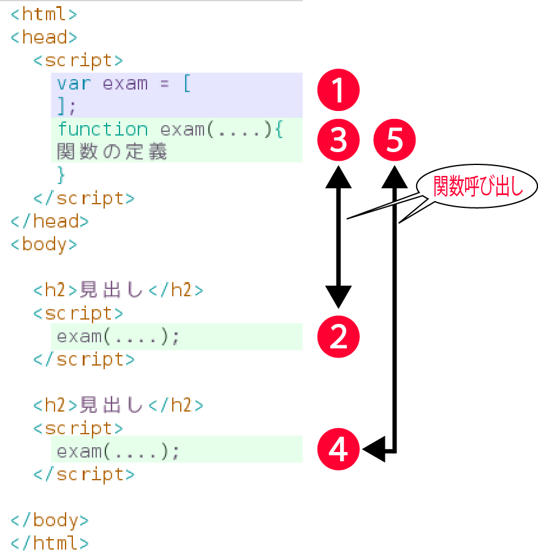

# 関数を定義

[ソースコード](https://github.com/aki-creatist/php_beginner/blob/master/var/www/html/function/function.php)

## ユーザー定義関数の作成

### functionステートメント

* 実際にユーザー定義関数(以降、関数と呼びます)を作成する
* 関数を定義するには`function`を使用する

```php
function 関数名()
{               // 関数のブロック { } に、処理を記述する
    処理1;
}

関数名();       // 実行
```

* `say_hi();`が関数の定義の前にあっても同じように機能する

```php
function say_hello() //大きな文字で「hi」と表示するための関数
{
    echo "<font size=20>";
    echo "hi  <br />" ;
    echo "</font>";
}

say_hello();
```

### 実行の順序

* 関数は、実行箇所より後に定義されていても動作する



## 引数

* 作成した関数の中で利用する値を、関数の外から与えることができる
* この値のことを引数と呼ぶ
* `$`引数は関数内の処理で利用されるが、関数の中の$引数が処理中に変更されても、関数の外の$変数には無影響(ローカルスコープ)
    * なお、引数には文字列、数値、変数、配列などを指定でき、`,`(カンマ)で区切ることにより複数指定可能

```php
$変数 = 数値;

関数名(渡したい値);

function 関数名($引数)
{
    処理;
    echo $引数;
}
```

## スコープ

* ある変数や関数が特定の名前で参照される範囲のこと
* ある範囲の外に置いた変数等は、通常、その名前だけでは参照不可
    * スコープは、原則、以下の2つしかありません。
        * グローバルスコープ
        * ローカルスコープ

## 引数にデフォルト値を設定する

* もし、引数が設定されている関数を、引数を指定しないで実行するとエラーとなる

```php
say_hello();
```

```text
Warning:  Missing argument 1 for say_hello()
```

* アーギュメントとは引数のこと
* 引数がなくてもエラーが出ないようにするには、引数のデフォルト値を関数側で設定しておけばよい
    * こうしておくと、引数がない場合、デフォルト値で代替されて、処理はエラーを出さずに実行される
        * もちろん、引数がある場合は、デフォルト値は代入しないで実行される
        * このデフォルト値は「引数＝値」のように指定すっる
        * またデフォルト値も`,`(カンマ)で区切って複数指定可能

```text
$変数 = 数値;

関数名($変数);

function 関数名($引数 = 値)
{
    処理1;
    処理2;
    echo $引数;
}
```

* ここでは、会員かどうかをチェックする関数check_memberを使って動作を確認する
    * この関数を`check_member()`として実行する
    * `check_member`関数では`$username="guest", $password="pass"`として、デフォルト値`guest`が両方の引数に設定されている
    * 引数がないので、ここで、デフォルト値が代入される
    * 最後に関数内の条件文で判定されて「ゲストさん、ようこそ！」と表示される
    
```text
check_member();

function check_member($username="guest", $password="pass")
{
    if ($username == "guest" && $password == "pass") {
        echo "ゲストさんようこそ";
    } else {
        echo "会員さんようこそ";
    }
}
```

* デフォルト値の指定には**順番**がある
* フォルト値を複数指定する場合、動作しない
    * デフォルト値を指定した引数の右側に、引数を指定しない引数があるとエラーよりも後に実行されるため

```php
//動作しない
function check_member($username="guest",$password)

//動作する
function check_member($username,$password="guest")
```

## 関数から値を受け取るには~返り値~

* 関数内でreturn文が実行されると、その関数の実行を即座に停止して、return文に指定された値を返す
* 次に、関数を呼び出した位置まで制御が戻り、$変数に返り値を受け取る

```php
$変数 = $関数();

function 関数名(引数名, 引数名, 引数名)
{
    関数内で実行する処理
    返り値にする変数 = 処理結果;
    return 返り値;
}
```

## 複数の値を返す ~list関数~

* 関数の処理によっては複数の値が欲しいことがあります。
* return文では複数の変数を返すことはできないので、値を配列にまとめて返す
* 以下のコードでは、受け取り側でlist関数により帰ってきた配列を変数に代入して受け取る
* 関数内ではarray関数で複数の値を配列にして返している

* https://github.com/aki-creatist/php_beginner/blob/master/var/www/html/function/init.php#L48

```php
list($変数1, $変数2, $変数3) = 関数();

処理1;
処理2;

function 関数()
{
    処理3;
    $変数 = 処理4;
    return array($変数1, $変数2, $変数3);
}
```
