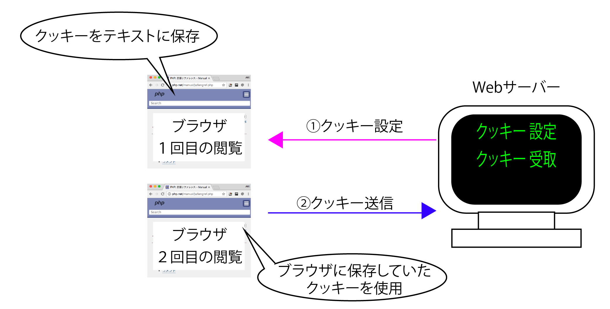

# クッキー

* クッキー(HTTP Cookies)を利用すると以下のことが可能
    * 掲示板などで一度入力したメールアドレスなどを、二回目の閲覧時に自動的に表示させたり
    * 「あなたの訪問は３回目です」と表示させたり、
    * 通信販売サイトで「商品の閲覧履歴」を表示させたり

## クッキーとは？

* ブラウザにデータを保存する仕組み
* 具体的には、履歴の書かれたテキストファイルを指す
    * 例: 
        * ブラウザで１回目に閲覧した時にWebサーバから送信されたレスポンスヘッダーにクッキー情報が格納されていると、ブラウザがその情報をテキストファイルとして保存する
        * ２回目の閲覧時にブラウザは閲覧中のサイトに閲覧したクッキー(テキストファイル)があると、その内容をリクエストヘッダーに含めてWebサーバへ送信
        * 保存されたデータを利用することで前述の機能を実現する



* 保存したデータは、必要に応じて、サーバーから読み込み、利用可能
* 有効期限も月、年単位で設定でき、ブラウザを閉じたあともアクセスしたいようなデータを扱う場合に便利

## クッキーを利用する際の注意点

### COOKIEとSESSION

* よく似た仕組みとして、セッションがある
* そして、ブラウザが開いている間だけデータを維持したいというケースでは、セッションの方が適している
* しかし、セッションはブラウザを閉じたあともデータを維持したいというケースには不向き
    * そのようなケースでは、クッキーを利用する

### 保存サイズ

* 大きなデータをなんでも詰め込むのではなく、データ本体はデータベースなどで管理して、クッキーにはそのキーとなる情報だけを保存するようにする
    * クッキーで保存できるデータサイズは、4キロバイトまでと、小さいため
    * 例えば、アプリを利用しているユーザーの情報であれば、漢字名やメールアドレス、権限情報などをすべてクッキーに保存するのではなく、ユーザーIDだけをクッキーに保存する
        
### 保存場所

* クッキーはブラウザで保存され、管理されるデータ
* 保存したデータの内容をユーザーが参照でき、さらにはユーザがデータの変更／削除も可能で内容を「盗聴」される恐れもある
    * データはネットワーク経由で受け渡しされるため
    * そのため、クッキーにはパスワードやクレジットカード番号のような機密情報
* アプリの挙動を左右するような情報を保存してはいけない

## 利用方法

### COOKIEの設定

```php
 setcookie(名前,値,有効期限,パス,ドメイン,SSL接続,HTTP経由)
```

* PHPでは、`setcookie関数`を使ってデータにクッキーを保存する
* 「キー」と「値」、「クッキーの有効期限」の順に引数を指定する
* `setcookie`関数は、ヘッダー情報を出力するため、これより前にprint文で文字を出力すると正常に動作しないので注意が必要
* なお、クッキーに設定されたデータは`$_COOKIE["キー"]`とすることで「値」を参照可能
        
### COOKIEの取得

* setcookie関数で保存されたクッキーには、スーパーグローバル変数$_COOKIEでアクセス可能
* 使い方は、これまでにも登場した`$_POST`、`$_GET`、`$_SESSION`と同じ
* `name`は、`setcookie`命令で指定したクッキーの名前
* `$_POST`、`$_GET`の値に限らず、外から得たデータはすべて`htmlspecialchars`関数で変換するのを忘れないように

## 基本的な引数

### COOKIEの名前と値

* クッキーを保存するうえで必要最小限の情報
    * 名前は自由ですが、クッキーは、アプリ全体からアクセスできる情報であるためアプリ全体で重複しないように注意
    * 有効期限が長いために、なるべく用途に沿った具体的な名前を付ける

### 有効期限

* クッキーの有効期限は、UNIXタイムスタンプ(西暦1970年1月1日からの秒数)で設定する
    * タイムスタンプとは、「1970年1月1日からの経過秒数」のこと
    * `time`関数では西暦1970年1月1日から実行した時の日時までの秒数を取得可能
    * `time`関数の値に対して、`60秒x60秒x24時間x90日`を加算することで、クッキーの有効期限を90日に指定
        * `time0+60 *60* 24 * 30`とすると有効期限が30日間となる
    * 有効期限は省略もでき、その場合、クッキーはブラウザを閉じたタイミングで破棄される

## セキュリティ設定に関わる引数

* 以下の設定は省略することも可能ですが、明記するクセを付けるべき

### ドメインとパス

* クッキーが有効となるドメイン／パスを指定する
* 例えばドメインに`.localhost`と指定した場合には`localhost`以下のすべてのサブドメインでクッキーが有効になる
* パスについても同じです。「/html/」と指定した場合、htmlフォルダとその配下のサブフォルダに対してだけ、クッキーが有効になる
    * 例えば、複数のユーザーが同じドメインを共有しているレンタルサーバーでは、必ずパスを指定しておくべき
    * さもないと、他のユーザーが管理しているページで勝手にクッキーを操作されてしまう恐れがある

### SSL接続

* このパラメータがTRUEの場合、暗号化通信（SSL：Secure Socket Layer）の環境でのみクッキーを送信する
    * 通信を暗号化している場合には、原則として、このパラメータをTRUEに設定する
    * これによって、暗号化されていないページが混在している場合に、クッキーが誤って送信されるのを防げる

### HTTP経由

* このパラメータをTRUEに設定することで、JavaScriptからクッキーにアクセスできなくなる
* これによって、クロスサイトスクリプティング脆弱性によるデータ流出の危険を軽減可能
* 一般的には、TRUE（有効）としておくのが望ましい
    * 既定はFALSE

## クッキーを利用する

## 掲示板アプリ

* COOKIEを利用し、掲示板アプリの自分の名前をブラウザに保存します。
* 2回目のアクセスからは、1回目に入力した名前が自動で表示されるようになります。
    * 前回とのソースの差分を確認しながら実装してみる
    * https://github.com/aki-creatist/outside_file_handling/commit/22dc880771d72c6600f3b489087753324d9acd0b
### ソース

* https://github.com/aki-creatist/outside_file_handling/blob/feature/cookie/var/www/html/input.php
* https://github.com/aki-creatist/outside_file_handling/blob/feature/cookie/var/www/html/write.php

## アクセスカウンター

### データを取得する

* https://github.com/aki-creatist/php_beginner/blob/master/var/www/html/cookie/counter.php
    * $countをはじめに「0」で初期化
    * クッキー情報があると`$_COOKIE["count"]`にデータが入っているため、`$countに$_COOKIE["count"]`の内容が格納される
    * `$count++`により1だけ加算する
    * `setcookie`関数には、キーを`count`、値に`$count`、有効期限に10病後を設定する
    * クッキー情報がない時には、`$count`には`1`が格納されているので、`if ($count == 1)`により、「クッキー情報はありません。」と表示される
    * `$count`が`2`以上のときは「<?=$count?>回目で表示される

## まとめ

* ページ間でデータを受け渡ししたい場合にはクッキーを利用する
* クッキーを記録するには、setcookieという命令を利用する
* クッキーを読み込むには、$_COOKIEという変数でアクセス可能
* クッキーには、大きなサイズのデータや機密情報を保存してはいけない
