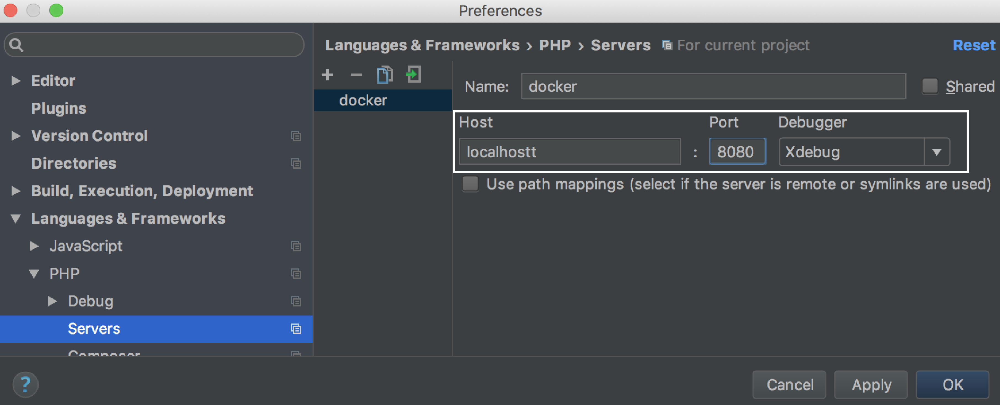

# Xdebug

## 前提条件

* ブラウザに**Xdebug helper**がインストールされていること
* docker-php-ext-xdebug.iniが用意されていること
* Dockerfileに以下が記載されていること
    * RUN pecl install xdebug
    * ADD ./docker-php-ext-xdebug.ini /usr/local/etc/php/conf.d/

## 設定画面を開く

* `ctrl + , (カンマ)`

## Languages & Frameworks > PHP

### Languages & Frameworks > PHP > PHP Language Level

* `PHP Language Level`欄で該当するPHPバージョンを選択

### Languages & Frameworks > PHP > CLI Interpreter

* 右の選択部分を押下


* 左上端の`＋`を押下


#### Languages & Frameworks > PHP > CLI Interpreter > Configure Remote PHP Interpreter

* Configure Remote PHP Interpreter を `From Docker, Vagrant, VM, Remote`を選択して開く


* ラジオボタンから`Docker Compose`を選択


    
* Configration file(s)の設定
    * docker-compose.ymlを指定する


#### Languages & Frameworks > PHP > CLI Interpreter > Additional

##### Languages & Frameworks > PHP > CLI Interpreter > Additional > Configuration options

* `Configuration options` を設定する
* 右端を押下


* 小窓が開く
* `＋`を押下


* `Configuration derective`: `xdebug.remote_host`
* `Value`: `docker.for.mac.localhost`
* `OK`を押下


### Languages & Frameworks > PHP > Path Image Mappings


* 右の選択部分を押下
* `Edit Project Path Mappings`が開く


## Languages & Frameworks > PHP > Debug > DBGp Proxy

* `IDE key`: `PHPSTORM`
* `Host`: `8080`
* `PORT`: `9000`

## Languages & Frameworks > PHP > Debug > Servers

* `Servers` を押下
    * `Host`: `localhost` を入力
    * `Port`: `8080` を入力
    * `Debugger`: `Xdebug` を選択



* `File/Directory`
    * docker-composeの設定に合わせてマッピング
* `Absolute path on the server`
    * docker-composeの設定に合わせてマッピング
    


## en0 第二IPを割当

```bash
sudo ifconfig en0 alias 10.254.254.254
```

