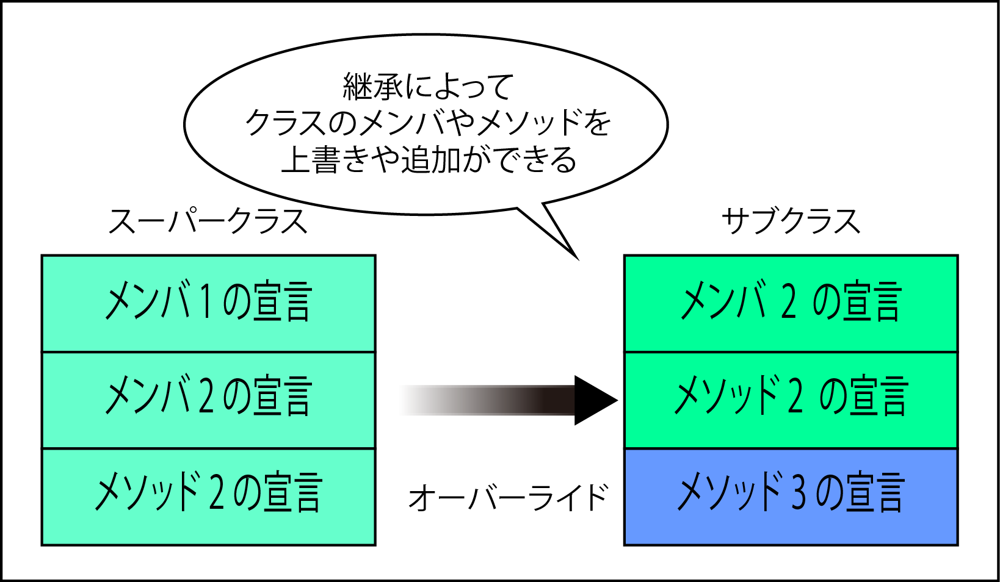

# クラスの継承

* クラスを継承することで機能を受け継いだ新しいクラスを簡単に作成可能
* また、継承するときに、必要なメソッドだけを上書きして新しい機能として利用することが可能

## 継承とは

* インヘリタンスとも呼ばれる
* 他のクラスの`内部データ`や`手続き`を引き継いで新たにクラスを作成する機能
    * 内部データ: メンバー
    * 手続き: メソッド
* オブジェクト指向の用語
    * スーパークラス: 継承されるクラス
        * 親クラスともいう
    * サブクラス: 継承するクラス
        * 子クラスともいう
        
### サブクラス(子クラス)

* 機能を受け継いでいる
* 親クラスにあるメンバー変数やメソッドは改めて定義しなくても利用可能
* 親クラスのメソッドをオーバーライド(上書き)可能
    * 子クラス内で、親クラスにある同じメソッド名を定義する
* 継承やオーバーライドを利用することで、コーディングの削減やバグ混入を未然に防ぐことが可能
* また、クラス同士の関係を明確にでき、階層化することが可能



## クラスを継承する

* `extends`キーワードを使用する

```php
class 新しいクラス名 extends 継承するクラス名
{
    //処理を記述
}
```

### `protected`

* protected宣言されたメンバー変数とメソッド
    * 親クラスと継承された子クラスからのみアクセス可能

### 多重継承はできない

* 多重継承はできない
    * 多重継承: 複数のクラスを親クラスとして継承を行うこと
* 継承できるクラスは１つ

### メソッドを上書きする

* 親クラスのメソッドと同じ名前のクラスを子クラス内で定義する
    * オーバーライド: 上書き
* 変数も同じものを定義することで上書き可能

### 上書きの例

* クラスUserの$nameをprivateで宣言して、NULLを格納する
* 次に、クラスGuestを新たに作成する
* extendsを記述して、クラスUserからメンバー変数やメソッドを継承する
* `$name` にはゲストを格納
* `print_hello()`内では`さん、はじめまして`と表示する

```php
class Users
{
    private $name = NULL;

    public function print_hello()
    {
        echo $this->name;
        echo "さん、こんにちは！<BR>";
    }
}

class Guests extends Users
{
    private $name = "ゲスト";
    public function print_hello()
    {
        echo $this->name;
        echo "さん、はじめまして！<BR>";
    }
}

$newuser = new Guests();
$newuser->print_hello();
```

### finalキーワード

* メソッドに対して指定
    * メソッドをオーバーライドできなくなる
* クラスに対して指定
    * クラスの継承を禁止する
    * 継承しようとするとエラーメッセージが表示され動作しなくなる

```php
class Test
{
    final public function test_method()
    {
        // 処理が記述される
    }
}

final class Test2
{
    public function test2_method()
    {
        // 処理が記述される
    }
}
```
