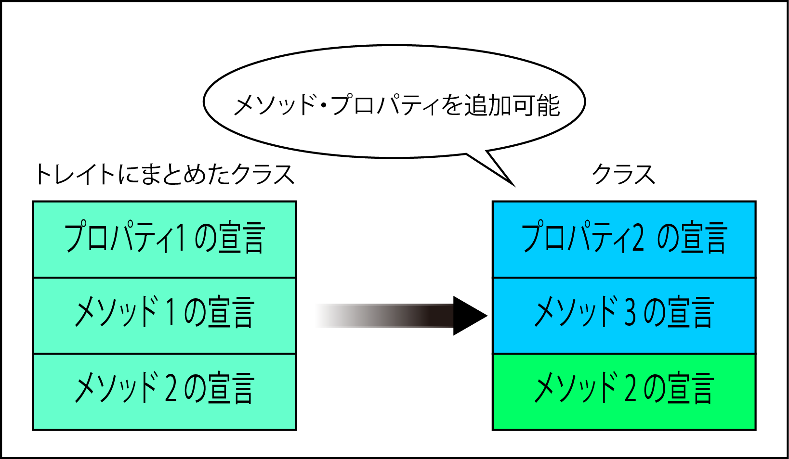

# トレイト

* コードを再利用するための仕組み
* `継承`と別方法で機能やメンバ変数をクラスに追加可能
    * 機能: メソッド
    * メンバー変数: プロパティ

## インスタンス生成は不可

* クラスのようにインスタンスを作成することは不可
* しかし、幾つかの機能をまとめてクラスを多重に継承したときのような使い勝手を実現する

## 読込の優先順位

* トレイトでメソッドをクラスに組み込んだときの優先順位
* 同じ名称のメソッドが存在した場合
    * メソッドにオーバーライド(動作の上書き)されるクラスのメソッド
    * トレイトのメソッド
    * 継承したメソッド



## トレイトの宣言

* トレイトを宣言するには、`class`と同様に`trait`に続けて、トレイトの名称を宣言する
* トレイト内部に追加したいメソッドをfunctionで宣言する
* publicやprivateなどのアクセス制限のキーワードは利用可能

```php
trait トレイト名
{
    public function トレイトのメソッド1()
    {
        処理...
    }

    private function トレイトのメソッド2()
    {
        処理...
    }
}
```

## トレイトの利用方法

* トレイトで宣言したメソッドを利用する
    * クラス内部で`use`を使ってトレイト名を指定する
* トレイトが複数宣言されている場合
    * 同様に`use`を使って`,`(カンマ)で区切って複数組み込む

```php
class クラス名1()
{
    use トレイト名;
}

class クラス名2()
{
    use トレイト名1, トレイト名2;
}
```

## トレイトのテスト

* PHPのクラスの継承は一つだけが、トレイトは使えばいくつでもメソッドを追加可能
* ここでは、`trait SayMorning`とトレイト宣言
    * `class Guest`内で`use SayMorning；`としてトレイトを組み込む
    * `$newuser->print_morning();`として、Guestクラスには存在しないメソッドを実行可能

```php
class User
{
    private $name = NULL;
    public function print_hello()
    {
        echo $this->name;
        echo "さん、こんにちは！<br>";
    }
}

trait SayMorning
{
    public function print_morning()
    {
        echo $this->name;
        echo "さん、おはようございます！<br>";
    }
}

class Guset extends User
{
    use SayMorning;
    private $name = "ゲスト";
    public function print_hello()
    {
        echo $this->name;
        echo "さん、はじめまして！<br>";
    }
}

$newuser = new Guset();
$newuser->print_hello();
$newuser->print_morning();
```

