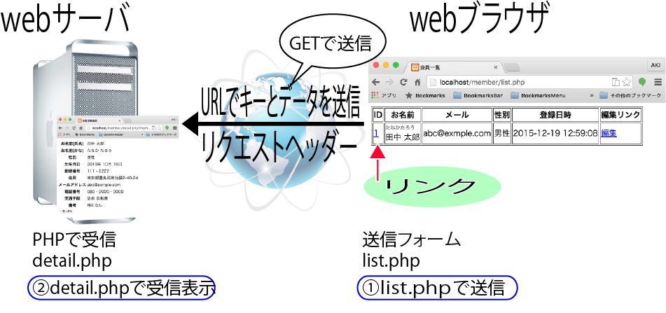

# 会員登録

* [エントリポイント](https://github.com/aki-creatist/smarty/tree/master/project/public)
* [処理の振り分け](https://github.com/aki-creatist/smarty/tree/master/project/php_libs/routes)

# メールを使って本人を確認

* 登録したユーザーにメールを送信して本人確認を行う
* ユーザーがリンクをクリックすることで登録を完了する

## 本人確認メール

### 機能を確認する

* premember.phpファイルは、登録者を確認するために使用する
* 通常は、メールで送信したURLをクリックしてアクセスする
    * しかし、ここでは、`http://localhost/premember.php`に直接アクセス
    * エラー画面に`このURLは無効`と表示されたら成功メール送信を利用する
        * メールの送信準備ができているかを確認。

### 本人確認の仕組み

* 登録時にランダムなパスワードを生成して、仮会員テーブルに登録する同じパスワードとアドレスをURLに追加
* 登録されたアドレス宛メールを送信する受信後、リンクをクリック
* すると、アドレスと本人確認用のパスワードが送信されてDBで照合する
    * 同一の場合、仮会員の情報を会員テーブルへ移動する
    
# メール送信からリンク先の起動まで

* 仮登録者へメールを送る
* premember.phpを起動する
* 有効なリンクの場合
    * テーブルへデータを挿入する
* 無効なリンクの場合
    * エラーメッセージを出力
* 入力を終了する
* 仮登録情報の削除
    * 仮登録情報の削除と会員情報の登録は一連の続いた処理として実行する
* 会員テーブルに登録する

## 登録画面表示までの動作

* 初めて訪問した閲覧者は会員になるための情報を登録画面から登録する
* このデータは仮登録テーブルに登録される処理の流れ
    * ログイン画面の`未登録の方はこちらから登録可能`をクリック
    * すると、`htt://localhost/index.php?type=regist&action=form`へアクセスする
    * index.phpが起動する
    * MemberControllerのオブジェクトが生成される
    * 同時に基底クラスのBaseControllerのコンストラクタが実行される
    * Smartyの準備が整う
    * `run()`が実行される
    
## 詳細画面

