## 作成の手順

* list.phpを作成
* detail.phpを作成
* listからdetailにGETでデータを渡す
* listからdetailでデータを受け取る
* list.phpの処理をユーザー定義関数にまとめる
* detail.phpの処理をユーザー定義関数にまとめる
* list.phpでPDOを使用する
* detail.phpでPDOを使用する
* PDODatabase.class.phpにDB関連の処理をまとめる
* jsファイルを作成し、cart.phpにデータを渡す
* cart.phpを作成する
* select処理のみ
* insert処理のみ
* select処理のみ( プリペアドステートメントver )
* insert処理のみ( プリペアドステートメントver )
* selectにカウント処理を追加する
* selectにdelete処理を追加する
* selectにdelete処理を関数にまとめる
* delete処理にプリペアドステートメントを利用する

### DB

* list.php
    * 一覧表示(表示のみ)
* 詳細表示(表示のみ)
    * 詳細表示(表示のみ)
* cart.php
    * カートの中身(表示のみ)
* cart.php
    * 入力のみ

### 関数とオブジェクト指向

* cart.php
    * カートの処理(select・insert)を関数にまとめる
* cart.php
    * カート内の処理をクラスに分割
* カート内の処理をDatabase.class.phpを外部ファイルに分割
* require_onceで外部ファイルの読み込みを行う
    * cart.php
    * conf.php
    * Database.class.php
    * cart.class.php
* 資料/smartyについて.txt
* smartyの設定

### 5日目~JavaScriptとLinux~

* list.php
    * detail.phpにGETで送信する
* detail.php
    * list.phpからGETで受け取る
* Javascript
* cart.php
    * 削除ボタンからGETで受け取る(表示と削除)

### ７日目~ECサイト開発~

* PDODatabase.class.php
    * cart.phpのDatabase.classをPDO化する
* Cart.class.php
    * cart.phpのPDODatabase.classにプリペアドステートメントを適用する
* list・detail・cartを内の処理をPDOに統合したPDOファイルを作成
    * PDODatabase.class.phpを作成
* セッションを利用する
* セッションを利用する

## 概要

* ECサイトでは商品をカートに入れる必要がある
* ポイントは**誰が何を**買ったのか
* そして必要な機能は以下の３つ
    * 一覧
    * 挿入
    * 削除
* また、ユーザーが知りたい情報としては、以下の２つが挙げられる
    * 合計個数
    * 合計金額
* ソースコードを書き始める前にどのような処理と情報が必要になるのかを概観してみる

### cart.phpの主な処理と情報

```text
$顧客番号を格納した変数の定義
$何を買ったのかを格納する変数の定義
$何を削除するのかを格納する変数の定義

商品を挿入する関数の実行と値の受け取り
商品を削除する関数の実行と値の受け取り
一覧を表示する関数の実行と値の受け取り

合計個数と合計金額を取得する関数の実行と値の受け取り

挿入する関数の定義
{
	挿入する処理
}

削除する関数の定義
{
	削除する処理
}

表示する関数の定義
{
	表示する処理
}

合計個数と合計金額を取得する関数の定義
{
	合計個数を取得する処理
	合計金額を取得する処理
}

HTML部分で表示
```

* 表示処理を行う関数の呼び出しが、挿入や削除よりも後
    * ソースコードは上から順に実行されるため
    * 例えば、表示を先頭に位置させると挿入される前のページを表示してしまう
        * `再度読み込み`を行わなければ挿入が反映されないため
        * また、再度読み込みの際に、挿入処理がもう一度実行された場合、以下のようになる
            * ページに視覚的に反映されていない商品も購入されている状態となる
                * 合計個数や合計金額が見えている商品数と異なってしまう

## 表示処理を追加してみよう

最初に定義する処理は以下の通り

* CRUD
    * 一覧
    * 挿入
    * 削除
* 合計個数
* 合計金額

### 実装

#### 表示処理

* [cart.php](https://github.com/aki-creatist/shopping_cart/blob/feature/001-get/var/www/html/shopping/cart.php)
    * localhost/shopping/cart.phpにアクセス

## 挿入処理
    
* ~~一覧~~
* 挿入
* 削除

* [cart.php](https://github.com/aki-creatist/shopping_cart/blob/feature/004-insert/var/www/html/shopping/cart.php)

## 削除処理の追加してみよう

追加をするのは削除する商品のidを格納する変数、削除処理、そして削除処理の実行部分

* ~~一覧~~
* ~~挿入~~
* 削除   

* [cart.php](https://github.com/aki-creatist/shopping_cart/blob/feature/006-delete/var/www/html/shopping/cart.php)
    * `delete_flg = 0`
        * 表示の検索条件でdelete_flgというカラムの値が1のもののみを表示する
            * つまり、実際にデータを削除しているわけではなく、`見えなくしている`(消したことにしている)

## ショッピングカートページを作成する

* 合計金額を表示
* SQL文で値段の合計を算出する
    * [cart.class.php](https://github.com/aki-creatist/shopping_cart/blob/6a53f0cac176096badbf2be5b9caf2afdcb2480b/var/www/shopping/class/Cart.class.php#L45)

## 補足説明

### 複数の値の受け取り

* 合計個数と合計金額はgetItemAndSumPriceという1つの関数の中で処理をしている
    * そのため、返す値は２つ
    * 複数の値を返すときは以下の書き方で返す

```php
return [値1, 値2];
```

処理結果の値を受け取る側の書き方は以下のようになる

```php
list(値1, 値2);
```

* また、同一の関数内で処理の内容や使用するテーブルは少し異るが、$whereの検索条件のみ同じ
* そのため、合計個数を算出する際にも直前の$whereがそのまま使用可能ので、$whereの定義は一度にまとめてしまう
    * 合計個数の算出部分では省略

### フォーマット

```html
<p>カート内商品数：<?= $sumNum ?>個 合計金額：&yen;<?= number_format($sumPrice, 0)?></p>
```

* `number_format()`を使用
    * 数字をグループ化してフォーマット
* 第二引数の0は`小数点以下の桁数はゼロ`という意味
    * 一覧
    * 挿入
    * 削除

## list.php

* 商品の一覧が表示される
* 右側のカテゴリーは外部ファイルを読み込む
    * [list.php](http://gist-it.appspot.com/github/aki-creatist/HTML/blob/master/shopping/list.php)
    
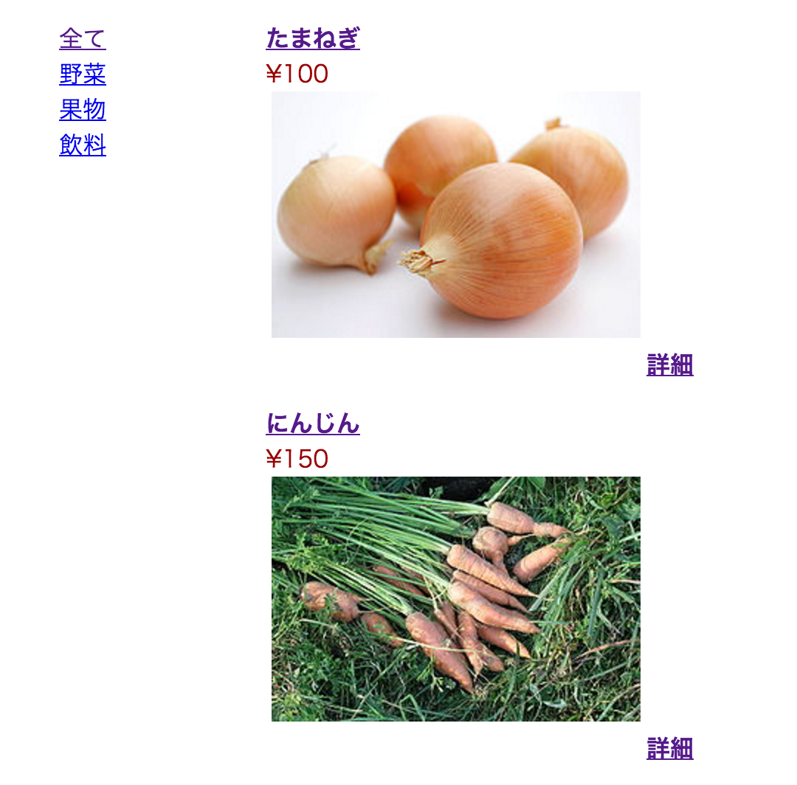

### 概要

外部ファイルの読み込み
* オブジェクト変数の定義
* テンプレート指定
* セッションIDを設定する
* カテゴリーを取得する
* Smartyに値を渡す

### もっとも簡単な形に直す

* 授業前半の知識だけで作成できる内容
* 最初に表示されるページであるため、値を受け取りなどの処理はない
* DBに接続をして表示処理を行う
* この関数は 1 つか 2 つもしくは 4 つのパラメータを受け取る
* パラメータが 1 つだけ渡された場合、 number は千位毎にカンマ `,` が追加され、 小数なしでフォーマットされる
* パラメータが 2 つ渡された場合、number は decimals 桁の小数の前に`.`、千位毎に`,` が追加されてフォーマットされる
* `number_format($変数, 0)`
    * パラメータが２つ、
    * また、`0`を指定している
    * 小数点以下が表示されずフォーマットされている
    
`number_format( $value['price'] )`というように、パラメータを１つにしても反応は同じ

* 詳細ページはまだ作成していないため、リンクを貼らずに「詳細」とだけ表示する

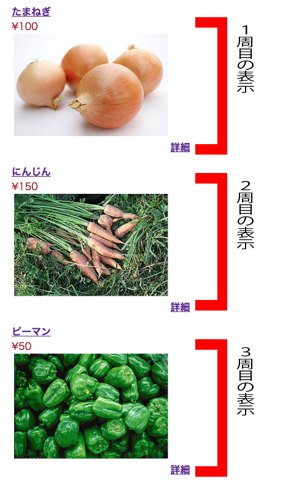

### GETでデータを渡す

* アイテムの名前、写真、詳細のそれぞれにdetail.phpへのリンクを貼る
* クリックされた商品のidをGETでデータを受け渡す
* まずはリンクの最後に「?」で繋ぐ
* `item_id = <?php echo $value['item_id'] ?>`と記述
* このようにすることで、飛び先のdetail.phpのurlに値が渡る
* detail.php側で受け取ったurlの値をもとに、アイテムテーブル内のidを検索条件にして、該当する商品の情報を表示

### detail.phpにリンクを貼る

* [detail.php](https://github.com/aki-creatist/shopping_cart/blob/f494588b37937bba557a6e888c57ede02e1d2c93/var/www/html/shopping/list.php#L47)

## カテゴリーを読み込む

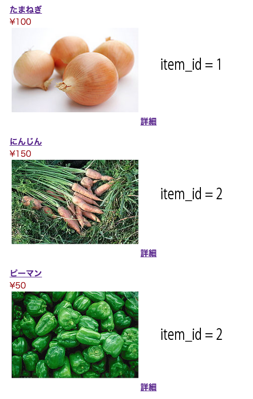

## Smartyの利用

* [list.tpl](https://github.com/aki-creatist/shopping_cart/blob/feature/007-smarty/var/www/smarty/templates/shopping/list.tpl)

## category_menu.php

* [category_menu.php](https://github.com/aki-creatist/shopping_cart/blob/feature/007-smarty/var/www/smarty/templates/shopping/category_menu.tpl)

## detail.php

* 一覧ページ(list.php)から値を受け取り、購入ページ(cart.php)に情報を渡す

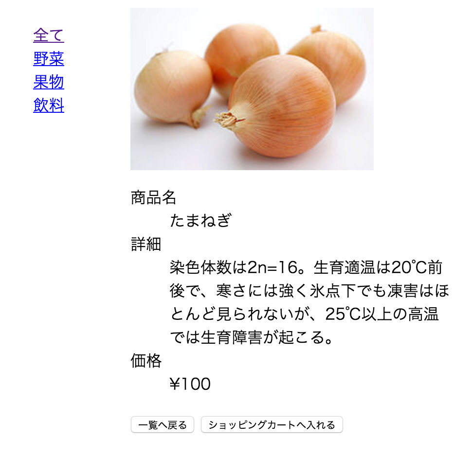

### listとの差異

* item_idを取得する

```php
// item_idを取得する
$item_id = ( isset( $_GET['item_id'] ) === true && preg_match( '/^\d+$/', $_GET['item_id'] ) === 1 ) ? $_GET['item_id'] : '';

// item_idが取得できていない場合、商品一覧へ遷移させる
if ( $item_id === '' ) header( 'Location: http://localhost/shopping/list.php' );
```

```php
// 商品情報を取得する
$itemData = $itm->getItemDetailData( $item_id );
```

## もっとも簡単な形に直す

### 関数を使用せず記述する

* list.phpからの値を受け取り処理が必要
    * DBに接続をして表示処理を行う
* 詳細情報の表示(foreachで展開をしていない)

```html
" alt="<?php echo $itemData[0]['item_name']; ?>" />
```

* `$itemData`のインデックスの`[0]`
    * DBのitemテーブル内の最初のデータを表す
        * 今回の例では、『たまねぎ』に関するもの

```html
<dt>商品名</dt><dd><?php echo $itemData[0]['item_name']; ?></dd>

<dt>詳細</dt><dd><?php echo $itemData[0]['detail'];?></dd>

<dt>価格</dt><dd>&yen;<?php echo number_format($itemData[0]['price'],0);?></dd>
```

* `<DD>`
    * Definition Descriptionの略で、定義の説明を表す
    * `<DT>～</DT>`(Definition Term)に定義する用語を記述
    * `<DD>～</DD>`にその用語の説明を記述
    * これら定義語と定義説明のセットは`<DL>～</DL>`の中に複数並べることが可能

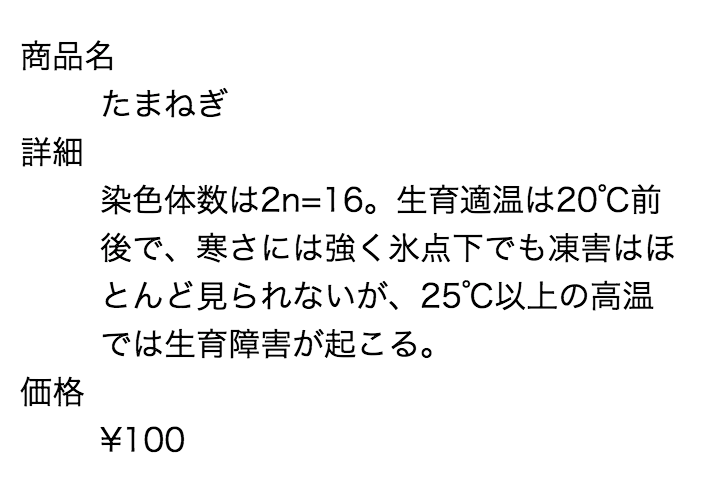

### list.phpからGETでurlを受け取る

#### 値の受け取り

* [detail.php](https://github.com/aki-creatist/shopping_cart/blob/94059ef2b39959a7cba38e4a4f7d6f66ee8e80c0/var/www/html/shopping/detail.php#L14)
    * Pitem_id`に値がセットされている
    * かつ、何桁かの整数
        * `\d`は省略形
            * 任意の 10 進数字を表し`[0-9]`と同じ
                * 正規表現では、`[0-9]`の代わりに`\d`などの省略形を扱える
                * [詳細](http://www.lightship.co.jp/FileVisor6/help/operation/regexp.htm")
        * `+` (プラス)
            * 直前の正規表現の 1 回以上の繰り返しに一致
            * 例: `[0-9]+` と指定した場合、`1`、`13`、`666` のいずれにも一致
* $item_idにGETで受け取った値(`url`の`?`以降)をセットしなさいの意味

### item_idが空の場合の処理

* detail.phpをurlで直接指定されても表示しない処理
    * idを検索条件に指定してテーブルからデータを検索して表示できる場合のみ、detail.phpを表示可能にする
    * 前回までは、GETによる値の受け取りの処理を記述していない
        * デフォルトで『たまねぎ`item_id = "1"`を表示させていた
        * 今回は、item_idがからの場合には、再びlist.phpを表示するという処理に変更
* [detail.php](https://github.com/aki-creatist/shopping_cart/blob/94059ef2b39959a7cba38e4a4f7d6f66ee8e80c0/var/www/html/shopping/detail.php#L17)

### item_idを検索条件に指定する

* [detail.php](https://github.com/aki-creatist/shopping_cart/blob/94059ef2b39959a7cba38e4a4f7d6f66ee8e80c0/var/www/html/shopping/detail.php#L19)

### SQL文を変数を使って組み立てる

* `$col`という形でまとめる

### JavaScriptファイルの読み込み</dt>

* [detail.php](https://github.com/aki-creatist/shopping_cart/blob/94059ef2b39959a7cba38e4a4f7d6f66ee8e80c0/var/www/smarty/templates/shopping/detail.tpl#L4)
* 一覧へ戻る」ボタン、「ショッピンカートへ入れる」ボタンが押された際のページ遷移にはjavascriptを利用する
    } HTMLヘッダー内で読み込みを行う

### ボタン操作にjavascriptを使用する

* [detail.php](https://github.com/aki-creatist/shopping_cart/blob/94059ef2b39959a7cba38e4a4f7d6f66ee8e80c0/var/www/smarty/templates/shopping/detail.tpl#L22)
    * `onlick=""`には`history.back()`と`cart_in`が指定されている
    * ご覧の通り、イベント属性の値には、JavaScriptなどのスクリプトを指定
    * 要素にこの属性を指定しておくと、その要素が特定の状態になった時に、値に指定したスクリプトが実行される
    * `history.back()`はブラウザの『前へ戻る』と同様の動き
        * `return false;`は、今回は本来は不要
        * こちらは、aタグを使用したhistory.back()の場合に必要となる
    * 例
        * こちらのリンクをクリックするとアラートが表示されたのちに、ページの上部に飛んでしまう
            * `<a href="#" onclick="alert('クリックされた後にページ上部に戻ってしまう');">クリック</a>`
        * 以下は`return false`で親要素へのバブリングとaタグの機能を無効化してあるため戻らない
            * `<a href="#" onclick="alert('クリックされた後も戻らない');return false">クリック</a>`

### ボタンを作成する

* javascriptを無効化しているユーザーに対応するには、
    * aタグでリンクを用意する前のページにリンクさせる
    * inputタグでボタンを作成し、aタグで囲むことでリンクをつける
* preventDefault();
    * 親要素へのバブリング（伝達）を保ちながら、aタグのリンク機能を無効化する
    * [詳細](http://qiita.com/mwtonbel/items/f3c6e2373c348ea74b19)
        * aタグの無効化 - preventDefaultとreturn falseの違

以下のイベント属性が定義されている

* `onclick=""`
    * 要素の上でクリックされた時<
* `ondblclick=""`
    * 要素の上でダブルクリックされた時
* `onmousedown=""`
    * 要素の上でマウスのボタンが押し下げられた時
* `onmouseup=""`
    * 要素の上でマウスのボタンが放された時
* `onmouseover=""`
    * 要素の上にカーソルが重なった時
* `onmousemove=""`
    * 要素の上でカーソルが移動した時
* `onmouseout=""`
    * 要素の上からカーソルが離れた時
* `onkeypress=""`
    * 要素の上でキーが押されて放された時
* `onkeydown=""`
    * 要素の上でキーが押し下げられた時
* `onkeyup=""`
    * 要素の上でキーが放された時
* `onload=""`
    * 文書の読み込みが完了した時
* `onunload=""`
    * 他の文書に移動して現在の文書が消える時
* `onfocus=""`
    * 要素がフォーカスされた時
* `onblur=""`
    * 要素がフォーカスを失った時
* `onsubmit=""`
    * フォームが送信される時
* `onreset=""`
    * フォームがリセットされる時
* `onselect=""`
    * 入力欄のテキストが選択された時
* `onchange=""`
    * フォーカスを失う際に値が変化していた時

## detail.tpl

* [detail.tpl](https://github.com/aki-creatist/shopping_cart/blob/feature/007-smarty/var/www/smarty/templates/shopping/detail.tpl#L22)

## Cartクラス

* `insert()`はPDODatabase.class.phpで作成
* 変数$customer_noはcart.phpで代入

### cart.php

* 購入商品が追加される
    * 商品の詳細ページ(detail.php)で購入ボタンが押された商品がこちらのページに追加される

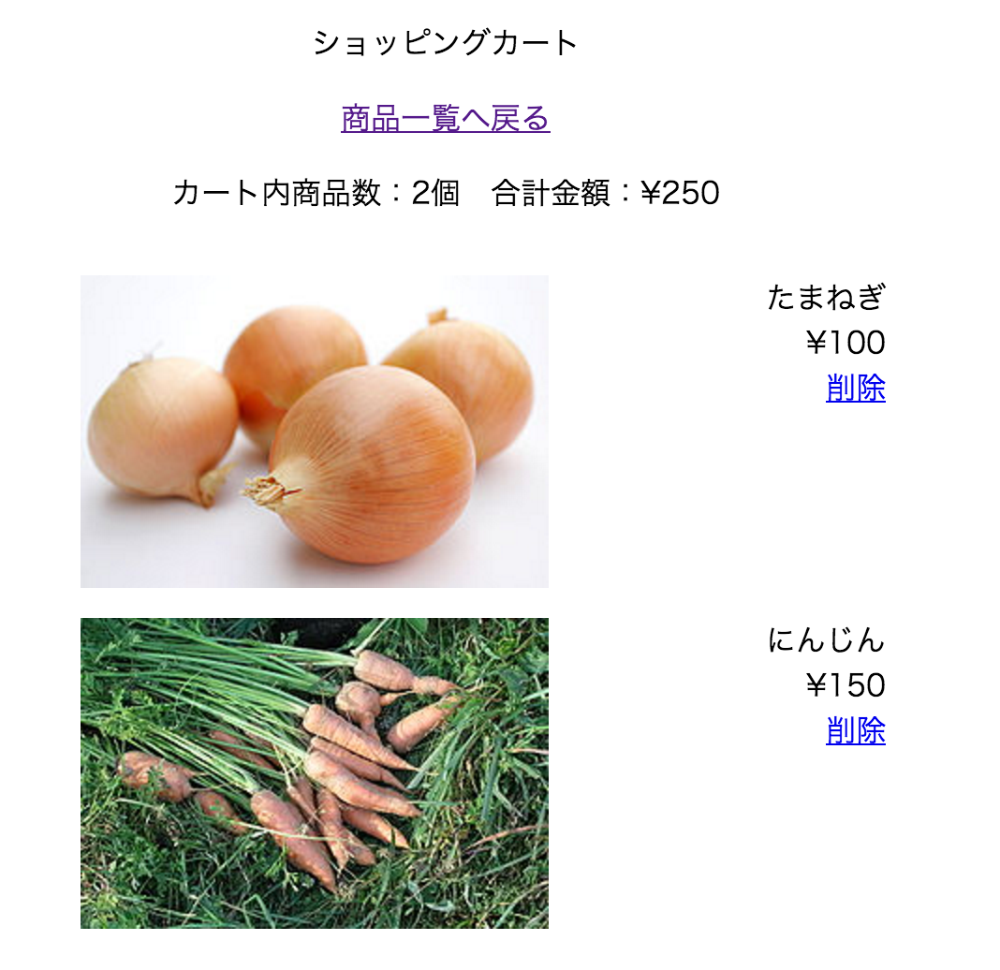

## 主な処理

* item_idを取得と登録
    * [item_idを取得する](https://github.com/aki-creatist/shopping_cart/blob/94059ef2b39959a7cba38e4a4f7d6f66ee8e80c0/var/www/html/shopping/cart.php#L15)
    * [item_idが設定されていれば、ショッピングカートに登録](https://github.com/aki-creatist/shopping_cart/blob/94059ef2b39959a7cba38e4a4f7d6f66ee8e80c0/var/www/html/shopping/cart.php#L21)
* [crt_idを判定する](https://github.com/aki-creatist/shopping_cart/blob/94059ef2b39959a7cba38e4a4f7d6f66ee8e80c0/var/www/html/shopping/cart.php#L19)
    * `$crt_id`はcart.tpl内の削除リンクが押された場合に送られてくる情報
    * アンカータグのURLでGETで送信している
* [crt_idが設定されていれば、削除する](https://github.com/aki-creatist/shopping_cart/blob/e1e0995e8206cba8ab891b208100ba43181a01ef/var/www/html/shopping/cart.php#L33)
* カート情報を取得する
* cart.tpl内でforeachで展開をし、表示を行う
* [カート情報を取得する](https://github.com/aki-creatist/shopping_cart/blob/e1e0995e8206cba8ab891b208100ba43181a01ef/var/www/html/shopping/cart.php#L39)
* [アイテム数と、合計金額を取得](https://github.com/aki-creatist/shopping_cart/blob/e1e0995e8206cba8ab891b208100ba43181a01ef/var/www/html/shopping/cart.php#L36)

## もっとも簡潔な形に直す

### 関数を使用せず記述する

* 値を受け取り、表示・挿入・削除の処理を記述

### 購入者を指定する

* セッションを使用することで、customer_noを自動挿入することが可能
    * だが、ここでは購入者番号を`"1"`(文字列)と指定して進める

```php
$customer_no = "1";
```

### item_idを取得する

* [item_idを取得する](https://github.com/aki-creatist/shopping_cart/blob/e1e0995e8206cba8ab891b208100ba43181a01ef/var/www/html/shopping/cart.php#L18)

### cart_idを取得する

* cart_idは削除処理で必要となる
* 削除処理を作成するまで使用しませんが、空で定義

```php
$cart_id = ( isset( $_GET['crt_id'] ) === true) ? $_GET['crt_id'] : '';
```

### select・insert関数の作成

* insCartData<td>挿入に使用するデータを配列にセットする
* $customer_no,$item_id
* $insData
* insert
* DB接続と、sql文の組み立て＆実行
* $table,$insData=array()
* $res
* select<td>DB接続と、実行
* $table, $column, $where, $arrVal
* $data
* getSql<td>selectを実行する場合に変数に値を代入する<br>select文の組み立て
* $type,$table,$where='',$column=''
* $sql
* getCartData<td>insertを実行する場合に変数に値を代入する
* $customer_no
* select( $table, $column, $where, $arrVal )

## select関数のみ定義

### 表示~select~

* detail.phpと差異なし
    * 引数の中身に差異があり
    * それぞれの変数の中身はgetCartDataで定義

```php
function select( $table, $column ='',$where = '', $arrVal = array())
```

### 表示~getSql~

* [getSql](https://github.com/aki-creatist/shopping_cart/blob/e1e0995e8206cba8ab891b208100ba43181a01ef/var/www/shopping/class/PDODatabase.class.php#L51)
* 外部から入ってきた$columnを、$columnKeyに入れ直す
* 検索条件を組み立てる
* select文を組み立てる

### 表示~getCartData~

* ポイントはリレーションを用いたSQL
* [Cart.class.php](https://github.com/aki-creatist/shopping_cart/blob/8a68484f06e6971d345db108c0bf2a423ceaf1f0/var/www/shopping/class/Cart.class.php#L21)

```php
SELECT
//    c.crt_id,
//    i.item_id,
//    i.item_name,
//    i.price,
//    i.image ';
//FROM
      cart c
  LEFT JOIN
      item i
  ON
      c.item_id = i.item_id  ';
//WHERE
//    c.customer_no = ? AND c.delete_flg = ? ';
```

* 「cart」テーブルに、「 c 」という略称を付ける</li>
* 「item」テーブルに、「 i 」という略称を付ける</li>
* 「cart」テーブルと「item」テーブルに共通の「item_id」でテーブルをつなぐ</li>

つまり、表示するテーブルはcartテーブル+itemテーブル

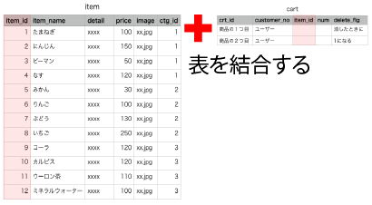

次に表示させるカラムについて

```php
SELECT
      c.crt_id,
      i.item_id,
      i.item_name,
      i.price,
      i.image ';
FROM
//      cart c
//  LEFT JOIN
//      item i
//  ON
//      c.item_id = i.item_id  ';
//WHERE
//    c.customer_no = ? AND c.delete_flg = ? ';
```

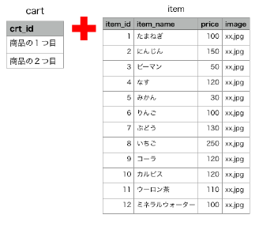

* 最後にWHERE句
* 検索条件を指定する箇所

```php
SELECT
//      c.crt_id,
//      i.item_id,
//      i.item_name,
//      i.price,
//      i.image ';
FROM
//      cart c
//  LEFT JOIN
//      item i
//  ON
//      c.item_id = i.item_id  ';
	WHERE
	    c.customer_no = 1 AND c.delete_flg = 0 ';
```

* 検索条件には今回はcustomer_noには１を指定している
    * `１`を入れている
* delete_flgは、データベース上で削除処理が行われた際に`delete_flg`は`0`から`1`に変わる
* これを指定しないと`削除したデータ`まで表示されることになる
    * のちにプリペアドステートメントを使用する際にはこちらの値は`?`が入る

### insert関数のみ定義

#### 挿入処理の記述

* ユーザー定義`insCartData`
* `$customer_no`と`$item_id`を使用している
    * 挿入する内容
        * **誰**が**何**を買ったのか
* `customer_no`と`item_id`をDBに挿入する
    * $insDataに配列で挿入し、関数「insert」に渡す
* [Cart.class.php](https://github.com/aki-creatist/shopping_cart/blob/8a68484f06e6971d345db108c0bf2a423ceaf1f0/var/www/shopping/class/Cart.class.php#L12)

### プリペアドステートメントを適用(1)

#### プリペアドステートメント(select)

* select文では、`customer_no`と`delete_flg`にプリペアドステートメントを利用
    * 後にカウント文でも利用する
        * 現段階では以上の２箇所のみ
* `c.customer_no`と`c.delete_flg`の値に`?`を配置
* 次に、実際に入力される値を準備
* [Cart.class.php](https://github.com/aki-creatist/shopping_cart/blob/379b01148b491c12494748c39fe8245e1e911a5a/var/www/shopping/class/Cart.class.php#L25)

上のSQL文は、下記のように組み立てられている

```php
	//SELECT
	//    c.crt_id,
	//    i.item_id,
	//    i.item_name,
	//    i.price,
	//    i.image ';
	//FROM
	//    cart c
	//LEFT JOIN
	//    item i
	//ON
	//    c.item_id = i.item_id  ';
	//WHERE
	//    c.customer_no = ? AND c.delete_flg = ? ';
```

* select関数の中で、$sql(`?`が使用されたもの)と、$arrVal (実際の値が入ったもの)を結びつける

```php
$stmt = $dbh->prepare($sql);
$stmt->execute($arrVal);
```

## カウント処理

* 商品数と料金を自動的に計算させる処理を追加

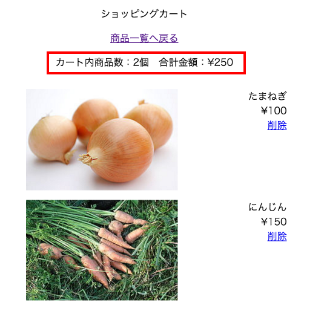

* 記述の順序
* 順序は、以下のhtml内の$sumNumと$sumPriceに計算した値を挿入する
* ３行目のcountはユーザー定義の関数ではなく、組み込みの関数
* そのため、新たにカウント処理の関数を作成する際に`count`という名称を使用するとエラー
    * `Fatal error: Cannot redeclare count()`
* html内のcountは配列の中の要素の数を数える通常の使用方法

```html
<p>カート内商品数：<?php echo $sumNum ?>個　合計金額：&yen;<?php echo number_format($sumPrice,0)?></p>
<?php if( count( $dataArr ) === 0){ ?>
```

### 合計個数を算出する~COUNT文~

* `count`関数を定義
    * 今回はこのcounts関数は使用しなくても動く
        * `count`文の作成の仕方の参考用
* [count](https://github.com/aki-creatist/shopping_cart/blob/379b01148b491c12494748c39fe8245e1e911a5a/var/www/shopping/class/PDODatabase.class.php#L52)
* sql文でカラムは、select文で使用するカラムを作成
* COUNT文では`SELECT AS COUNT(*)`とすることで、テーブル内のデータの個数を算出可能

```php
case 'counts':
    $columnKey = 'COUNT(*) AS NUM ';
    break;
```

* また以下のように、`AS ~ `とすることで、`カラムの名称を指定`可能
* 指定がない場合には、COUNT(*)というカラム名で表示される

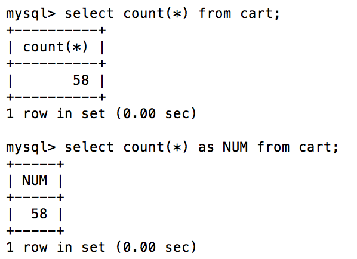

```html
<p>カート内商品数：<?php echo $sumNum ?>個　合計金額：&yen;<?php echo number_format($sumPrice,0)?></p>

<?php if( count( $dataArr ) === 0){ ?>
```

## アイテム数と合計金額を取得する

### アイテム数

* cartテーブルのうちのnumカラムの個数を算出
* [アイテム数を算出](https://github.com/aki-creatist/shopping_cart/blob/379b01148b491c12494748c39fe8245e1e911a5a/var/www/shopping/class/Cart.class.php#L56)

### 合計金額

* `i.price`(itemテーブルのpriceカラム)の値の合計を算出
* [合計金額](https://github.com/aki-creatist/shopping_cart/blob/379b01148b491c12494748c39fe8245e1e911a5a/var/www/shopping/class/Cart.class.php#L46)

## delete処理を追加する

* SELECT文で購入商品を表示したら、各商品の横の『削除』に機能追加
* プリペアドステートメントで、削除に関するSQL文をあらかじめ用意

## UPDATE文

* 今回の手順の最終目的はテーブルに対して以下の形式で命令を与えること
* `UPDATE cart SET delete_flg =1 WHERE crt_id ="HTML`から受け取る`cart_id"`
* UPDATE文は表にすでにあるレコードの更新に使用する

```sql
UPDATE	表名
SET	列名 = 値,列名 = 値...
WHERE	条件
```

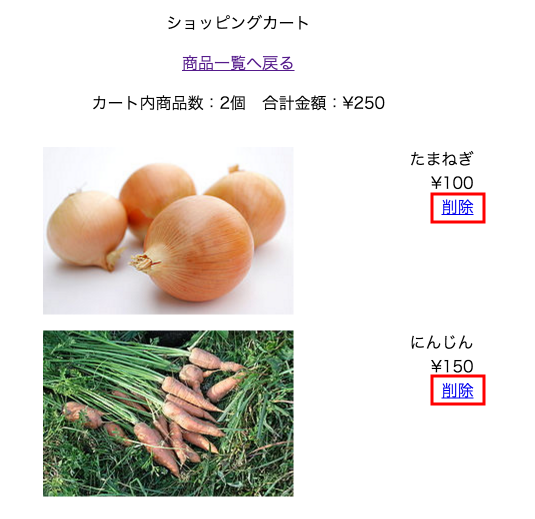

### 削除処理を関数にまとめる

#### cart_idをGETにより送信

* HTMLの削除ボタンに、cart_idのデータを付加

```html
<a href="http://localhost/cart.php?crt_id=<?php echo $value['crt_id'] ?>">削除</a>
```

#### crt_idの取得

* HTMLの削除ボタンからcrt_idを受け取り、$cart_idの中に挿入

```php
$crt_id = ( isset( $_GET['crt_id'] ) === true && preg_match( '/^\d+$/', $_GET['crt_id'] ) === 1 ) ? $_GET['crt_id'] : '';
```

#### 削除処理を行う

* `delCartData`関数を使用し、削除処理を追加

```php
    // crt_idが設定されていれば、削除する
    if ( $crt_id !== '' ) {
        $res = delCartData( $crt_id );
    }
```

## 削除処理にプリペアドステートメントを適用(2)

### プリペアドステートメント(delete)

* プリペアドステートメントの利用
    * SQL文を$sqlとして以下の形式で準備

```php
UPDATE cart SET delete_flg =? WHERE crt_id = ?
```

* この命令に、実際の値を受け取り、結びつける

```text
array(2) { [0]=> int(1) [1]=> string(1) "HTMLから受け取るcart_id" }
```

* 削除処理を追加
    * $arrWhereValには、delCartData関数の処理により、削除する商品のIDが挿入されている
        * var_dumpすると`array(1) { [0]=> string(2) "58" }`のように表示される
        * ここでの"58"とは削除ボタンが押された商品の`cart_id`
        * `insDataVal`
            * `getPreparedStatement`関数
            * `$insData = array( 'delete_flg'=> 1 );`
                * `delete_flg => 1`という連想配列を、`array_values`関数により通常の配列に変換したもの
                * `array(1) { [0]=> int(1) }`といった結果を返す
            *  `array_merge`は配列を結合する関数
            * 結合された結果である`$updateData`を`var_dump`
                * `array(2) { [0]=> int(1) [1]=> string(2) "58" }`
            * SET以降の`$preSt`には、`?`がセットされる
* [update](https://github.com/aki-creatist/shopping_cart/blob/379b01148b491c12494748c39fe8245e1e911a5a/var/www/shopping/class/PDODatabase.class.php#L111)

### カートの情報を削除する

* [delCartData](https://github.com/aki-creatist/shopping_cart/blob/379b01148b491c12494748c39fe8245e1e911a5a/var/www/shopping/class/Cart.class.php#L32)

### 削除ボタンにリンクを貼る

```php
<li><a href="http://localhost/shopping-cart-delete-prepare/cart.php?crt_id=<?php echo $value['crt_id'] ?>">削除</a></li>
```

### プリペアドステートメント

* `$insData`には削除ボタンが押された商品のcart_idが入っている
* `array_keys`関数により、キー部分のみが配列化されている
    * `array(1) { [0]=> string(10) "delete_flg" }`
* count関数で`$insDataKey`の配列の要素数を数えると`int(1)`という結果が返る
    * 繰り返し構文で`0~1`まで、`$arrPreSt`の中に挿入していく
* `arrPreSt`を`var_dump`
    * `array(1) { [0]=> string(14) "delete_flg =? " }`
* 次に、implode
    * `string(14) "delete_flg =? "`
    * 配列ではなくなっている点に注意
* 最後に、`array($preSt, $insDataVal)`で返す
* 書き換える
    * `array("delete_flg =?", 1 )`となる
* [getPreparedStatement](https://github.com/aki-creatist/shopping_cart/blob/379b01148b491c12494748c39fe8245e1e911a5a/var/www/shopping/class/PDODatabase.class.php#L127)

