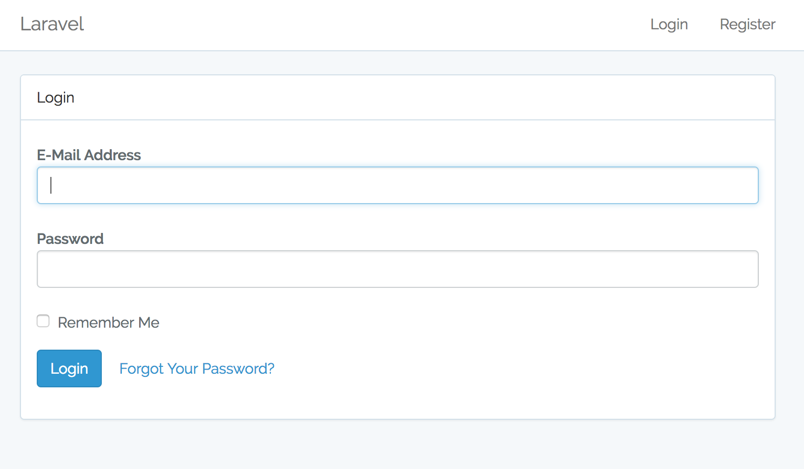
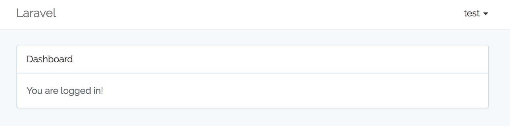
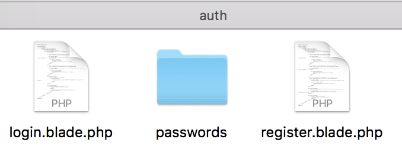
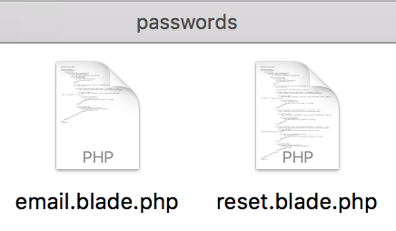
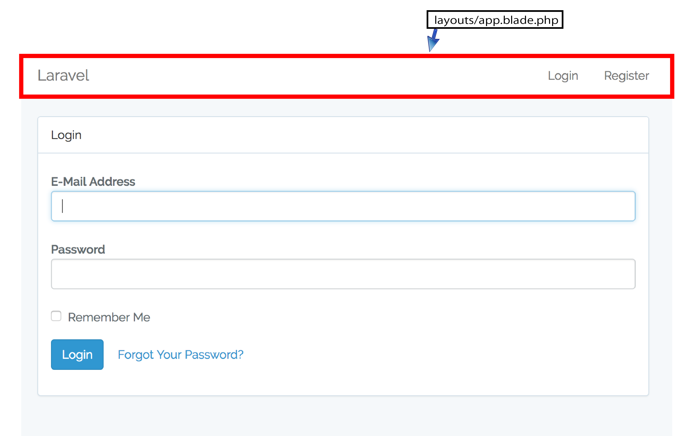
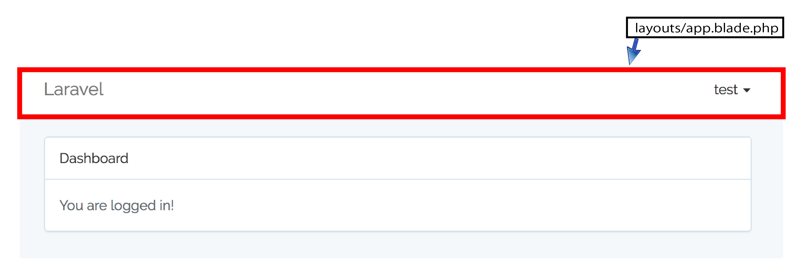

# ログイン認証

ユーザーのサインイン・ログイン認証機能を設置

### ログイン認証を設置

```bash
#ログイン認証の設置
php artisan make:auth
#ログイン認証機能のデータテーブルを作成
php artisan migrate
```

* /routes/web.phpの最下行に以下の２行が追加されている

```diff
+ Auth::routes();        // 認証機能を使用する
+ Route::get('/home', 'HomeController@index')->name('home'); // 追加されたファイル
```

コントローラにHomeController.phpが追加され、以下の内容となっている

[HomeController](HomeController.php)

### 確認

* URLに/homeを追加して確認してみる
* http://localhost:8000/home



* ログイン画面が表示されれば正常な動作
* ログインしてない状態で、/homeを表示する
    * `ログインしてください`と催促し、ログイン画面が表示される
    * また、他のページにはログイン制御処理をしていない
        * 今まで通り表示できていることを確認する
* 画面右上には`Register`という項目がある
* ここをタップすると会員登録可能
* 試しに登録を完了してみる
    * ユーザー名`test`
    * アドレス `test@gmail.com`
    * パスワード`testtest`
* 登録が完了すると以下のような表示がされる



### Migration初期データ

* 画面から会員登録をする際に、データはどこに保存されるか
* 実はLaravelインストール直後の初期状態でdatabase/migrations/以下に２つのマイグレーションファイルが配置されている
    * 2014_10_12_000000_create_users_table.php
    * 2014_10_12_100000_create_password_resets_table.php
        * 日付の部分は異なる
* CLIから$ php artisan migrateを実行した際に、usersテーブルとpassword_resetsボタンが作成された
* MySQLからテーブルとデータを確認

```sql
mysql -u root -p

use project;
show tables;        // テーブルが作成されていることを確認
desc users;        // usersテーブルの構造を確認
desc password_reserts        // password_resertsテーブルの構造を確認
select * from users;        // 先ほど登録した情報が格納されていることを確認
select * from users;        // この時点ではまだ空であることを確認
```

* もし、これより以前にこの２つのテーブルを`不要なテーブル`と判断して削除してしまった方
    * もう一度マイグレーションファイルを実行する
* しかし、一度実行したマイグレーションファイルを再実行不可
* ファイル名の日付を変更すれば、実行可能

```text
2014_10_12_000000_create_users_table.php
↓日付部分を変更
2014_10_12_000001_create_users_table.php
```

```bash
#再実行する
php artisan migrate
```

```text
Migrating: 2014_10_12_000001_create_users_table
Migrated:  2014_10_12_000001_create_users_table
Migrating: 2014_10_12_100001_create_password_resets_table
Migrated:  2014_10_12_100001_create_password_resets_table
```

### 登録後の表示ページを変更する

* 新規登録後の画面が`登録/一覧画面`になるよう変更を加える

```bash
vim routes/web.php
```

```diff
- Route::get('/home', 'HomeController@index')->name('home');
+ Route::get('/home', 'PersonsController@index')->name('home');
```

### ビューに追加されたログイン認証ファイルを確認

* ビューに追加されたauthフォルダ一式はログイン認証用



* login.blade.php
* register.blade.php



#### 画面ファイル

ログイン画面とログイン後の画面

* [resources/views/auth/login.blade.php](https://github.com/aki-creatist/Laravel5/blob/persons-auth/resources/views/auth/login.blade.php)
* [resources/views/auth/register.blade.php](https://github.com/aki-creatist/Laravel5/blob/persons-auth/resources/views/auth/register.blade.php)





両画面ファイルどちらもレイアウトファイルは`layouts/app.blade.php`

* [resources/views/layouts/app.blade.php](https://github.com/aki-creatist/Laravel5/blob/persons-auth/resources/views/layouts/app.blade.php)

app.blade.phpの内容は以下

resources/views/layouts/app.blade.php

```html
@if (Auth::guest())  // guest()の返り値がfalseの場合
Login  Register      // falseならLoginとRegisterを表示する
@else                // true( 認証済み )なら以下をトップバーに表示
 {{ Auth::user()->name }} Logout {{ csrf_field() }} 
@endif 
```

### 全ページに適用する

* 他のページもログイン認証後にだけ表示するように変更
* `__construct()`を追記
    * これで他のページもログイン認証しなくては閲覧できなくなる

```bash
vim app/Http/Controllers/PersonsController.php
```

```diff
+ public function __construct()
+ {
+     $this->middleware('auth');
+ }
```

### ログイン認証したユーザーの情報を取得

* ログインユーザーの情報取得の記述式

```php
Auth::user()->プロパティ名;
```

* テンプレート側のログインユーザーの情報取得の記述例

```html
<td>id : {{ Auth::user()->id }}</td>
<td>{{ Auth::user()->name }}さん</td>
<td>登録日時 : {{ Auth::user()->created_at }}</td>
```

* コントローラ側のログインユーザーの情報取得して利用する記述例

```php
use Auth; // 認証モデルを使用する(他のuseを記述している箇所の下に記述)
...
// 使用例１
$auth = Auth::user()->id; // $authに「id」値のみ代入する方法
// 使用例２
$auths = Auth::user(); // $authsに「id,name,,,etc」の複数値をまとめて代入する方法

// テンプレート側で「$auths->プロパティ名」で値取得が可能
return view( 'persons', [ 'persons' => $persons, 'auths' => $auths ] );
```
