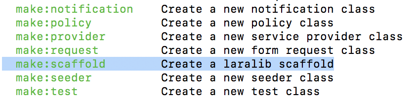

# CRUD自動生成
    
## Scaffold

Scaffoldはベースとなるプログラムを自動生成する仕組み

### Scaffoldを使えるようにする

```bash
#プロジェクトフォルダに移動
cd プロジェクトフォルダ
#composerでScaffoldを使えるようにする
composer require 'laralib/l5scaffold' --dev
```

#### scaffoldをプロバイダーに追加

```bash
vim config/app.php
```

```diff
+ Illuminate\Validation\ValidationServiceProvider::class,
+ Illuminate\View\ViewServiceProvider::class,
+ Laralib\L5scaffold\GeneratorsServiceProvider::class,  // ←ここに追加
```

```bash
#scaffoldが追加されたことを確認
php artisan
```



### エラーが出た場合

上記の手順で行っても、以下のようなエラーが出ることがある

```text
[Symfony\Component\Debug\Exception\FatalErrorException]         
  Trait 'Illuminate\Console\AppNamespaceDetectorTrait' not found 
```

* プロジェクトフォルダのcomposer.jsonのrequire-devに以下の追記

```diff
  "require-dev": {
+     "laralib/l5scaffold": "dev-master",
  },
```

```bash
composer update
```

* 前の手順の影響で"laralib/l5scaffold":の記述がある
* その場合には、右側を"dev-master"に変更

### scaffold実行

```bash
php artisan make:scaffold Task --schema="title:string, price:integer,body:text,published:datetime"
```


### 作成されたファイル

以下のファイルが作成される


### ルートを書き込む

```bash
vim /routes/web.php
```

```diff
+ Route::resource("tasks", "TaskController");
```

### テーブルを作成する

* テーブルを作成するこれまでの手順でマイグレーションファイルはすでに作成されている
    * migrateを実行する場合、migrate実行でtasksテーブルが作成される

```bash
php artisan migrate
```

### 画面で確認する

http://localhost:8000/tasksに接続すると以下の画面が確認可能


以下が情報の追加画面


* 追加をしてみるとエラーとなる
* インサート文が正しくないという意味のエラー


仕方ないので、SQLを直に挿入し情報を入れてから確認

```sql
insert into `tasks` (`title`, `body`, `published`,  `price`) values ("test", "test body", "2017-06-06 21:20", 1000);
```

すると以下のようにデータベースの内容が参照可能なのがわかる


