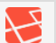
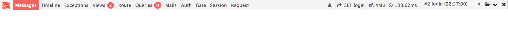

# デバッグバー

## インストール

composer.jsonに一行追記し、composer updateする

```json
    "require-dev": {
        "fzaninotto/faker": "~1.4",
        "laralib/l5scaffold": "dev-master",
        "barryvdh/laravel-debugbar" : "dev-master",
        "mockery/mockery": "0.9.*",
        "phpunit/phpunit": "~5.7"
    },
```

## 設定

### comfig/app.php

* providers, aliacesに下記を記述する

```diff
  'providers' => [
     ...
+    Barryvdh\Debugbar\ServiceProvider::class,
  ],
  'aliaces' => [
      ...
+     'Debugbar' => 'Barryvdh\Debugbar\Facade',
  ],
```

### .env

* 以下の箇所がtrueになっていることを確認
* falseの場合にはtrueに変更する

```php
APP_DEBUG=true
```

## 動作を確認する

ページの左下に下記の画像のようなアイコンがある



これをクリックするとデバッグ用のバーが現れる



## 記述方法

* コントローラ内で使用する場合には下記の一行をコントローラに追記する
    * これで`debug()`が使用可能になる

```php
//app/Http/Controllers/xxxxControllers.php
debug( $変数 );
```