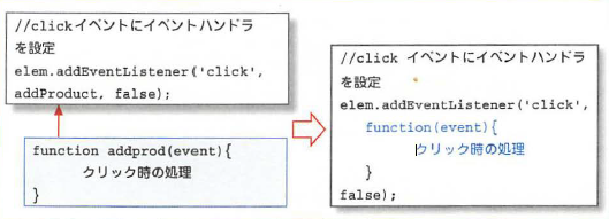
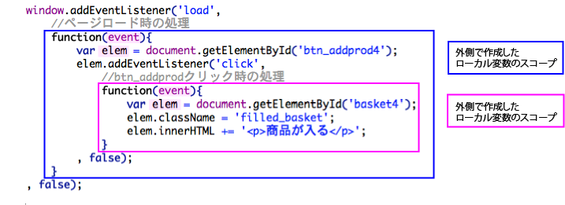
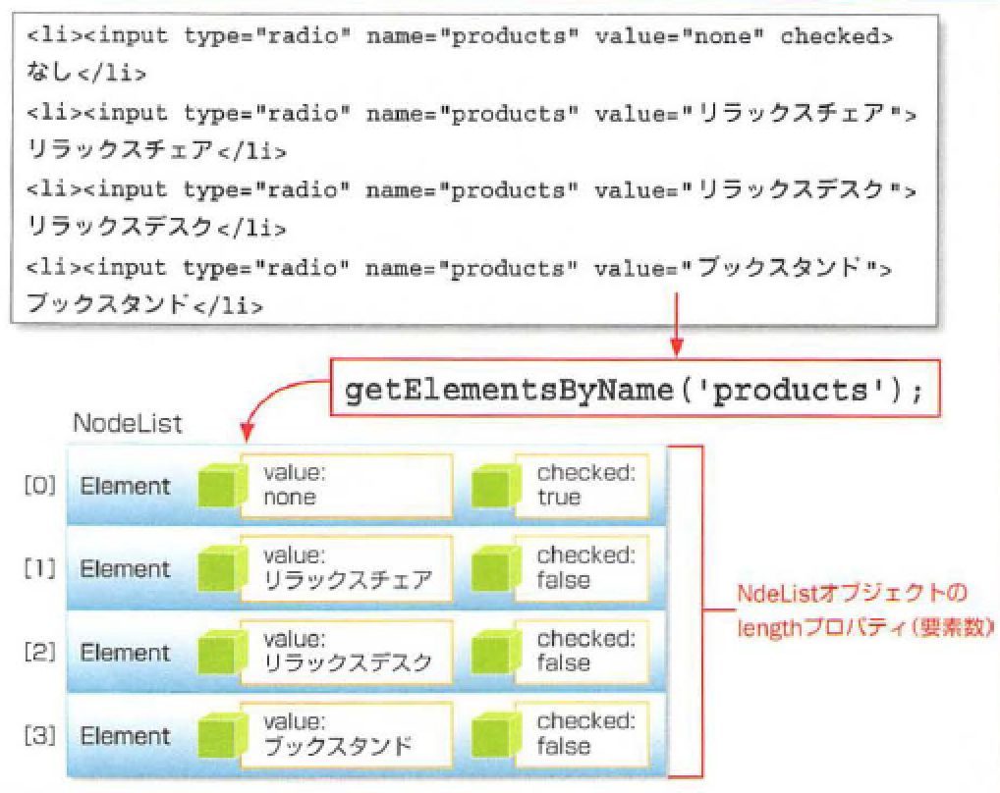

# 無名関数を利用する

* 無名関数を使って、イベント関連のコードをよりシンプルに記述する
* まずは、addEventListenerメソッドを使用したコードを確認

## after(addProduct関数を無名関数にする)

* addProduct関数の定義を２つ目のaddEventListener内の第二引数の部分に移動し、関数名を削除する

## イベントハンドラに無名関数を使用する

* 関数には、コードに名前をつけて、なんども呼び出して使えるというメリットがある
* しかしイベントハンドラにする関数は一度しか呼び出さない
    * 名前をつける意味がない
* また、イベントとイベントハンドラを関連付ける部分とイベントハンドラ自体の記述が分かれている
    * 関連するコード全体が把握しにくくなるという欠点もある
* こういうときに使うと便利なのが「無名関数」
    * 無名関数では、function文の後に関数名を書かずに関数の定義を書く
    * イベントハンドラの指定に用いた場合は、不要な関数名を書くことを避けられる
    * 特定のイベントに関する処理をまとめて書くことができる



* 書き方やメリットはわかっても、なぜこんなことができるのか
* 関数の定義は「Functionオブジェクト」のインスタンスであり、それを変数に代入したものであるため
* そして、function文にはFunctionインスタンスを作る働きがある
* 「function 関数名(引数)」のように関数名を指定した場合は、関数名の変数を作成して、そこにFunctionインスタンスを代入するします。
* 関数の定義を、一般的なオブジェクトのインスタンス作成のように書くと、次のようになる

```js
//Functionインスタンスを作成して変数addProductに代入
var addProduct = function(event){
	クリック時の処理
}
```

* つまり、名前付き関数と無名関数の違いは、作成したインスタンスをいったん変数に入れてから引数にするか、引数の部分に直接インスタンスの作成を書くかの違い
* なお、あまり使われませんが、new演算子を使って、次のように書いて関数を定義することも可能
    * Functionがオブジェクトであることがイメージしやすい

```js
var addProduct = new Function(e, 'クリック時の処理');
```

* イベント処理には必ず無名関数を使うべきだとは限らない
* 無名関数内で実行する処理が長い場合や、無名関数の中にさらに無名関数を書くような場合、コードがかなり見にくくなる
* 状況に応じて、名前付き関数を使う方法と、無名関数を使い分けるようにする

## 無名関数内のローカル変数のスコープ

* 以前、関数内で作成したローカル変数は、その関数の中でしか通用しないと
* 無名関数の場合も、その中で作成したローカル変数は、外側にある関数のローカル変数とは別になる
    * 引数もルールは同じ
* 変数の有効範囲のことを「スコープ」といい、ローカル変数と引数のスコープは次のようになる



* それぞれの無名関数で作成しているローカル変数elemと引数eventは全く別のもの
    * 内側の無名関数のelemに代入しても、それは外側のelemには影響がない
* ただし、ローカル変数を「作成していない」場合は、内側の無名関数から外側の関数のローカル変数にアクセス可能

## まとめ

* 関数名をつけずに定義した関数を「無名関数」と呼ぶ
* 内側の無名関数でローカル変数を作成した場合、外側の関数に同名のものがあっても、別の変数となる
* 内側の無名関数から、外側の関数のローカル変数にアクセス可能

## 様々なコントロールから値を取得する

## before(classをfilled_basketに変えるだけ)

```js
window.addEventListener('load',
    //ページロード時の処理
    function(event){
        var elem = document.getElementById('btn_addprod');
        elem.addEventListener('click', addProduct3, false);
    }
, false);
//btn_addprodクリック時の処理
function addProduct(event){
    var basket = document.getElementById('basket');
    basket.className = 'filled_basket';
}
```

## after(実際に商品を挿入する)


## オプションボタンから選択値を取得する

* input要素のtype属性に「option」を指定すると、オプションボタンになる
* HTML上での使用方法は、複数のオプションボタンに同じname属性を指定してグループにする
* JavaScriptでオプションボタンの値を取得する場合は、name属性が同じ要素を全て列挙し、その中からchecked属性がtrueになっているものを選択されているとみなす
* こういう場合は、getElementByIdメソッドではなく、`getElementByName`メソッドを使う
* 名前の通りname属性を手がかりに要素を選択するメソッド
* 複数の要素を返すため、メソッド名も「getElement**s**」と複数形になっている

```js
//選択されたオプションを取得
var product = '';
var options = document.getElementsByName('product');
```

* getElementsByNameメソッドの返り値は、NodeListオブジェクトのインスタンス
* これは配列変数に似たもので、中の要素にElementオブジェクトのインスタンスが入っている
* ここの要素にアクセスするには`options[0]`のように書く



* NodeListオブジェクトの要素数はlengthプロパティで調べることができる
    * あとはfor文の要素数の繰り返し処理を行い、checkedプロパティの値を調べていく

```js
for( var i=0; i &lt; options.length; i++){
	if(options[i].checked){
    	product = options[i].value;
        break;
    }
}
```

* checkedプロパティがtrueの場合は、変数productにvalueプロパティの値を代入する
* それ以上繰り返し処理を続ける必要はないので、「break文」を使ってfor文のブロックから脱出し、繰り返し処理を終わらせる

## テキストボックスから値を取得する

* テキストボッックスからの値の取得は比較的簡単で、Elementオブジェクトのインスタンスを取得したら、あとはvalueプロパティを参照するだけ

```js
//個数を取得
	var tbox = document.getElementById('txt_amount');
    var amount = "tbox.value";
    //値を設定
basket.innnerHTML += '&lt;p&gt;' + product + ' ' + amount + '個&lt;/p&gt;';
```

* 入力された内容が数字であってもテキストとして返される
* 必要に応じて数値に変換する必要がある
* 今回は、単純にオプションボタンから取得した製品名と、テキストボックスから取得した数値を連結し、テキストとして表示させている

## まとめ

* 同じグループのオプションボタンをまとめて選択するには、getElementsByNameメソッド利用する
* テキストボックス、オプションボタン、リストボックスの値は、valueプロパティで取得可能
* オプションボタンの選択状態や、チェックボックスの状態はcheckedプロパティで確認可能
