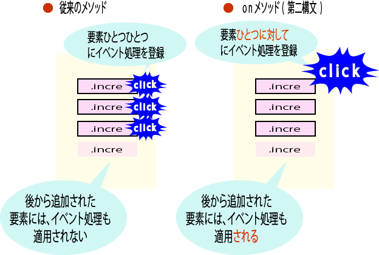

# その他、知っておきたいイベント関係のメソッド

* ここまでに紹介してきた以外にも、jQueryにはイベントにはイベント関係でまだまだ知っておきたい機能がある

## mouseenter/mouseleaveイベントをまとめて設定する--hoverメソッド

* hoverメソッドは、mouseenter/mouseleaveイベントをまとめて設定するためのメソッド
* mouseenter/mouseleaveイベントはその性質上、まとめて利用することの多いイベント
* hoverメソッドを利用することで、これらのイベントをよりスマートに設定できるようになる

```js
$(セレクター).hover(
	function(){
    	...mouseenterイベントに対応する処理...
    },
    function(){
    	...mouseleaveイベントに対応する処理...
    }
)
```

```js
$(function() {
  $('#home')
  .hover(
    function() {
      $(this).attr('src', '../images/open_home.gif');
    },
    function() {
      $(this).attr('src', '../images/home.gif');
    }
  );
});
```

* コード量がそれほど大きく変わるわけではないが、視覚的にもワンセットであることが明確にわかり、複雑なコードも読みやすくなる
* 関係するmouseenter/mouseleaveイベントの処理はできるだけhoverメソッドで書くようにする

## イベント応じて一度だけ実行される処理を定義する--oneメソッド

* あるイベントに対して一度だけ処理を実行したい場合には、oneメソッドを利用する
* 書き方はbindメソッドと同じ

```js
$(セレクター).one(イベント名, function() {
	...イベントに対応して行うべき処理...
})
```

* 以下は簡単なクイズアプリケーション
* 問題に対しては回答すると、正解/不正解をダイアログを表示する

```js
$(function() {
    $('#btn').one(
        'click',
        function() {
            if ($('#answer').val() === 'on') {
                window.alert('正解！');
            } else {
                window.alert('残念、不正解...');
            }
        }
    );
});
```

```html
<form id="fm">
    イベント処理を設定する汎用的な命令は？<br />
    <input type="text" id="answer" />
    <input type="button" id="btn" value="答える" />
</form>
```

* [答える]ボタンをクリックすると、テキストボックス(<input id="answer">要素)への入力値を確認し、結果に応じた内容をダイアログに表示している
* サンプルを実行してみると、初回クリックではダイアログが表示される
    * ２回目以降はクリックしてもダイアログが表示されないことが確認できる
    * ページをリロードすればまた回答可能
    
## まだない要素にもイベント処理を定義する--onメソッド

* click、mouseoverのような簡易メソッドは、基本的にはすでにある要素に対してだけイベント処理を定義する
* しかし、onメソッドのもう一つの構文を利用すれば、後から動的に追加される要素に対しても、あらかじめイベント処理を定義しておくことが可能

```html
<script>
    $(function() {
        $('#fm2').on(
            'click',
            '.incre',
            function() {
                $('<input type="button" class="incre" value="追加" />').appendTo('#fm2');
            }
        );
    });
</script>
<form id="fm2">
    <input type="button" class="incre" value="追加" />
</form>
```

* onメソッドの第２構文は以下の通り

```js
$(セレクター).on(イベント名,子セレクター,function() {
	...イベントに対応して行うべき処理...
});
```

* これによって、「<セレクター>配下の<子セレクター>で指定された要素で、<イベント名>が発生した場合に、指定された処理を実行しなさい」と言う意味になる
* この例であれば「<form id="fm">」要素配下にあって、class属性が"incre"である要素でクリックイベントが発生した場合」の処理を登録している
* このような構文を利用することで、イベント処理はあくまで親要素(この例であれば、<form id="fm">要素)で管理されますので、子要素が後から追加されたも、そのイベントを補足できる
* 試しに従来の構文で、以下のように書いてみると、増えたボタンを押してもボオタンは増えない(＝イベント処理が実行されない)ことが確認できる

```html
<script>
    $(function() {
        $('#fm3 .incre2').on(
            'click',
            function() {
                $('<input type="button" class="incre2" value="追加" />').appendTo('#fm3');
            }
        );
    });
</script>
<form id="fm3">
    <input type="button" class="incre2" value="追加" />
</form>
```

* onメソッド(第２構文)のもうひとつのメリットは、その性質上、大量のイベント処理を効率的に登録できるという点
* 先ほどの図を見てもわかるように、簡易メソッドやonメソッド(第１構文)は対象となる要素ひとつひとつに対してイベント処理を登録する
    * しかしonメソッド(第２構文)で登録されるイベント処理は、親要素に対してひとつだけ
* 例えば、何百行にも及ぶテーブルのひとつひとつのセル(<td>要素)にたいして、イベント処理を登録するようなケースでは、onメソッドの第二構文を利用することで、イベント登録の負荷を大幅に軽減可能

```js
$('td').on('click', function(e) {...});  //負荷大
$('table').on('click', 'td', function(e) { ... }); //負荷小
```

