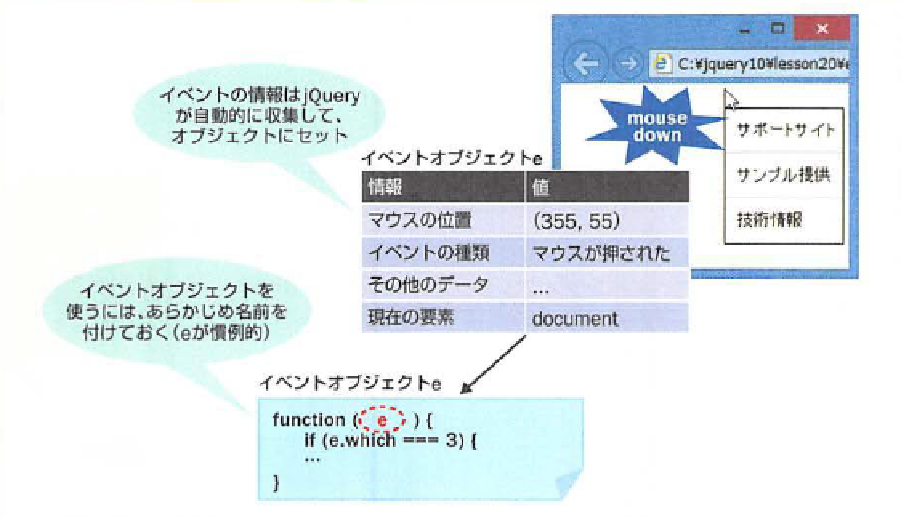
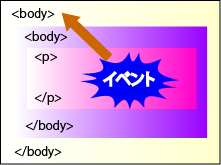
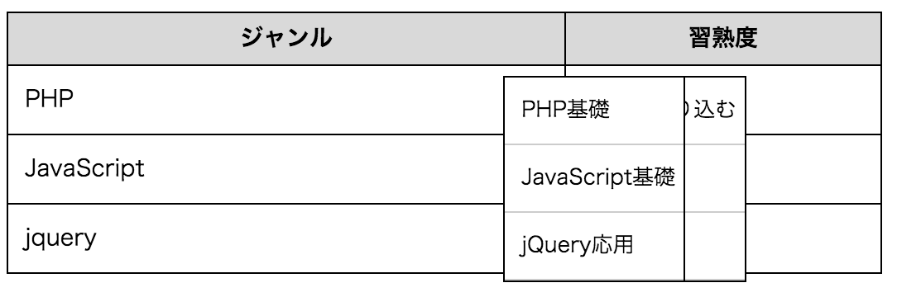
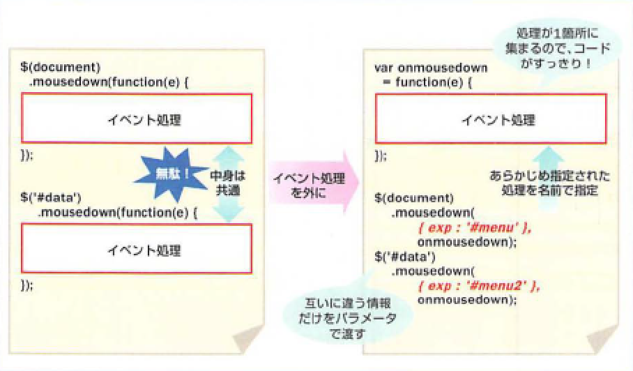

# イベントオブジェクトを活用しよう</h2>

* イベント処理を記述する上で、イベント情報や捜査を担当するイベントオブジェクトの利用は欠かせない

## イベントオブジェクトとは？

* イベントオブジェクトとは、イベントが発生した時の様々な情報を詰め込んだ箱
* イベントが発生した時にブラウザが自動的に情報を収集して、オブジェクトにセットしてくれますので、プログラマが自分で用意しなくても利用可能
* イベントオブジェクトを利用するために必要な手続きは、イベント所英を記述する際に、イベントオブジェクトにアクセスするための引数(変数)を宣言しておくことだけ

```js
$(...).イベント名(function(e) {
	...イベント処理...
});
```

* イベントオブジェクトの用意はされていても、名前がないとスクリプトの中でアクセス不可
* そのためこのようにして名前をつけている
* 絶対のルールではないが、イベントオブジェクトの名前は「**e**」とするのが一般的
* コードの読みやすさという意味でも、名前はできるだけ慣例に沿っておいたほうが良い



* イベント処理の中でイベントオブジェクトを利用しない場合は、引数**e**は省略しても構和ない

## コンテキストメニューの実装

* マウスでページの適当な場所を右クリックすると、マウスポインターの現在位置に応じて独自のコンテキストメニューを表示する例

## ①コンテキストメニューは<ul>要素で定義する

* マウスクリックによって表示するコンテキストメニューの領域は、`<ul>`要素で定義
* コンテキストメニューは、後からマウスの位置に応じて表示位置を設定する必要がある
* CSSのpositionプロパティをabsolute(前後要素に影響されない)を設定しておく
* また、displayプロパティをnone(非表示)ニツィ、デフォルトでは表示されないようにしておく

## ②押されたマウスボタンの種類を検知する

* スクリプト例では、ページ全体($(document))に対して３種類の処理を施している
* その中でも②の処理が今回の主眼
* まず、マウスバタンがクリックされた(mousedownイベントの)タイミングでコンテキストメニューを表示している
* ただし、コンテキストメニューは右ボタンをクリックした場合にのみ表示したいので、他のボタンでは処理を行わないようにする必要がある
* それを行っているのが、以下の部分

```js
if (e.which === 3 ) {
	...中略...
}
```

* 押されたマウスばおたんの種類を検知するには、イベントオブジェクトのwhichプロパティを利用する
* whichプロパティは、左ボタンが押されたら１、右ボタンは３、中央ホイールは２を返す
* この例では、whichプロパティが３であるかどうかを確認しているわけです(それ以外のボタンが押されても何もしない)
* ボタンの種類を確認したら、あとはcssプロパティでdisplayプロパティをblock(ブロックとして表示)にし、top、leftプロパティ(表示座標)にマウスの現在位置をセットし、コンテキストメニューを表示
* マウスの現在位置は、pageX、pageYプロパティで取得できる

## ③自前のコンテキストメニューを閉じる

* ここではページの任意の場所でマウスを左クリックした場合(whichプロパティが１の場合)に、コンテキストメニューを隠す
* リンクをクリックした場合はまずリンクの機能が優先される
    * きちんと他のページに移動してくれる

## ④ブラウザ標準のコンテキストメニューを無効にする

* ③までの処理では、マウスボタンを右クリックした時に、本来のコンテキストメニューも表示されてしまう
* preventDefaultメソッドで無効にしておく
    * 自分でコンテキストメニューを表示する場合には、元々のコンテキストメニューが重複して表示されてしまうと邪魔

## イベントのバブリングを止める--stopPropagationメソッド

* jQueryでイベントを処理する場合、知っておきたい重要な性質があり、それがイベントのバブリング
* イベントバブリングとは、下の階層で発生したイベントが上の階層にまで自動的に伝播していく様子が泡(Bubbling)に喩えられた表現
* 発生したイベントは自動的に上の要素に伝わっていく



* 図で例えると、最下層の<p>要素で発生したイベントは、`<p>`要素だけではなく、その上位の`<div>`、`<body>`要素(document)にも伝わっている
* 実は、このイベントバブリングを意識していないと、コードが正しく動作しない場合がある
* 試しに以下のコードをコメントアウトする

```js
$(function() {
  $(document)
    .mousedown(function(e) {
      if (e.which === 3) {
        ~中略~
        //e.stopPropagation(); //コメントアウト
      }
    });
});
```

* この状態でテーブルを右クリックすると、イベントバブリングの結果、$(document)にもmousedownイベントが伝播してしまい、コンテキストメニューが表示されてしまう



* もちろん、これは意図した挙動ではないので、電波自体を止めたい
    * それが先ほどの `e.stopPropagation();`
* イベントオブジェクトのstopPropagationメソッドを呼び出すことで、イベントの処理はその要素のみで完結し、上の要素には伝播しなくなる
* このように、複雑なページを作成する際には、イベントバブリングによって現在の要素のイベントが他の要素に影響してしまわないかを確認することが大切

## イベント処理に際して必要な情報を渡す

* さて、ソースコードを見直してみると、いまいちスマートではないと感じるかもしれない
* というのも、`$(document)`、`$('#data')`での`mousedown`イベントの処理がほとんど同じコードであるのに、そのまま重複して記述されているため
* これは無駄にコードが長くなるというだけでなく、修正があった場合に両方とも直さなければならないという意味で、望ましい状態ではない
* こんな時は、イベント処理を個別に切り出して、必要な情報だけを受け渡しするようにすると良い
    * これには、イベントオブジェクトのdataプロパティを利用します。</p>

  

* 共通した処理は外に切り出して、早速書き直す

```js
$(function() {
  var onmousedown = function(e) {
    if (e.which === 3) {
      $(e.data.exp).css({
        display: 'block',
        top: e.pageY,
        left: e.pageX
      });
    }
    e.stopPropagation();
  };

  $(document)
    .mousedown({ exp : '#menu' }, onmousedown)
    .click(function(e) {
      if (e.which === 1) {
        $('#menu').css('display', 'none');
        $('#menu2').css('display', 'none');
      }
    })
    .contextmenu(function(e) {
      e.preventDefault();
    });
  $('#data')
    .mousedown({ exp: '#menu2' }, onmousedown);
});
```

* まず重複したイベント処理を、onmousedownという名前で切り出している
* `e.data.exp`というコードに注目
    * これはイベント処理の際に呼び出し元から渡されたexpという名前のパラメータを受け取りなさいという意味
    * パラメータexpには#menu、#menu2のようなセレクターがセットされているものとする

```js
e.data.パラメータ名
```

* これで呼び出し元に応じて、#menu1、または#menu2のメニューが切り替え表示されるようになる
* そして、そのonmousedownを呼び出しているのが以下の部分
* パラメータ付きでイベント処理を呼び出すには、以下のように記述する

```js
$(...).イベント名({ パラメータ名: 値, ...}, イベント処理名)
```

* { 名前:値 }の形式はハッシュと呼ぶのでした。また、イベント処理を別の場所に切り出した場合には、呼び出しの側ではその名前だけを指定する
* これでイベント処理そのものは１箇所にまとめられましたので、コードがすっきりする

## まとめ

* イベントとは、マウスのクリックやキーの押下などのページの中で起こる様々な出来事のことをいます。
* jQueryでは、<イベント名>(function(){...})と言う書き方で、イベントに対応した処理を定義できます。
* jQueryが標準で対応していないイベントは、onメソッドで処理できます。
* マウスの出入りをまとめて処理するhoverメソッド、１回だけ処理するoneメソッド、イベントリスナーを破棄するoffメソッドなどもあります。
* イベントが発生すると、イベントオブジェクトが自動的に作成され、イベント処理(イベントリスナー)に渡されます。イベントオブジェクトは、イベンチに関わる様々な情報を保存しています。
* 文書の下の階層で発生したイベントが、順に上の階層に伝播していくことを「イベントバブリング」と言います。
