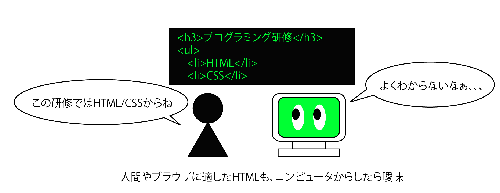
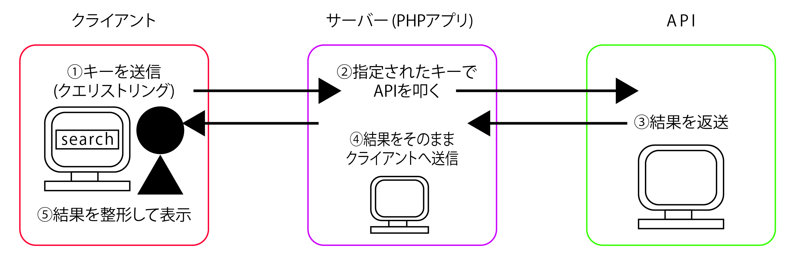
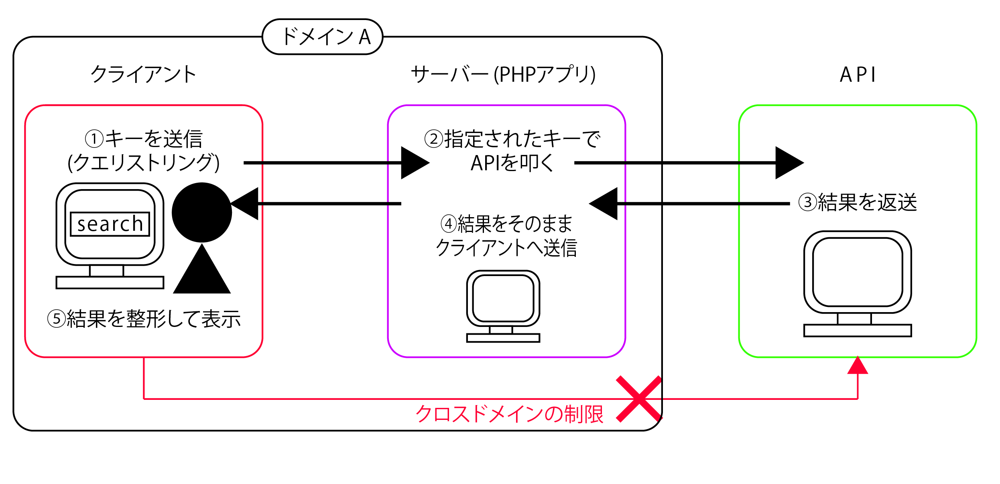
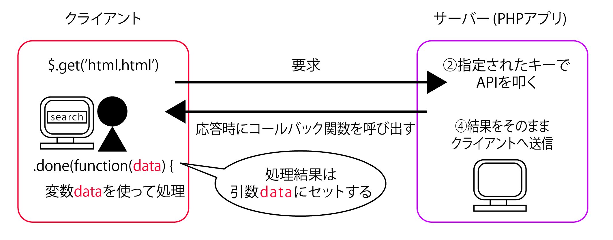

# APIを使うための準備をしよう
## APIにアクセスする

### PHPスクリプトからAPIにアクセスする

* 続いて、アプリケーション(PHPスクリプト)からAPIにアクセスする
* ただし、これは人間にとって最適化されたもので、コンピューター(アプリケーション )にとっては使いにくいサービス
* というのも、HTMLによる結果は表示のための様々な情報が入っているため、プログラムから利用するのがとても難しい



* そこで、APIでは、別の言語を使って情報を返している
* そうすることで閲覧のための余計な情報も含まず、コンピューターから読みとりやすい
* これが、「アプリケーションからアクセスするためのサービス」と言う意味
* このようなサービスのことを、「Web経由で利用するアプリケーション作成のための道具(API)」と言う意味で、Web APIと略称する
* API = `Application Program Interface`

### APIの使い方

* いつも使っているWebページにアクセスするのと同じように、決められたURLでアクセスするだけで使用可能
* URLで「?」よりも前の部分がAPIで決められたアドレス
* このアドレスに対して「パラメータ名 = 値」の形式で検索に必要な情報を渡す
    * パラメータが複数ある場合は、`&`で連結
    * このような情報のことを`クエリ情報`という
* この例では、以下の情報をパラメータとして渡している
* 問い合わせに成功すると、最初の手順のような結果が得られる
* 普段使っているWebページでは結果はHTML(実際にはブラウザで解釈された結果)が帰ってくるが、Web APIでは代わりに別の形式で返される
* 逆に言えば、WebページとWebAPIとの違いはただそれだけ
* もっとも、こうした形式のデータをそのまま人間見ずらいので、実際にはJavaScriptやPHPなどのアプリケーションで読み込んで、処理を行うことになる
* 今回の例であれば、PHP経由で取得したXMLをさらにJavaScript(jQuery)で受け取って、検索結果をHTMLページに整形するようなアプリケーションを最終的な目標とする



* このように、Web APIを利用することで、インターネットに提供されているサービスを、あたかも自分のアプリケーションの一部であるかのように利用可能

### そもそもJavaScriptだけではダメなのか？

* PHPスクリプトはただ単にWeb APIから結果データを受け取り、そのままブラウザ側に転送しているだけ
* であれば、JavaScriptから直接にWeb APIにアクセスしてもいいとは思いませんか？
* しかし、これはセキュリティ上の理由からNGです。JavaScriptでは「自分が属しているサーバー(ドメイン)以外のサービスにはアクセスできない」という制限がある
* これを**クロスドメイン**の制限という
* そのため、JavaScriptで外部サービスを利用する場合には、アクセスそのものはサーバー側で代理して、JavaScriptからはその結果を利用させてもらうという方法をとる



## APIで検索機能を実装

* サーバーからデータを取得し、処理するには`$.get`というメソッドを利用する

### loadより汎用的な非同期通信を行う $.getメソッド

* 以前使用した

* loadメソッド
    * あらかじめ埋め込むべきコンテンツが出来上がっている際に使用
    * シンプルなコードで利用できるが、応用が利かない。
* $.get/doneメソッド
    * サーバー側から受け取ったデータをjQuery(JavaScript)側で加工したい
    * 応用がきく
* 今回は後者なので、以下のように、$.get/doneメソッドを利用します。
* $.getはサーバーからデータを受信するためのメソッド
* doneは受信したデータを手元で処理するためのメソッド

セットで利用する。

```js
$.get(
'読み込むデータのURL'
[, 読み込み先に送信するデータ]
)
.done(function(data){
通信に成功した場合の処理
})
```

* これまでの多くのメソッドと違って、「$(セレクター).〜」ではなく、`$.〜` で呼び出せる点に注目
* 最初に `$()`関数で要素セットを用意しておく必要がない
    * `$.get`メソッドでは、何らかの要素セットを対象に処理を行うわけではないため
* 例えば、以下のような書き換えも可能

```js
$('#result').load('html.html');
```

↓

```js
$.get(html.html')
.done(function(data){
$('#result').html(data);	//処理結果を<div id="result">に反映
});
```

* html.htmlにアクセスして、そこで得た結果をfunction(data){...}の中で<div id="result">要素に反映させているわけです。今回は、「読み込み先に送信するデータ」は必要ないため、省略しています。
function(data){...}は、これまでも何度か登場した<span style="color:red;">コールバック関数</span>の一種です。$.getメソッドによるサーバーへの通信が成功したところで自動的に呼び出され(コールバックされ)、通信結果を処理します。コールバック関数には、呼び出しの時にサーバーから取得したデータが渡されます。引数dataの部分がそれです。



* このように、$.getメソッドで書き換えてみると、loadメソッドがhtmlメソッドとよく似ているという意味も実感できる

## APIのアクセス

* { パラメータ名:値, ... } の形式のような形式をハッシュという
* とりあえずここではページ番号(page)は固定で１とし、検索キーワード(keywd)にはテキストボックスkeywdの値をセットしておく
* これで、PHPスクリプトに$.getメソッドでアクセス可能

## APIから取得した結果を処理する

* 続いて、PHPスクリプトから取得したデータを処理する
* PHPスクリプトの結果はAPIから取得したデータ
* これを処理しているのは、doneメソッドで表されたコールバック関数
* appendメソッドを利用することで、階層を持ったHTMLを動的に生成可能
* eachメソッドの中では、thisは順番に取り出した要素(ここでは`<entry>`要素)を表す
    * `&('title', this)`は、`<entry>`要素配下の`<title>`要素を表す

### : を含んだ要素

* `$()関数`で、`<media:thumbnail>`のように `:`(コロン)を含んだ要素を取得する際はには注意
* まず、`$('media:thumbnail')`のような記述は不可
* `:`がセレクターにとって`予約語`であるため、`$('media¥¥:thumbnail')`のようにエスケープが必要
    * 対象の文字(ここでは `:` の直前に `¥¥` を付与する
* ただし、これだけでは不足
    * というのも、Chromeなどの一部のブラウザでは、そもそも名前空間プレフィックスを認識しない
    * よって、この例であれば、$('thumbnail')と指定する必要がある
* 以上を合算した結果が、`$('media¥¥:thumbnail, thumbnail')` という記述

### 名前空間プレフィックス

* `<prefix:name>`のprefixの部分を名前空間プレフィックスという
* 同じ名前で異なる意味を表す要素を識別する、キーとしての役割を果たす
* 例えば、`<hoge:name>`と`<foo:name>`は異なる要素

### エスケープ

* エスケープとは、その文脈で特別な意味を持った文字を打ち消すことをいう
    * 例えばHTMLエスケープと言ったら `<`や`>`のようはHTMLで意味を持った文字を、タグとして無効な「 `&lt;`や``&gt;`に置き換えることをいう
