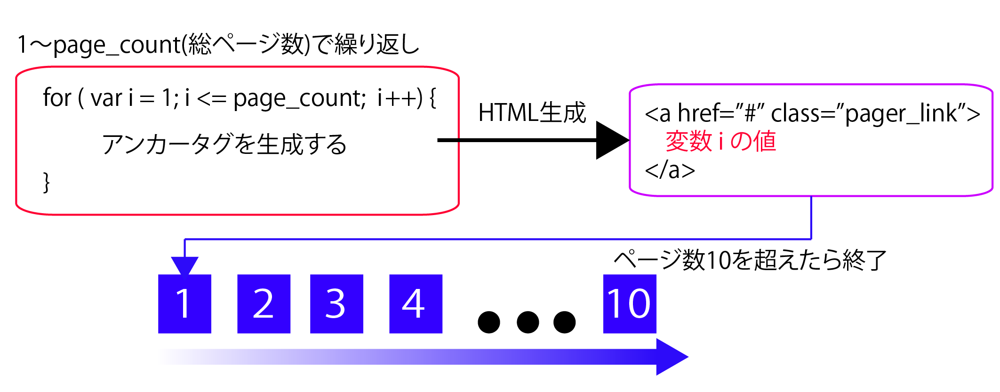

# 検索機能にページング処理を追加しよう

* 動画検索アプリケーションに対してページング機能を実装する
* 先ほどの例では、検索キーワードにヒットした最初の20件しか不可だったが、ページング機能によってそれ以降のデータも自由に確認可能にする

## ページング機能を実装するための準備

* ページングを実装するために、HTML/CSS側では、以下の準備
    * ページャ(ページングのためのリンク)を表示する`<div id="pager">`要素を追加
    * ページャを中央寄せするための#pagerスタイルを追加
    * ページャのここのリンクをスタイル付けするための、.pager_linkスタイルの追加

## ページング機能のスクリプトを概観する

* 余計なコードを取り払い、全体的なコードをの作りを概観

```js
var onsearch = function(e) {
  〜 省略 〜
  e.preventDefault();
};

$('#search').click(onsearch);
$('#pager').on('click', '.pager_link', onsearch);
```

* `[検索]`ボタンをクリックした時、ページャをクリックした時に呼び出されるイベント処理
* このように複数の箇所でイベント処理を共有している場合、それぞれで同じコードを記述するのは得策ではない
* ここではあらかじめ`onsearch`という名前としてイベント処理を準備しておき、`click`、`on`メソッドでは名前でもって関連付けている
* `on`(イベント名、セレクター、リスナー)は、スクリプトによって動的に生成される要素に対してイベント処理を関連づけるための構文
    * ページャは検索ヒット数に応じて動的に生成するのもの
    * イベント処理もonメソッドの第二構文で登録しておく必要がある
* `e.preventDefault();`は、ページャからイベント処理が呼び出された場合に、リンク本来の挙動(画面の切り替え)をキャンセルするための措置

## ページング本体の処理を確認しよう

* 順番にポイントとなる部分

```js
var page_num = !$(this).text() ? 1 : $(this).text();
```

* まず、$(this).text()はイベント発生元となる要素の配下のテキストを表す
* `[検索]`ボタンであれば空で、ページャであればページ番号が入っているはず
* そこでここでも、`$(this).text()`が空でない場合には最初の検索であるとみなして、変数page_numに１を、そうでない場合にはリンク上のページ番号をセットしている
* 要素の値がからであるかどうか調べているのは `!(this).text()`
* `!式`で式の値が空でないかを判定可能
* また、`?:演算子`は条件式に応じて異なる値を返す命令

```js
条件式 ? 条件式がtrueの場合の値 : 条件式がfalseの場合
```

* 続いて、page_numの値は、そのままvideo.phpに渡す

```js
page: page_num
```

* 続いて、ページャリンクを生成するための処理
* あらかじめページャの表示領域を空にしておくのを忘れないようにする

```js
$('#pager').empty();
```

* 以下が実際のページャ作成のコード
* ページャ領域を変数pagerに入れているのは、後から何度も呼び出す必要があるため
* 必要になるたびに `$()` 関数を呼び出すのは無駄なので、最初に変数にセットしておく

```js
var pager = $('#pager');
```

* 以下は総ページ数を求めている
* `<openSearch:totalResults>`要素には結果件数が入っている
* それをpage_size(ページあたりの表示件数)で割った値を、小数点切り上げしたものが総ページ数になる
* `Math.ceil`メソッドは、小数点数を切り上げるための命令

```js
var page_cnt = Math.ceil(
  $('openSearch\\:totalResults, totalResults', data).text() / page_size);
</pre>
    <pre class="brush:js;" title="Math.ceilメソッド">
Math.ceil(小数点数)
```

* 以下は総ページ数が２以上あるかを確認しています。１ページしかない場合、ページャを表示する必要がないからです。</p>

```js
if (page_cnt > 1) {

}
```

* for命令で１〜page_cntまでループを繰り返し、順番にリンクを出力している
* ただし、件数の多い場合にあまりたくさんのリンクを表示させても邪魔なので、３６行目で１０ページ以上になったらループをbreak命令で終了させてしまう
* つまり、最大１０ページ目までのリンクしか表示しないということ

```js
      if (page_cnt > 1) {
        for (var i = 1; i <= page_cnt; i++) {
        if (i > 10) { break; }
			〜 省略 〜
        }
      }
    });
    e.preventDefault();
  };

  $('#search').click(onsearch);
  $('#pager').on('click', '.pager_link', onsearch);
});
```



* 以下は、`<a>`要素を作成し、ページャ領域に追加している
* href属性にはリンク先がないため、ここではダミーの値として `#` を渡している

```js
pager.append(
  $('<a></a>')
    .addClass('pager_link')
    .attr('href', '#')
    .text(i)
);
```
* `<a>`要素の内容は以下のようになっている

```html
<a href="#" class="pager_link">＜変数iの値＞</a>
```
