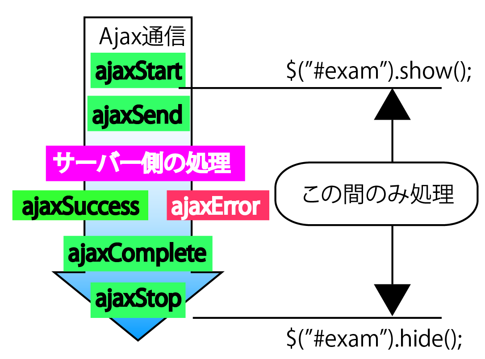

# Ajax通信の進捗状況やエラー情報を表示しよう

* Ajaxを機能を利用して、Ajaxによる通信中に進捗バーを表示するとともに、検索エラーが発生した場合にエラーメッセージを表示するようにしてみる
* Ajaxイベントを利用することで、Ajax通信でひつ王な共通処理を簡単なコードで実装できるようにする

```html
<div id="prog"></div>
```

* 検索フォームが表示されます。キーワードを入力して`[検索]`ボタンをクリックすると、検索の間、進捗バーが表示されることを確認する

## Ajax通信の開始や終了のタイミングで処理を実行する

* jQueryでは、Ajax通信の途中でページ独自の処理を差し挟めるように、様々なイベントを用意している


* これらのイベントを利用することで、例えば以下のような処理を作成可能
* ajaxStartイベント
    * 進捗バーを表示し、ajaxStopイベントで進捗バーを非表示にする
    * ( = Ajax通信中に進捗バーを表示する)
    * ajaxSendイベント
* 通信開始前に特定のパラメータ情報を追加
* ajaxErrorイベント
* 通信に失敗した場合のエラーを表示
* ajaxCompleteイベント
* 通信が完了した時に何かしらユーザーに追加(アニメーション処理を実行するなど)

## (1)通信中に進捗バーを表示する

* Ajaxが普通の通信と異なるのは通信中であることが一見してユーザーの目には見えないこと
* 普通の通信であればブラウザのアイコンが回ったり、ステータスバーに通信中であることが表示されたりするが、Ajaxではそうした変化が一切ない
* そのため、ユーザーが通信中であることがわからず、不安になったり、ボタンを何度も押してしまったりということが起こる可能性がある
* そこでAjaxである程度時間のかかる処理を行う場合には、ユーザーに通信中であることを見せる必要がある
* 以下のコードでは、進捗バーを表示している

```js
$(document)
  .ajaxStart(function() {
    $('#prog').show();	// 通信が始まったら進捗バーを表示
  })
  .ajaxStop(function() {
    $('#prog').hide();	// 通信が終わったら進捗バーを消す
  })
```

* `<div id="prog">`要素は、進捗バーをイメージしたアニメーション画像
* 初期状態では非表示になっています(displayプロパティをnoneに設定)
* ここでは、ajaxStartイベントでこれを表示し、ajaxStopイベントで非表示にすることで、通信中のみ進捗バーを表示するという効果を演出している



* イベント処理の書き方は、これまでとほぼ同じ
* 常にdocument ( ページ全体 )に対して登録しなければならない点に注意

```js
$(document).ajaxXxxx(function(){
	...対応する処理...
});
```

* なお、処理が速すぎて、進捗バーの動きをうまく確認できない場合にはvideo.phpの先頭に以下のコードを追加する

```js
sleep(3);
```

* これは３秒処理を停止しなさいという意味の命令
* これによって応答までの時間を通らせられますので、進捗バーをきちんと確認できるようになるはず

## (2)通信に失敗した場合にエラーメッセージを表示する

* 通信に失敗したことはajaxErrorイベントで検出可能

```js
.ajaxError(function(e, xhr, opts, err) {
  $('#result').html('<strong>エラー発生：' + err + '</strong>');
});
```

* イベント処理の書き方はこれまでとほぼ同じですが、１点だけ注意すべき点がある
* それは、イベント処理に様々な引数が渡されている点
* Ajax関係のイベントでもイベントオブジェクトは利用できるが、さらに様々な情報が引数として渡されるようになっている

| 引数 | 内容 |
|:----|:----|
| e | イベントオブジェクト |
| thr | jqXHRオブジェクト(jQuery固有の機能を追加したXMLHttpRequest(XHR)オブジェクト |
| opts | オプション情報 |
| err | エラー情報 |

* XMLHttpRequestオブジェクトとは、Ajax通信を操作するための基本的なオブジェクト
* 細かな制御をしたい場合にはXMLHttpRequest(jqXHR)オブジェクトを利用すると良い
    * jQueryではXMLHttpRequestの機能をうまく包み隠しているため、あまり意識する必要はないため
* ここでは引数の最後で渡されているエラー情報を基にして、エラーメッセージを表示している
* イベント処理に渡される情報の種類は、イベントによって微妙に違う

## jQuery高速化の手がかり

* jQueryはもともとが高速な動作を旨としたライブラリ
* しかしちょっとしたポイントを押さえておくことでさらにパフォーマンスを向上可能

### (1)効率的なセレクターを選択する

* 内部的にブラウザ標準のメソッドを利用しているセレクターを、できるだけ利用する
* 具体的には、なるべく#id、element(要素名)、class系のセレクターを利用する

### (2)jQueryオブジェクトを再利用する

* なんども利用するjQueryオブジェクトは、毎回$()関数で生成するのではなく、できるだけ変数に代入して再利用する
* そもそも可能なのであれば、まずはメソッドチェーンに頼るべき

### (3)検索の範囲を指定する

* $(セレクター, 要素)の構文を利用することで、文書全体を検索しなくてもよくなるため、そもそもの検索負荷を軽減できる
* children、endなどのトラバーシング系のメソッドを利用するのもいい方法

### (4)onメソッド(第二構文)を利用する

* 大量のリスト項目(`<li>`)やセル(`<td>`要素)などに対して、個別にイベントリスナーを登録するのは非効率
* onメソッドの第二構文を使って親要素でリスナーを登録すれば、登録の負荷を軽減可能

### (5)できるだけ新しいjQueryを利用する

* jQueryではバージョンアップのたびに大幅にパフォーマンス改善している
* セキュリティ面の安全性、機能面などの観点からも、利用するjQueryのバージョンはできるだけ新しくしておくべき
