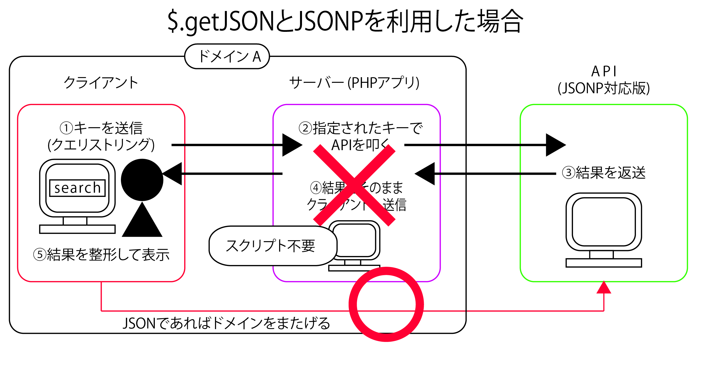
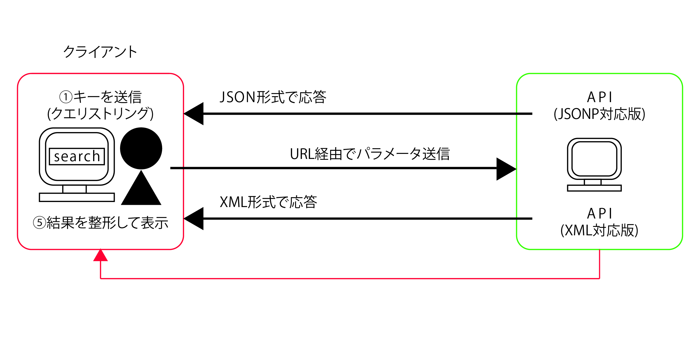

# jQueryからAPIに直接アクセスする

* $.getJSONというメソッドを使って、動画検索機能を実装する
* `$.getJSON`メソッドを利用することでサーバー側でプログラムを書かなくても外部のサービスにアクセスできるというメリットがある
    * これまで利用してきた`load`、`$.get`メソッドでも大概のことはできる
    
## 外部サービスとスムーズに連携する

* Ajaxでは自分が属しているサーバー(ドメイン)以外とは、通信できない
* このため、外のサービスを利用するには、いったんサーバーサイド(PHPなど)のプログラムを準備して、これを経由して外に出る必要があったため
* しかし、外部のサービスがJSONPに対応している場合例外的にAjaxでも外部のサービスと通信が許可される
* `JSONP` ( JSON with Padding )とは、JSのオブジェクト形式(JSON)でデータをやり取りする仕組み
* JSONPでは、本来、Ajax通信を担当しているXMLHttpRequestというオブジェクトを利用しないため、「ドメインをまたいで通信してはいけない」という制限からも自由になる



## APIでJSONPを利用する

* JSONPを利用するとはいっても、結果をXMLで得るのかJavaScriptで利用できるオブジェクト形式で得るのかという点だけ



* もちろん、JSONPを利用できるかどうかは、サービス側がそれに対応しているかどうかという点に左右される
* 例えばXML形式でしかデータを提供していないサービスではJSONPは利用不可

## $.getJSONメソッドの使い方

* APIから返されるデータの構造を理解したところで、具体的なコードを読み解く
* JSON技術を利用したアクセスを行うには、`$.getJSON`というメソッドを利用する

```js
$.getJSON(
	'読み込むデータのURL'
    [, 読み込み先に送信するデータ]
)
.done(function(data){
	通信に成功した場合の処理
})
```

* 書き方は$.getメソッドと同じ
* `$(セレクター).〜`ではなく、$.〜で呼び出し可能
    * 何らかの要素セットを対象に処理を行うわけではないため

### ①検索のためのURLにクエリ情報「callback=?」を付与する

* これによりjQueryでは外部のサービスから取得したデータを処理できるようになる

### ②コールバック関数はJavaScriptのオブジェクトを受け取る

* あとは、`$.get`メソッドと唯一違うのは、コールバック関数に渡される値(ここではdata)が、JavaScriptのオブジェクトであるという点
* よって、aaa.bbb.cccのようにすることでbbbプロパティは以下のcccプロパティにアクセス可能
* 検索結果の１件目のタイトルを取り出したいならば、aaa.bbb.ccc[0].title.$tのように書ける

## オブジェクトからサムネイルを組み立てる

* 続いて、APIから取得したデータを処理する

```js
$.each(aaa.bbb.ccc, function() {
  $('#result').append(
    $('&lt;a&gt;&lt;/a&gt;')
      .attr('href', this.link[0].href)
      .append(
         $('&lt;img&gt;')
          .addClass('thumb')
          .attr({
            src: this.media$group.media$thumbnail[0].url,
            title: this.title.$t
          })
      )
  );
});
```

* まず、aaa.bbb.cccで検索結果を全て配列(オブジェクトの集合)として取得している
* 取得した配列は、$eachメソッドで順に処理可能
* `$.each`メソッドは配列の内容を順に処理するためのメソッド

```js
$.each(配列, function(){
	...処理内容...
}
```

* `function(){...}`の中では、thisで個々のオブジェクトにアクセス可能
* 例えば、`this.title.$t`であれば、`data.feed.entry`プロパティで取得した結果データの中の`title.$t`プロパティを指すことになる
* `$(this)`のように囲む必要がない点にも注目
    * オブジェクトからデータを取り出すには、特にjQueryの機能は利用しないため

## まとめ

* 一般的なWebの世界では、サービス(コンテンツ)を提供するサーバーとサービスを受け取るクライアントとが存在する
* Ajaxは、サーバーとの通信をJavaScriptを使って行う技術
    * Ajaxによる通信では、ドメインをまたがった要求を行うことはできない
* サーバーから取得したデータをそのままページに反映するには、loadメソッドを使う
* Web APIを利用することで、外部で提供されているサービスをあたかも自分のアプリケーションの一部であるかのように利用可能
* サーバーから取得したデータに対して何らかの処理を行うには、`$.get`メソッドを使う
* `$.getJSON`メソッドとJSONPという技術を利用することで、ドメインをまたがった通信が行える
* `ajaxStart`、`ajaxStop`、`ajaxError`などのAjaxイベントを利用することで、Ajax通信の途中でアプリケーション独自の操作を挟むことも可能
