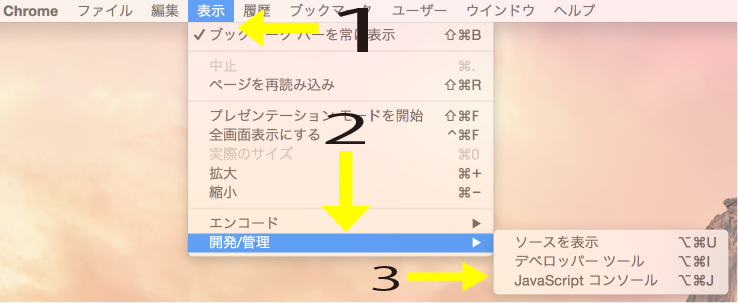
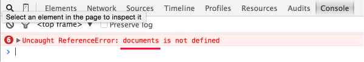
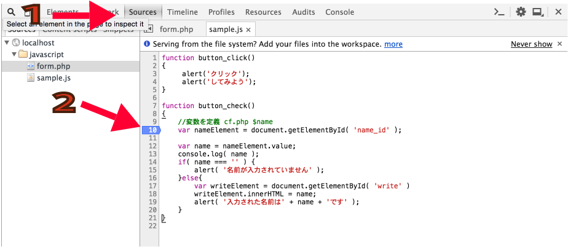
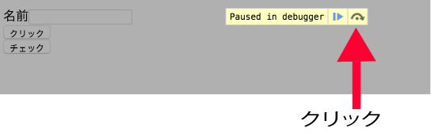
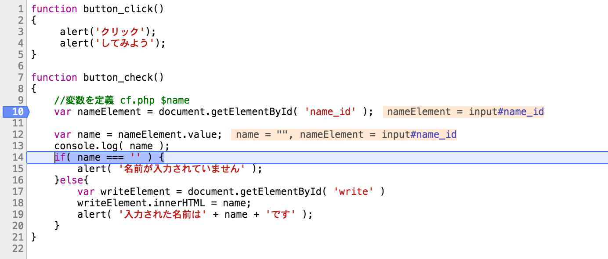

# Javascript

* プログラミングの学習ではjavascriptというものも扱う

## scriptタグ

* JSのコードは、script要素の中に書く

```html
<script></script>
```

## デベロッパーツールでエラーを確認する

* JSのコードは些細なミスであっても、プログラムは正常には動作しなくなる
* その結果HTMLで記述した部分だけが表示され、JSによって表示されるはずの部分が無視された状態になる

## エラーの確認方法

* エラーが起きているかどうかを確認する
    * Chromeを使用している場合
        * 右上のボタンをクリック
        * `[その他ツール]`を選択
        * `[JSコンソール]`を選択
        * デベロッパーツールを起動する

## JSコンソールを開く



* メソッドをdocument**s**と誤表記をする

### Consoleタブをクリック



* 画面右側のJSコンソールタブにはdocumentsが見つからないというエラーが表示されているのがわかるか

### Sourcesタブを開く



* １、Sourcesタブを開く。２、処理を止めたい行数を選択し、青く反転させる

### ステップ実行ボタンを押す



### １行ずつ実行する



* プログラムを一行ずつ実行可能
