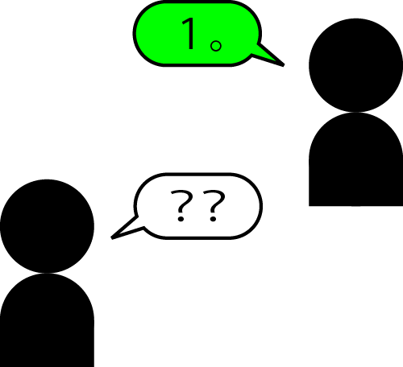
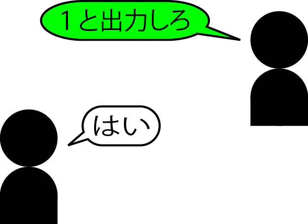
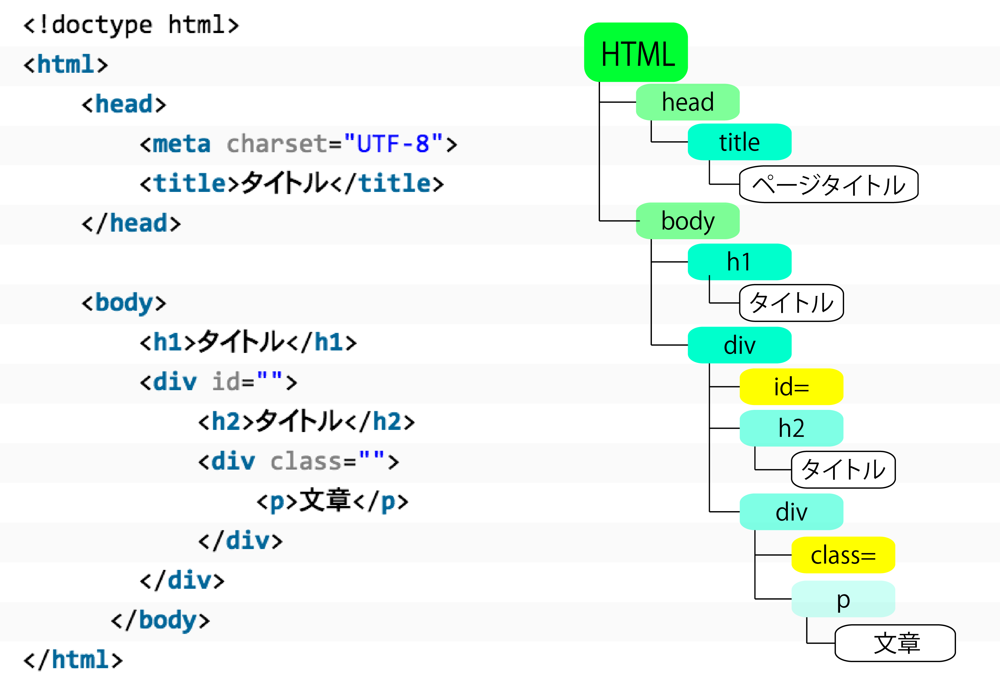

# プログラミング言語

* [基本](00)
* [PHP](01_php)
* [JS](02_js)
* [ruby](03_ruby)

## ページに出力する

### テキストを出力する

* `テキスト`とは**全角文字を使うことができる空間**
    * Webページの中にテキストを表示する

```text
命令("出力したい文字")
```

### 言語の専用空間

* 各言語にはそれぞれの言語の専用空間ある
* 専用空間に別の言語を書いてはいけない

```text
// PHP
echo ("HelloWorld");
//javascript
document.write('<p>HelloWorld</p>');
// Java
System.out.println("HelloWorld");
// Swift
print("HelloWorld")		// セミコロン不要
```

* プログラムは言語に関係なく、『命令』と『データ』が基本

```php
<?php
1  //「1」と書かれても、コンピュータからすれば「は？」となる
?>
```



* そこで「出力しろ！」という命令が必要になる



### 引数

* 命令は各言語には方言ほどの違いはある
    * `()`の中に表示したい文字列を入れるルールのものが多い
* PHPのechoも`echo("文字列")`と書いても同じように動作する
* 命令の直後の`()`の間に書かれる値を`引数`という
    * 引数は**命令に渡すデータ**

```text
買ってこい("パン")
```

### 引用符

* 引用符とはシングルクォートかダブルクォートのこと
* プログラムのルールは**プログラム内にテキストを書く時は、引用符で囲む**
    * 数字の場合には引用符で囲う必要はない

```text
命令(1234) //数字の出力
```

* つまり逆に言えば、**引用符で囲えばテキスト**になる
* 現時点ではシングルとダブルの違いはない
* 冒頭の例のようにHTMLの要素(タグ)を引用符の中に入れることで、HTMLの効果が適用される
    * プログラム内にHTMLを直接書くことはできないが、引用符で囲うことでHTMLを表現可能

### テキスト(文字列)と数字

* 文字列と数字は、引用符で囲うか否か、という違いがある
* これは、コンピュータからの扱われ方が違うということ
* つまり、コンピュータから見ると**文字列と数字は、『型』が異なる**ということ

## データの型

### 型ってなに？

* プログラムのデータには『型』がある
* 現時点で大きく分けると以下の２つ
    * int型(number型)
        * 整数を扱う型
    * String型
        * 文字列を扱う型

### 型を調べる

#### JS - typeof

* データの種類の調べ方は言語ごとに多少異なる
* [typeof.js](https://github.com/aki-creatist/php_beginner/blob/master/var/www/html/type/typeof.js)
* `typeof`は`typeof演算子`というデータの種類を調べる`演算子`
* typeof ◯◯`と書くと、データの種類を表すテキストを返す
    * １つ目は、`string`」というテキストを返す
    * ２つ目は、`number`というテキストを返す
    * ３つ目は、テキストと数値を足している
        * この場合、`テキストの連結`が行われ、typeof演算子は`string`を返す

#### PHP - var_dump

* [typeof.php](https://github.com/aki-creatist/php_beginner/blob/master/var/www/html/type/typeof.php)

### 基本型

* 最初から組み込まれていているものは**基本型**と呼ばれる
* int(number)やstring、undefinedは、基本型
* 基本型と区別した「参照型」と呼ばれるものがある
* intは基本型(プリミティブ型)として扱われるが、言語によっては**Stringはただの基本型ではない**

### 文字列(String)型

* 文字列は文字の集まりですが、ただの基本型ではなく、`文字列を表すクラスの実体(インスタンス)`として生成される
    * クラス
        * 属性と役割をまとめたもの
    * インスタンス
        * クラスを実際に利用できるよう実体化したもの
    * オブジェクト
        * クラスとインスタンスを合わせたもの
* 注意が必要なのは、文字列が基本型なのか、String型のオブジェクトなのかは、言語により異なる
    * 例えば、javascriptではテキストは基本型だが、同時に「Stringオブジェクト」でもある
* オブジェクトとしてメソッドとプロパティを利用可能であり、基本型として代入時にはコピーされるように、使い勝手が工夫されている
    * テキストは非常によく使う種類のデータであるため

### 自身で命令を持つ

* プログラムでは「数字」と「文字」は別物
* 言い換えれば、文字列は**それ自体が文字列を操作する命令を持っている**

### オブジェクト

* 文字の出力の仕方で、javascriptは以下のように書かれていた

```js
document.write('文字列');
```

* writeは『命令』で、カッコの内側は引数だった
* ここで登場している`document`が**オブジェクト**
* これは**documentオブジェクトの中のwriteという命令でカッコ内のテキストを表示せよ**を意味している

### documentオブジェクト

* **documentオブジェクト**はWebページ自体を表す
* 「メソッド」は**オブジェクトの中**に用意された**命令**のこと
* document.writeのように、`オブジェクト.命令`の形式で書く
* つまり、documentとはHTML文書を加工するための命令が詰まったオブジェクトであるということ

他にも以下のような命令がある

| 命令 | 役割 |
|:----|:----|
| getElementById | id属性で単一の要素を選択する |
| getElementsByTagName | HTMLのタグ名で複数の要素を選択します。<br>Elementオブジェクトでも利用可能 |
| getElementsByName | 名前(name属性)で複数の要素を選択する |
| getElementsByClassName | クラス名で複数の要素を選択する |

### Document Oject Model

* documentオブジェクトなどは**DOM**という規格に含まれている
* DOMは、文書をオブジェクトが連結したものとして表現し、要素を探索したり、加工したりするためのメソッドを定義している
* HTML文書は要素の中に要素が入った階層構造となっている
    * html要素の中にhead要素とbody要素が入り、body要素の中にWebページに表示される様々な要素が入っており、すべて入れ子となっている



* DOMでは、文書を構成する部品を「ノード」と呼び、そのノードの種類として以下のものがあるとしている

| ノードの種類 | 表すもの |
|:----|:----|
| Document | 文書全体を表す |
| DocumentType | 文書の種類<br>HTMLではDOCTYPEで指定 |
| Element | 要素を表す |
| Attr | 要素の属性を表す |
| Text | テキストを表す |
| Comment | コメント |

## 文字列の操作

### Stringオブジェクトの利用

* 以下の一覧は、文字列が持つ働きと同等の役割のプロパティ/メソッドの一覧

| 文字列長取得 | |
|:----|:----|
| lenghプロパティ | 文字列の文字数を返す |

| 比較メソッド | |
|:----|:----|
| localeCompare | テキストを辞書式に比較し、並べ替え順で前に来る場合は-1、等しい場合は0、後に来る場合は1を返す |
| match | 正規表現を利用して、条件を満たす部分の配列を返す |

| 検索・置き換えメソッド | |
|:----|:----|
| int indexOf(int ch) | 自身から、ch(指定されたテキスト)が最初に現れる位置を返し、見つからない場合は-1を返す |
| int lastIndexOf(int ch) | 指定されたテキストが最後に現れる位置を返し、見つからない場合は-1を返す |
| String replace(chaSequence target, CharSequence replacement) | テキストの一部を置換したテキストを返す |

| 抽出メソッド | |
|:----|:----|
| char charAt(int index) | indexの位置にある一文字を返す |
| String[] split(String regex, int limit) | 指定した区切り文字でテキストを分割し、テキストの配列を返す |
| substr | テキストの一部分を取り出し、新しいテキストとして返す |
| String substring(int beginIndex, int endIndex) | テキストの一部分を取り出し、新しいテキストとして返す |
| String slice(int beginIndex, int endIndex) | 自身の文字列から、beginIndexから始まりendIndexの直前で終わる範囲の部分文字列を生成する |
| concat | ２つのテキストを連結し、新しいテキストを返す |
| String toLowerCase() | 自身を小文字に変換して返す |
| String toUpperCase() | 自身を大文字に変換して返す |
| String trim() | 先頭の空白を除去した文字列を返す |

* PHPの場合は[公式リファレンス](公式リファレンス)を参照

* Stringオブジェクトはテキストの１文字目を０とする数値で表す
* 置換や部分取り出しを行うメソッドを実行しても、元のテキストは変化しない

### 文字列長取得プロパティ

* Javaは`length`メソッド、javascriptは`プロパティ`
* 文字列の長さはアルファベットや漢字など、どんな文字種であっても、１文字につき１と数える

```text
// javascript
document.write("abc".length);
// Java
System.out.println("abc".length());
// PHP
echo strlen("abc");

// 3と出力される
```

### Stringオブジェクトの命令

#### 比較メソッド

* 文字列の大小を**Unicodeの順番**で辞書式に判定する
* 例: "America"、"apple"、"August"は、Unicode順では、`America < August < apple`
    * 一般の辞書順では、`America、apple、August`の順

```text
// javascript
document.write("b".localeCompare("a"));
// Java
System.out.println("b".compareTo("a"));
// PHP
echo strcmp('b', 'a');

// 1と出力される(引数に"b"ならbと等しいので0、"c"ならbより後ろなので-1)
```

#### 検索・置き換えメソッド

* 検索メソッド
    * 検索・置換メソッドからは文字列内の位置(インデックス)という概念が登場する
    * 特に断らない限り、位置は「先頭文字を0」として数えた値を意味する

```text
// javascript
document.write("abc".indexOf("b"));
//PHP
echo strpos("abc","b");

// 1と出力される
```

```text
// javascript
document.write("ababab".lastIndexOf("a"));
// PHP
echo strrpos("ababab","a");

// 4と出力される
```

* 置き換えメソッド
    * 文字列の置換は、対象文字列を置き換えるのではなく、置換した新たな文字列を生成する
    * 元の文字列は最初の状態から変化しない

```text
// javascript
document.write("ababab".replace(/a/g, ""));
// PHP
echo str_replace("a", "", "ababab");

// bbbと出力される

// Java
String before = "となりのきゃくはよくかきくうきゃくだ";
String after = before.replace("きゃく", "客");
System.out.println(after);

document.write("ababab".replace("a", ""));
// bababと出力される。上記のようにすると最初の一文字しか置き換えされない。
```

#### 抽出メソッド

* 文字の抽出は、文字列からインデックスの位置にある文字を返す

```text
// javascript
document.write("abc".charAt(1));
// bと出力される

// Java
// 文字列(HELLO)を「縦表示」します。
String st = "HELLO";
for (int i = 0; i < st.length(); i++) {
    System.out.println(st.charAt(i));
}
```

* また、charAtを使用せずに以下のように特定の文字列を抽出可能

```text
// PHP
echo("abc"[1]);
// javascript
document.write("abc"[1]);
```

#### substrとsubstring
    * substrとsubstringは名前が似ているが、機能は異なる

| 命令 | 第二引数 | 例 |
|:----|:----|:----|
| substr | 文字数 | 2文字抽出 |
| substring | 範囲 | 2文字目まで抽出 |

* substr
    * 引数が１つの場合には、指定された数値の文字列を返す

```text
    document.write("abc".substr(0, 2));
    // abと出力される(第一引数は取り出しを開始する位置、第二引数は取り出す文字数。)

    document.write("abc".substr(2));
    // cと出力される
```

* substring
    * 終了位置の文字列は含まれないので注意
    * 終了位置を指定しない`String substring(int beginIndex)`という使い方もある
        * substring: beginIndexの位置から始まる部分文字列を抽出

```text
document.write("abc".substr(0, 2));
// abと出力される(第一引数は取り出しを開始する位置、第二引数は取り出しを終了する位置)

//Java
// メールアドレスからユーザ名(@以前)を切り出し、それぞれ表示します。
String eMail = "xxx@test.jp";
int at = eMail.indexOf('@');
System.out.println("ユーザ名:" + eMail.substring(0,at));
System.out.println("ドメイン名:" + eMail.substring(at + 1));
```

### 変換メソッド

#### 大文字小文字を変換

* 整数や実数などの基本型の値を文字列に変換するためには、空文字列との加算(連結)を行うのが一般的
* objがあるクラスのインスタンスである場合は、そのクラスのtoStringメソッドの結果を返却する

```text
document.write("Hey!!put your hands up".toLowerCase());
// hey!!put your hands upと出力される

document.write("Hey!!put your hands up".toUpperCase());
// HEY!!PUT YOUR HANDS UPと出力される
```

### 書式の指定

```text
// Java
System.out.printf
// javascript/PHP
sprintf();
```

* 書式文字列の中には「データの形式指定」が含まれる
* これは"%"から始まる指定で、後ろに指定したデータに対応します。ちなみに"%d"は10進数を表す

#### データの形式の指定

| 形式指定 | 内容 |
|:----|:----|
| %d | 10進数の整数 |
| %f | 10進数の実数(浮動小数点数) |
| %s | オブジェクトの文字列表現 |
| %tT | '"時：分：秒"で表される時刻 |
| %tF | `年-月-日`で表される日付 |
| %% | 文字"% |
| %n | 改行

* `%s`はオブジェクトの文字列表現で、nullが指定された場合は`null`を表示する
* 時刻や日付は、Long, Date, Calendarなどの時刻情報を指定する

#### 桁数指定

* `%`の直後に「表示に使う桁数文字数)」を数字で指定可能
* データが桁数に満たなかった場合は空白で埋められ、超えた場合は桁数は無視される

```text
// PHP
echo sprintf('%04d%02d%02d', date('Y'), date('m'), date('d');
```

* `%4d`
    * 4桁の10進数
* `%10f`
    * 10桁の浮動小数点数(うち小数点以下は6桁
* `%5.3f`
    * 5桁の浮動小数点(うち小数点以下は3桁
* `%-5d`
    * 5桁の10進整数(左詰め)
* `%-10s`
    * 10文字の文字列(左詰め)

* 桁数をうまく使えば、複数行の表示を見やすく揃えることができる

###まとめ

* 文字列(テキスト)はStringオブジェクト
* オブジェクトはクラスとインスタンスを合わせた概念
* インスタンスはnew宣言でクラスを呼び出してインスタンスを生成する
* Stringオブジェクトの場合にはインスタンス生成は不要
* オブジェクトはそれ自体に命令を持つ

## SQL文の発行

* Webページ上からDBを操作するための準備
    * SQL文をPHP内から発行して結果を画面に表示するまでの手順
    * SQL文の組み立て方について

### 送信データとSQL文

* データを送信
    * フォームから送信
    * リンクから送信etc
* 受け取ったデータを元にSQLを組み立て
* DBへSQLを発行
* DBから結果を受け取り
* 画面にて結果の表示
* WebページからDBを操作する

## SQL文作成に必要なデータ

* データを受け取る時にそれを使ってDBの操作に合わせてSQL文を作成する
* DB上の操作には、挿入、検索、更新、削除などがあるが、どの操作を行うにも表のように必要なデータがある
    * 例: 
        * データを挿入するには、挿入するデータとどのカラムに挿入するのかを示すデータの両方が必要
        * 検索の場合は検索キーワードを使った条件文が必要になる

| 操作 | 必要なデータ |
|:----|:----|
| 挿入 | データとカラム位置 |
| 検索 | 検索条件に使用するデータ |
| 更新 | 更新後のデータとその条件 |
| 削除 | 削除条件に使用するデータ |

### SQLによるDBの操作

* CRUD以外
    * 集計(カウント、合計、平均、最大、最小)
    * SQLにはこれらを処理するための集計関数がある
    * `group by`などの文と組み合わせて、集計結果を計算することが可能