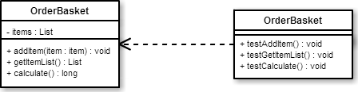

# 単体テスト

* [TDD](01_tdd)

## 概要

* システムを構成するモジュール単位のテスト
    * モジュール単位: クラス
* 結果と本来得られるはずの値とを比較する
* モジュールの開発が終了した時点で行う

## テストの役割

* 単体テストのテストケースは、内部設計をインプットとして作成
    * システムがどのような振る舞いをするのが正しいかを記述
    * プログラムの機能が変わっていないことを保障する
    * 設計や要件定義と対応する
* テストを自動化すれば、すでに開発されている機能を改修も可能

### ユニットテストの対応例

* 1つのメソッドに１つのテストケースメソッドを作成
    * テスト条件によってテストケースメソッドを複数定義も可能
    


## リファクタリング

### 概要

* プログラムの保守性を高めるための開発手法
    * 振る舞いには手をつけずに、実装だけを変更する
    * 機能をそのままにして、プログラムの構造やソースコードを保守性が高まるように修正
* 局所的にボトムアップで行う作業
* ソースコードは常にメンテナンスしやすい状態を保てる

### 目的

* DRY(Don't Repeat Youself)を保つ

### 注意点

* メソッドの名前を変える際、そのメソッドが参照されている全ての箇所を確実に書き換える
* `カバレッジに含まれないものに手を触れてはいけない`

### 前提条件

* テストケースを先に作成されていること

### TODO

* 大きすぎるメソッドやクラスを分割する
    * 役割に応じて分割することで、重複もなくせる
* 分岐をポリモーフィズムに置き換える
    * 分岐の多くは、何らかのクラスの状態として表現可能
    * ポリモーフィズムにすることで分岐を排除可能
* カプセル化を進める
    * 属性が不適切なクラスに所属すると、不要なメソッドが必要になる
    * 属性を移動してカプセル化を進める
* クラスやメソッドの名前を見直す
    * 適切な名前にする

### コツ

* 大幅な変更をする際は、古い機能と新しい機能を併存させる
    * 新しい機能が完成したら古いほうを取り除く
* この変更を小さな歩幅を重ねて進めていく
    * まず、ほかの名前を使ってオブジェクトバックエンドを作る
    * これと古い配列の両方に観察者を追加する
    * そして、新しいオブジェクトを使うように更新する
    * 追加したテストに合格する
    * ここからさらにテストを追加していく

## ふるまい駆動開発

* ふるまい駆動開発
    * BDD: Behavior-driven development
* 語彙を標準化を目指す
* プロセスの中心にユーザーストーリーを据える
    * ユーザーストーリー: システムとのやり取りを描いたもの
* CucumberなどのBDDフレームワークでは、ユーザーストーリーを実行可能テストとして使用可能

## ATDD

* 受け入れテスト駆動開発
    * Acceptance Test-Driben Development
    * 目標は、受け入れテストに合格すること

## 継続的統合

* プログラマ全員のコードを随時統合する開発方法
* 独立した機能単位がリポジトリにコミットされるたびに、結合された全体をチェック
    * 早い段階でエラーを補足しやすくなる
* 通常、結合は、リポジトリにコードをプッシュするたびに行われる
* すべてのソースをビルドしてから、テストを実行する

### 分担

* 開発者は少数の代表的なブラウザでテスト
* 広範囲な対象は継続的結合サーバーがテストする

### 通知

* エラーが見つかったときには電子メールやRSSでチームに知らせる

### ミニファイ

* スクリプトのミニファイ
    * 回線に流すバイトを節約するために、スクリプトの実行に不要な空白やコメントを取り除く
    * ミニファイされたリリースファイルを作り、そのファイルのもとでもテストスイートを再実行

## 自動テスト

* 一度に無数のブラウザでテストを実行可能

## ルール

* ソフトウェアコンポーネントを周囲から切り離して行う
    * どのテストも他のテストに依存してはならない
    * 同時並行にどのような順序でも実行可能であること  
* 依存する部品についてモックやスタブを使う

## 役割

* 実装完了時/変更時に、動作が正しいかどうかを試す
* システムに新しいユニット(単体)が追加された際の回帰テスト

### 単体テストのフレームワーク

* 通常、単体テストは単体テストフレームワークを使用する

## 退行テスト

* 過去の誤りがそのまま残っていないことを確かめる
* システムが大きくなり、複雑になるにつれて、手作業の退行テストは急速に不可能にる

## クロスブラウザテスト

* 単体テストを活用すれば、様々な環境でコードが動作することを確かめるために必要な作業量が削減可能
* 書いた単体テストを全てのターゲット環境で実行してみるだけで済む

## その他の利点

* テストは、インターフェイスのドキュメントにもなる
* ポイントが絞られている単体テストがあれば、新規参画者でも、テストから使用把握可能

## 単体テストの注意

* 単体テストの作成が下手だと単体テストの利点はどれ１つとして得られない
* 時間がかかってメンテナンスしにくいテストにいつまでも悩まされる

## 必要なもの
        
* テストフレームワーク
* カバレッジレポートや継続的結合のためのツール

## テストフレームワーク

### テストフレームワークの機能

* 一連のテストメソッドを実行可能なテストランナーを提供し、結果を報告する
* テストケースは、個別のテストの実行前後に呼び出されるsetUp、tearDown関数を定義可能
    * 共有テストフィクスチャを作りやすくするため
* テスト対象のシステムの状態をチェックするために使われるアサーションを提供している
    * 一般的なのは、期待される値と実際の結果を比較するassertEqual

### テストランナー

* テストを実行するもの
* テストは、ブラウザ内で実行されるまでに以下を行う
    * ブラウザにHTMLファイルをロード
    * そのHTMLファイルがテスト対象のライブラリをロード
* テストから計測値を集める
    * テストカバレッジレポートetc

### テストカバレッジレポート

* テストが本番コードを何行実行したかを計測
* テストスイートがシステムをどれくらいよくカバーしているかを示す
* テストの対象になっていないコードを探すために役立つ

### アサーション

* 単体テストがその意図を明確に示す

```javascript
assertEqual(expected, actual)
```

## ブラウザ内テストワークフレーム

* テストランナーは、実行するテストファイルのURLの入力を求めてくる
* テストファイルは、実行する複数のテストケースをリンクしているHTMLテストスイート
* テストは、サンドボックス化されたフレームで実行される
    * サンドボックス: 
        * 保護された領域で動作させシステムが不正に操作されるのを防ぐセキュリティ機構
    * HTMLフィクスチャは、単体テストのために必要なダミーマークアップのホスティング機能も果たす
        * ダミーマークアップ: URLをスキャンしてパラメータからロードするライブラリ

## まとめ

* テストケース、テストメソッド、アサーション、テストフィクスチャ
* 統合テストと単体テストが混同されやすい
* アプリの独立したコンポーネントをテストすることになっているかどうかで見分けられる
* 単体テストは長期的に見れば時間の節約につながる
* テストがなければ、リファクタリングが困難になる
* リファクタリングの前にテストを書いておけば、リスクを大きく軽減可能
* 同じ単体テストがクロスブラウザテストをかなり簡単なものにしてくれる