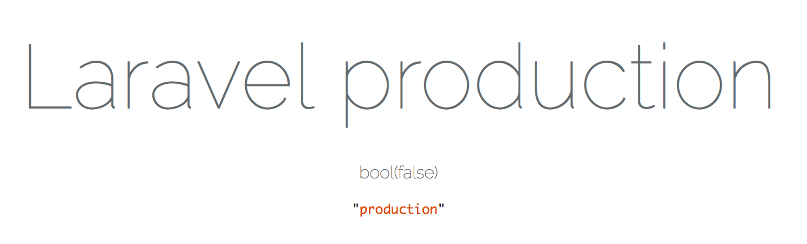

# ph.7: システムテスト

* 本番環境での稼働テスト、拠点への展開、業務の移行
* システム全体のテスト
* システム全体の開発が終了した時点で行う
* テストケースを作成する時には要件定義の内容をインプット(材料)にする
* 要件定義で定義した内容をシステムテストで確認

## E2Eテスト

* Seleniumコンテナ

```yaml
### Sesenium を追加 ##########################################

    chrome:
      image: selenium/standalone-chrome-debug:3.11.0-californium
      container_name: chrome
      ports:
        - 4444:4444
        - 15900:5900
      networks:
        - frontend
```

# 本番用設定 - Laravel

* `.env`で定義した値はconfig/以下の各設定ファイルで使用される
    * ここで設定が行われていない値は、config/で設定される
* `.env`の値は下記のようにすることでアクセス可能

Laravel/resources/views/welcome.blade.php

```php
<div class="title m-b-md">
    Laravel <?php echo App::environment(); ?>
</div>
<?php var_dump(getenv('APP_ENV')); // output  =>  false
dd(\App::environment()); // output => production ?>
```

## 本番環境

```diff
- APP_ENV=local
+ APP_ENV=production
- APP_URL=http://localhost
+ APP_URL=http://本番URL
```

### 0. .envの環境変数を空にする

まずは、APP_ENVの設定の値を空にする

```text
- APP_ENV=local
+ APP_ENV=
```


この際、定義は消していないことに注意

定義ごと削除してしまうと、以下のconfig/app.phpの以下の箇所が動作してしまう

config/app.php

```php
// 変数が存在しない場合にデフォルト値を返す
'env' => env('APP_ENV', 'production'),
```

APP_ENVがない場合、App::environment();で取得する値がproductionとなってしまう



* 今回は、APP_ENVの値を条件に設定を分岐したい
    * 余計な定義は混乱するだけ
    * 『APP_ENVは存在しているが、空の状態』になるようにしている

### 1. httpd.confを設定する

* httpd.confの設定
* public/httpd.confに以下の一行を冒頭に追記

```text
Define local
```

これで開発環境ではAPP_ENVの値はlocal、本番環境ではproductionとなる

### htaccessを編集する

httpd.confで宣言した変数に合致しているか否かで、APP_ENVの値を分岐する

public/.htaccess

```text
<IfDefine local>
   SetEnv APP_ENV local
</IfDefine>
<IfDefine !local>
   SetEnv APP_ENV production
</IfDefine>
```

### envのDB設定を削除

1. `.env`の中で条件分岐をすればいいんじゃないの？
2. 複数の`.env`ファイルを作成して、条件分岐すればいいんじゃないの？

* 1に関しては、.envの中はプログラムが書けない
* 2に関しては`.env`という名前のファイルがなければプログラムが動作しない
    * Laravel5.4ではhttpd.confと.htaccessで環境変数をlocalで定義する
    * 事前に.env.localを用意しておいたとしても)読み込まれるのは`.env`

環境変数の値による分岐とDB設定はconfig/database.phpに任せるため、ここではDB設定を丸ごと削除する

### config/database.phpを編集する

`.htaccess`で設定した値によって分岐し、DBの設定をする

config/database.php

```php
<?php
$env_flg = getenv('APP_ENV') === 'production';

if ($env_flg) {
    $db = [];
    $db['host'] = "本番DBのHOST";
    $db['user'] = "本番DBのUSER";
    $db['pass'] = "本番DBのPASS";
    $db['name'] = "";
    return $db;
} else {
    $db = [];
    $db['host'] = "localhost";
    $db['user'] = "user";
    $db['pass'] = "pass";
    $db['name'] = "project";
    return $db;
}
    〜中略〜
        'mysql' => [
            'driver' => 'mysql',
            'host' => $db['host'],
            'port' => env('DB_PORT', '3306'),
            'database' => $db['name'],
            'username' => $db['user'],
            'password' => $db['pass'],
    〜以下略〜
```

## 確認する

```bash
php artisan make:model Member
php artisan tinker
#>>> App\Member::all(); 
```

* 指定したモデル名のテーブルのデータの一覧が取得できたら成功

## ポイント

`.htaccess`で直接DB_HOSTなどを指定してしまえがいいのでは？

例

public/.htaccess

```text
<IfDefined local>
    SetEnv DB_HOST 127.0.0.1
    SetEnv DB_USER user
    SetEnv DB_NAME prject
    SetEnv DB_PASS pass
</IfDefined local>
```

config/database.php

```php
<?php
    〜略〜
        'mysql' => [
            'driver' => 'mysql',
            'host' => DB_HOST,
            'port' => env('DB_PORT', '3306'),
            'database' => DB_NAME,
            'username' => DB_USER,
            'password' => DB_PASS,
    〜以下略〜
```

* これは失敗する
* 一度、変数に入れるか文字列を直接入れなくてはDBエラーとなる