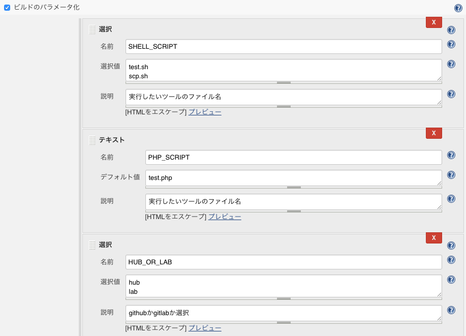

# Tool

## 概要

* リモートに配置したツールを利用する
    * 使用するスクリプトは選択可能にする

## 処理

* ビルド
    * シェルの実行
* ビルド後スクリプト
    * リモートホストでPHPを実行
    * ツールリポジトリ削除

## 設定

* ビルドのパラメータ化をチェック
    * パラメータの追加
        * テキストを選択
            * 名前: SHELL_SCRIPT
            * デフォルト値: test.sh
    * パラメータの追加
        * テキストを選択
            * 名前: PHP_SCRIPT
            * デフォルト値: test.php
* ビルド後スクリプト
    * リモートホストでPHPを実行
    * ツールリポジトリ削除
* ビルド - シェルの実行にシェル
    * クローン
    * シェルの実行

### ビルド後スクリプト

* ビルド環境
    * SSHサイト
        * jenkins@web1:22
    * リモートホストでPHPを実行

```bash
cd /jenkins/article_frame/tools
php ${PHP_SCRIPT}

rm -rf /jenkins/article_frame/tools
```

### ビルド

```bash
cd /var/jenkins_home/article_frame

GIT=git@github.com
git clone ${GIT}:aki-creatist/tools.git
cd tools
bash ${SHELL_SCRIPT}
```


