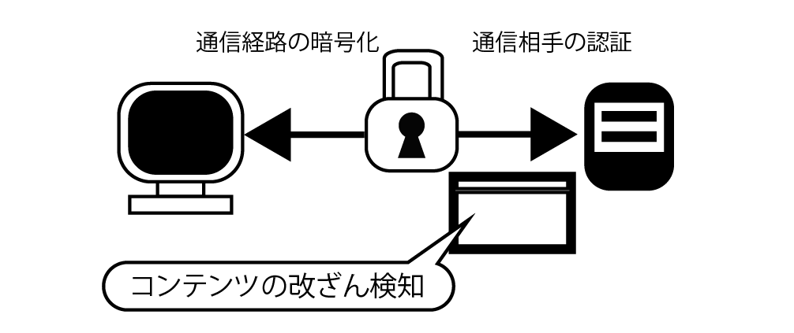
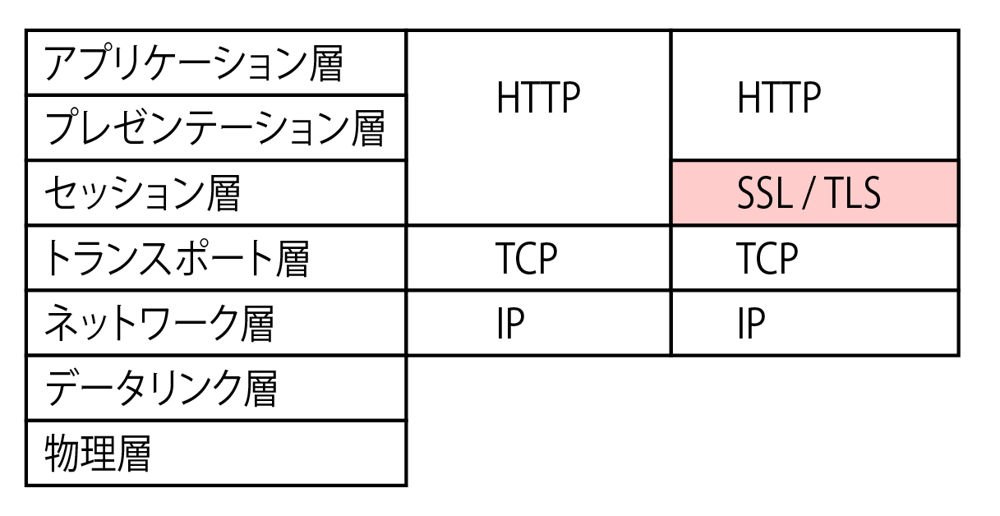
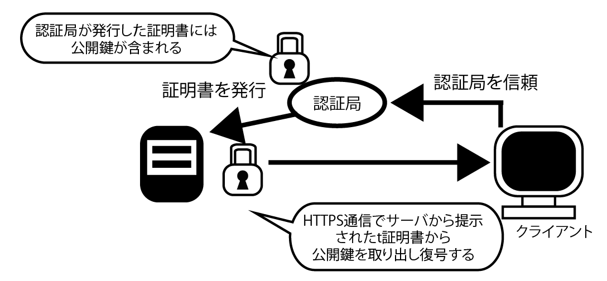
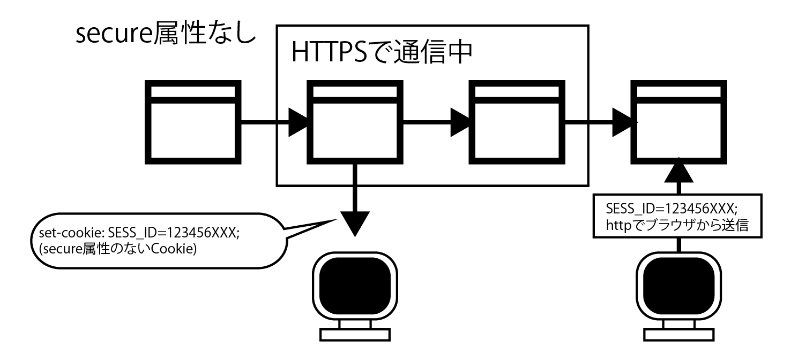

## 4-1HTTPの機能

```text
HTTPSは、Webアクセス時にHTTPでの通信を暗号化するプロトコル
HTTPには、(1)通信経路の暗号化、(2)コンテンツの改ざん検知、(3)通信相手の認証―――の三つの機能がある
```



* (1)では、HTTPSはWebブラウザーとWebサーバー間の通信経路を暗号化する
    * 万が一、通信が盗聴されたとしても、通信経路上でやり取りているデータ(情報)が暗号化されているので、データの内容は読み取れません。
* (2)では、サーバーから送信されたコンテンツが途中で改ざんされていないことを保障可能
* (3)では、通信相手のサーバーやクライアントが本当に意図した相手かどうかを確認可能
    * つまり、利用したいWebアプリケーションが、本当に運営者のものかどうかを確かめられる
    * また(2)と(3)により、クライアントとサーバーの中間に入ってデータを改ざん中継する「中間者攻撃」（Man in the middle、MITMなどと略す）を防げる



#### どのようなときにHTTPSを使うべきか

* ユーザーIDやパスワードを入力する画面は間違いなくHTTPSにすべき
* またネットショッピングの決算画面で、クレジットカード情報や配送先を入力するような画面も同様
* このほかにも、HTTPSを利用する事で防げる脅威（盗聴、改ざん、なりすまし)がある場面では、HTTPSを積極的に検討する

#### SSLとTLSのバージョンに注意

* HTTPSは、HTTP通信を行うソケット部分を、SSLあるいはTLSに置き換えている

## 4-2PKIの鍵交換メカニズム

HTTPSはPKI(Public Key Infrastructure、公開鍵基盤)という暗号化基盤によって成り立っている



* インターネットで不特定多数の相手と通信するWebアプリケーションでは、暗号化や復号に使う「鍵」を安全かつ効率よい交換が必要
* それを実現するのがPKI
    * PKIでは、暗号化と複合に「秘密鍵(Private Key)」と「公開鍵(Public Key)」の二つの鍵を一対(ペア)で利用
    * 秘密鍵で暗号化したものは、対応する公開鍵でないと正しく複合できない
    * 秘密鍵はその名の通り、他社に公開禁止だが、公開鍵は他社に公開しても問題ない鍵
* コンテンツの暗号化と復号では同一の鍵(共通鍵)を使うが、この共通鍵を安全に交換するために秘密鍵と公開鍵を使う
* WebアプリケーションでHTTPS通信を行う場合には、Webサーバーに認証局(Certificate Authority、CA)が発行した「サーバー証明書」をインストールする
* サーバー証明書は、通信相手となるWebサーバーが正しいかどうかを確認するためのもの
* サーバー証明書によって、ドメインの有個性を確認可能
* さらに、証明書の種類によっては、Webサーバーを運営している団体が本当に存在しているかどうか(実在性)を証明できる

#### 証明書は階層構造を持つ

* 認証局(CA)としては、SymantecやGlobalSign(日本法人はGMOグローバルサイン)などがある
* 認証局が発行する証明書は階層構造を持っている

```text
ルート証明書機関 (認証局 ex.Verisign) ブラウザにいプリインストールされている
├── 認証局
└── 認証局
    ├── サーバA サーバ証明書
    ├── サーバB サーバ証明書
    └── サーバC サーバ証明書
```

* 最上位に位置する認証局を、ルート認証局という
* アクセスしたWebサイトの証明書がWebブラウザーに標準で組み込まれているルート証明機関によって証明できない場合、警告が表示される
* こうした証明書は「自分で自分を証明する」ようなものなので、通称「オレオレ証明書」と呼ばれている

## 4-3サーバー証明書の安全で正しい設定

* 通常、HTTPSのセットアップやサーバー証明書の申請、インストールは、Webサーバー管理者が行う
    * 設定のポイント
        * 第一に、安全なプロトコルを利用すること
            * SSL 2.0/3.0には脆弱性が指摘されているので、TLS1.0以上を利用するようにする
        * 第二に、サーバー証明書を申請する際に作成する「秘密鍵」は、十分な鍵長を指定して発行する
            * 暗号アルゴリズムとしてRSAを使う場合は2048ビット、ECDSAの場合は256ビットを指定
            * なお、RSAで1024ビットの鍵長の場合は、認証局で新規の申請を受け付けていない
        * 第三に、サーバー証明書を申請する際に指定する「署名アルゴリズム」は、SHA-1ではなくSHA-2を指定
            * SGA-1アルゴリズムには従来から重大な脆弱性が指摘され、2013年から2014年にかけて、Microsoftと米GoogleがそれぞれSHA-1からSHA-2への移行をアナウンスしている

## 4-4HTTPS 利用時の設計・開発の注意点

* HTTPSを利用したWebアプリケーションの設計・開発時には、以下の4点に注意
    * まず、画面設計での注意点として、Webブラウザーのアドレスバーやステータスバーを非表示にしないようにする
        * HTTPSはユーザーを守るための仕組みです。送信するデータがHTTPSによって守られていることを、確認できるようにすべきです。
    * 二つめは、画面遷移の設計に関することです。HTTPSでデータを保護するには、有力画面と送信先画面の両方でHTTPSを使うようにする
        * 入力画面があっても、送信先がHTTPSでなければ効果はない
    * 三つめは、一つの画面の中でHTTPSとHTTPのリクエストを混在させないようにすること
        * HTTPSとHTTPのリクエストが混在していると、Webブラウザーのステータスバーに注意が表示される



## 4-5 HSTSヘッダーの活用

* HSTSヘッダーとは、Webブラウザーに対して、指定されたWebサイトにはHTTPSだけで通信するように強制するヘッダー
* HSTSヘッダーを指定する事で、WebアプリケーションのHTTPS通信に関する設定ミスを防げる

HSTSヘッダーは次のように設定する

```text
Strict-Transport-Security：　max-age=31536000; includeSubDomains
```

* max-ageにはヘッダーの有効期限を秒単位で指定
* includeSubDomainsは、サブドメインにもこのヘッダーを有効化する指定(オプション)

## 第4章のまとめ

#### HTTPSの機能

* HTTPSの役割は「通信経路の暗号化」「コンテンツの改ざん検知」「通信相手の認証」
* 認証や個人情報をやり取りする場合はHTTPSで暗号化する
* Webサイト全体をHTTPSで保護するものも増えてきている

#### PKIの鍵交換メカニズム

* HTTPSはPKIという暗号化基盤により成り立つ。PKIは「秘密鍵(PrivateKey)」と「公開鍵(PublicKey)」の2種類の鍵を一対(ペア)で利用する。PKIによって、HTTPSの暗号化と複合に使う共通鍵を安全に交換できる
* HTTPS通信を行う場合には、Webサーバーに認証局(CertificateAuthority、CA)が発行した「サーバー証明書」をインストールする。
* 認証局が発行する証明書は階層構造を持つ。最上位に位置する認証局を、ルート認証局と呼ぶ。ルート認証局の証明書は、Webブラウザーにあらかじめ登録されている

#### サーバー証明書の安全で正しい設定

* サーバー証明書を申請する際に指定する「プロトコル」「秘密鍵」「署名アルゴリズム」は、申請時テインで信頼できるものを指定する
* 証明書の運用中の場合でも、新たな脆弱性の発見などにより更新が必要になる場合があるので、最新情報に注意する
* サーバー証明書やWebサーバーの設定をチェックできるサービスがあるので、適宜利用する

#### HTTP利用時の設計・開発の注意点

* Webブラウザーのアドレスバーやステータスバーを非表示にする画面設計は避ける
* HTTPSを利用する場合、送信元・送信先ともにHTTPSで暗号化させる
* 一つの画面でHTTPとHTTPSを混在させないようにする
* HTTPSのみで利用するCookieにはsecure属性を付ける

#### HSTSヘッダーの利用

* HSTS(HTTP Strict Transport Security)ヘッダーを使うと、Webブラウザーに対し、HTTPSだけで通信するように指定できる
* Webサイトへの初回訪問時からHTTPSでアクセスさせるには「HSTSプリロードリスト」にあらかじめ登録申請する