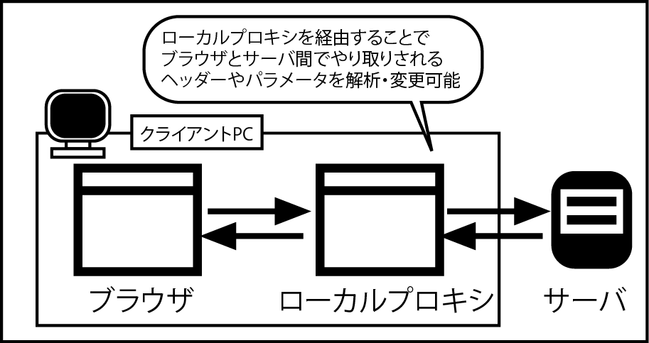

# ローカルプロキシーを使った入力データの改変

* ユーザーがWebブラウザーに入力したデータがどのような形でWebサーバーに送信されているかを確認するには、「ローカルプロキシー」と呼ばれるツールを利用する方法がある
* ローカルプロキシーは、パソコンにインストールして使う
* ローカルプロキシーはWebブラウザーとWebサーバーの間位に入り、Webブラウザーに変わってWebサーバーと通信する

