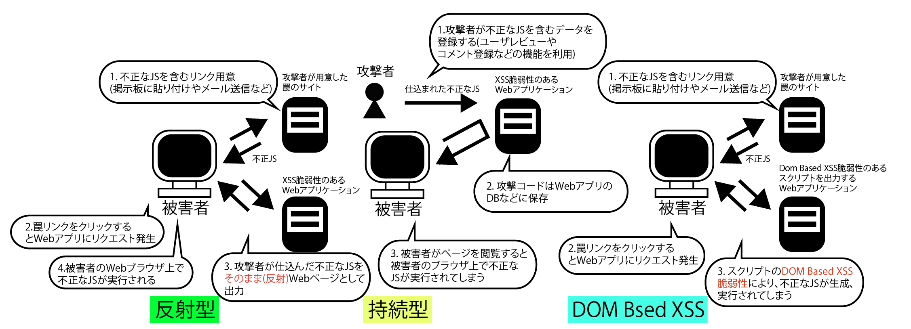

# クロスサイトスクリプティング

* XSSは、ユーザーのWebブラウザー上で動作する不正なスクリプト(JS)を混入する攻撃手法または脆弱性
* XSS脆弱性があると、以下に引っかかる可能性がある
    * CookieのセッションIDを盗み出してセッションを乗っ取られる(セッションハイジャック)
    * Webサイトに偽の入力フォームが構築されてフィッシング詐欺の被害に遭う
* XSS脆弱性は、WebアプリケーションがHTMLを出力するときに、HTMLの特殊文字を適切に処理せずに出力することが原因
* つまり、ユーザーからの入力値をそのまま出力するケースです。

ユーザーが入力した値が入る部分に、例えば以下のような文字列が入力され、そのまま出力したとします。

```html
"><script>alert(document.cookie)</script>
```

* すると、開発者が意図しないHTMLが出力されてしまい、このHTMLを表示したWebブラウザーでスクリプト(JS)が動作する
* このほか、セッション仮に使うCookieの値を外部のWebサイトに送信することなども可能

## 反射型、持続型、DOM Based XSSの３種類がある

```text
XSSは攻撃の方法によって、反射型XSS、持続(蓄積)型XSS、DOM Based XSSの３つに分類可能
```

* 反射型XSS
    * 攻撃者がXSS脆弱性のあるWebアプリケーションに送り込む攻撃コードを別のWebサイトに用意しておいたり、攻撃コードを含むURLを記述したメールを被害者に送付したりする
    * 反射型XSSで悪用されやすいのは、入力画面の内容をそのまま確認画面位表示しているような箇所
* 持続(蓄積)型XSS
    * ネットショッピングでのユーザーレビューのコメント欄や、製品サポートフォーラムでの投稿などが典型例
    * DBに攻撃コードを保存する手法としては、SQLインジェクションが使われることもある
* DOM Based XSS
    * HTMLやXMLをアプリケーションから利用するためのAPI
    * クライアント側のプログラム(JS)に処理のも誰があることが原因
    


## XSS脆弱性を防ぐために確認すべきこと

* 対策の一つ目は、「入力チェック」をもれなく組み込むこと
    * 入力チェックはあくまでアプリケーションの使用に基づき実施するものであり、根本的な脆弱性対策とはならない
        * Webアプリケーションが処理するすべての入力値を入力チェックの対象とする
        * テキストボックスやテキストエリアなどの入力値だけでなく、セレクトボックスやラジオボタンなどの選択項目も、規定の範囲内にあるかどうかをチェックする
        * ヘッダーやCookieなど、クライアントから送信されてきた値をWebアプリケーションお処理で使う場合も、入力チェックを行う。
        * DBやファイルから取り出した値も入力チェックの対象とする
        * クライアント側のプログラム(JS)で処理を行う場合も入力チェックを行う
* 対策の２つ目は、プログラムからHTMLを出力する際に、HTMLの特殊文字を別の文字や記号に変換するエスケープ処理を行うこと
    * HTMLの特殊文字をエスケープすることを「HTMLエンコーディング」と呼ぶ

### 例

* HTMLのコンテンツ：`<p> XXXXX</p>`
* タグの属性値：`<input type="text" name"userid" value"XXXXX">`
* JS内の文字列：`<script>var message="XXXXX";</script>`
* イベントハンドラ：`<a onclick="alert ('XXXXX') ">`

```text
こうしたエンコーディング処理は、自作するのではなく、開発言語やフレームワークが用意している関数やメソッドを利用する
また、JSの動的生成では、JSとHTMLのそれぞれの特殊文字をエスケープする必要があります。
```

* 対策の三つ目は、タグの属性値を必ず引用符(`"`ダブルクォート)でくくること
    * 以下に属性値に引用符がない例を示す。XXXXXの部分にユーザーからの入力値が出力される

```html
<input type="text" name="userid" value=XXXXX>
```

* 属性値を引用符でくくることで、引用符の間(`"`から`"`まで)を属性値としてWebブラウザーが認識するようにする

```html
<input type="text" name="userid" value="XXXXX">
```