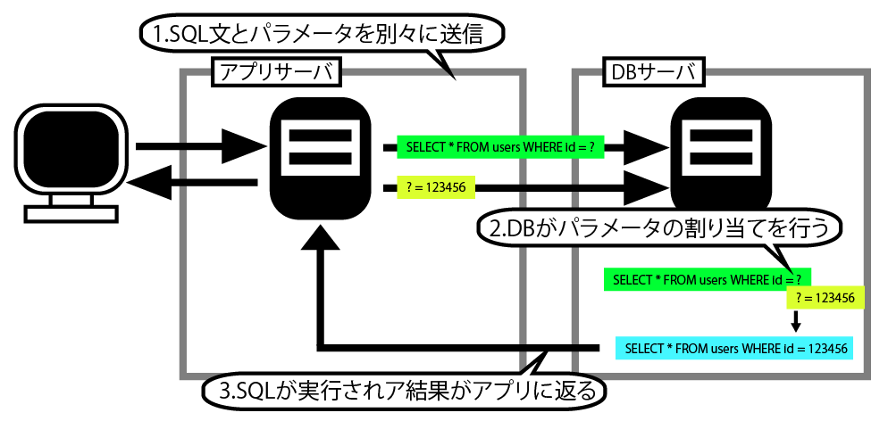
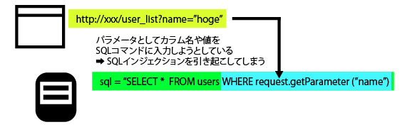

# SQLインジェクション

* DBに登録された会員情報(個人情報)などの機密データの漏洩
* DBのデータの改ざん、消去
* 認証(ログイン)機能を回避し、パスワードなしでシステムにログイン
* SQLからシェルコマンドを呼び出し、DBサーバーのファイルの読み書き、不正な実行

## 手順

* 1.攻撃者が不正なSQLコマンドをフォームから入力
* 2.WebアプリケーションがSQL文を組み立てて、DBサーバに送信
* 3.不正なSQLがDBサーバ上で実行される
* 4.SQLの結果を返す
* 6.DBのデータ漏洩、認証をバイパスしてログイン、管理者権限でログイン
* 7.攻撃者によるデータの改ざんや正気、OSコマンドを利用したファイルの書き出しや読み込みなどの不正捜査

## SQLインジェクションが発生する仕組み

* WebアプリケーションがSQL文を動的に組み立てる際に発生する
    * 例えば、SQL文を組み立てるプログラムで、検索条件となる部分に、Webブラウザから送信されてきたパラメータをそのままセットする
    * ここで、Webブラウザから検索条件として、以下のようなパラメータを指定する

```text
1 or 1=1
```

* これにより、例えば以下のようなSQL文が組み立てられたとする
* このうち「1=1」は、「常に真(true)」となる
* 従って、このSQL文は、テーブルに登録されているすべてのデータを返してしまう

```sql
SELECT user_id, user_name FROM users WHERE user_id = 1 or 1=1
```

## プレースホルダ方式を使ってSQL文を呼び出す

* SQLインジェクションを防ぐ根本的な対策は、WebアプリケーションでSQL文の呼び出しに、文字列連結による組み立てを使わないこと
    * パラメータ部分に値を埋め込む際、文字列を連結してSQL文として組み立てる方法を「文字列連結による組み立て」と呼ぶ
* 文字列連結による組み立ての代わりに、SQL文の呼び出しには「プレースホルダ」方式を使う
* プレースホルダ方式は、DBMS(データーベース管理システム)のマニュアルや開発言語の解説書では、「バインド(メカニズム・機構)」「プリペアドステートメント」と呼ぶ場合もある



## 基本的な対策は５つある

* 入力チェックを行う
* SQL文の呼び出しにプレースホルダ形式を使う
* ユーザーが入力したパラメータを、SQL文の一部に直接使用しない
* DBに接続するユーザー権限を管理する
* エラーメッセージを制御する



この例では、並び順を変更したい列のタイトルをクリックすると、以下のようなリクエストがWebアプリケーションに送信される

```text
http://xxx/user_list?orderby=id
```

* このリクエストを受け取ったWebアプリケーションが、SQL文の組み立てを図5-10のようにしていると、SQLインジェクションを引き起こしてしまう
    * 図5-10では、パラメータで受け取ったカラム名をそのままORDER BY句でならべかえるから無名として指定している
    
## 文字列型カラムに対するSQLインジェクション

* SQL文で文字列型カラムに対する値を指定するときには、引用符(`'`)で値を括る
* パラメータとして引用符を含む文字列を与えると、SQL文の意味が変更してしまうことがある
* 本文中で使ったSQL文で、「user_id」列が文字列型('15040001'など)だった場合、`'or'1'='1`をパラメータとして与えると、組み立て後のSQL文は次のようになる
    * 太字の部分がパラメータ
    * `'`をうまく使うことで、SQL文として文法的にエラーになることを回避しつつ、SQL文の意味を変更可能

```sql
SELECT user_id, user_name FROM users WHERE user_id = '<strong>' or '1'~'1'
```

### UNION句を使ったSQLインジェクション

* SQLには「UNION句」というコマンドがあり、複数のSELECT文を組み合わせる構文
* 全く異なるテーブルのデータの検索結果を表示できてしまう
* 以下の例では、usersテーブルに対するSQL文に、cardinfoテーブルに対するSELECT文を組み合わせている

```sql
SELECT user_id, user_name FROM users WHERE user_id = '15040001' UNION SELECT cardnum,expire FROM cardinfo
```

### 服文によるSQLインジェクション

* 複文とは、複数のSQL文を続けて実行できる機能のこと
* 複文を実行できるDBでは、本来SELECT文を実行する機能に対して、UPDATEやDELETEなどの任意のSQL文を実行できてしまう
* 複文はSQL Serverでは「;(セミコロン)」に続けて挿入できるが、実際にはセミコロンなしでも複文を実行可能

### ブラインドSQLインジェクション

* ブラインドSQLインジェクションとは、表示される結果の違いを比較することで、情報を抜き出す手法
* ブラインドSQLインジェクションでは、画面上には目的となるデータそのものは表示されない
* 検索条件を組み合わせ、結果の違いに着目して情報を抜き出す