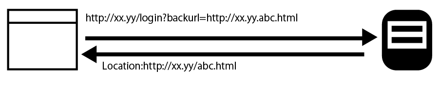
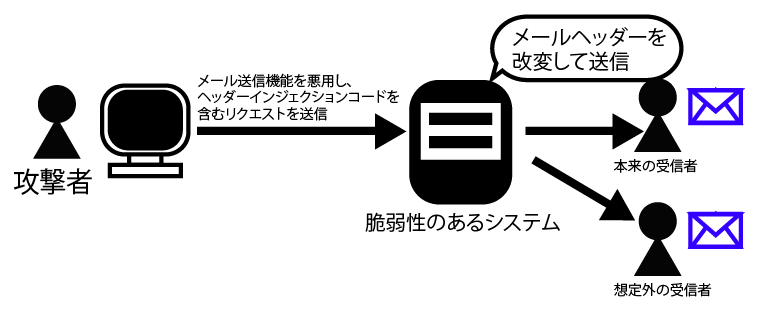
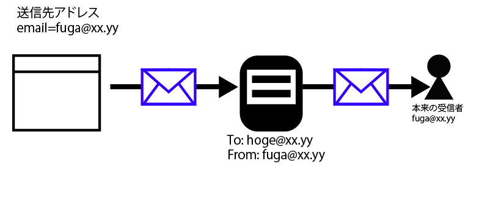

# ヘッダーインジェクション

* Webシステムが外部からのパラメータを元にヘッダーを出力している箇所では、ヘッダーインジェクション攻撃への対策が必要
* Webシステムからヘッダーを出力する箇所としては、HTTPでのやり取りで出力する「HTTPレスポンスヘッダー」と、メール送信の際に出力する「メールヘッダー」がある
* これらを悪用した攻撃をそれぞれ「HTTPヘッダーインジェクション」「メールヘッダーインジェクション」と呼ぶ
* いずれの場合も、ヘッダー出力における特殊文字は改行コード
* HTTPヘッダー及びメールヘッダーでは、改行コードまでを一つのヘッダーとして扱う
* 外部からのパラメータに、改行コードに続けて任意のヘッダーを加えるのが、ヘッダーインジェクション攻撃の典型的な手法

## HTTPヘッダーインジェクション

HTTPヘッダーインジェクション攻撃による被害としては、次のようなものが挙げられる

* 任意のCookieを発行する(攻撃者が指定したCookieを受け入れてしまう)
* 任意のURLにリダイレクトさせる
* 偽のレスポンスボディを表示させることでユーザーがフィッシング被害にある

```text
HTTPヘッダーとして出力する箇所で、改行コードを含むパラメータをそのまま出力してしまうと、任意のHTTPヘッダーをWebシステムが出力する可能性がある
改行コードに続けてLocationヘッダーを加えることで任意のCookieをWebブラウザに読み込ませたりできる
```

### HTTPヘッダーインジェクションを防ぐには

* HTTPヘッダーインジェクションを防ぐには、自作でHTTPヘッダーを出力する実装を極力避けるようにする
* 開発言語やフレームワークで用意されている、リダイレクトやCookie発行の専用関数やAPIを使う



## メールヘッダーインジェクション

* メールヘッダーインジェクションは、Webアプリケーションからメールを送信する機能における攻撃手法または脆弱性
* メールヘッダーには`送信元`、`宛先(To、Cc、Bcc)`や`件名(Subject)`などが含まれている
    * これらの値を外部からパラメータとして指定可能な場合、メールヘッダーインジェクションの危険性がある
* メールヘッダーインジェクションの被害例として、次のようなものが挙げられる
    * Webシステムのメール送信機能が迷惑メールの送信に悪用される
    * メール件名やメール本文の改ざん



* Webシステムが外部からのパラメータをメールヘッダーにそのまま出力していると、改行コードに続けて任意のメールヘッダーや本文を設定してしまう危険性がある



### メルヘッダーインジェクションを防ぐには

* メールヘッダーインジェクションを防ぐには、Webシステムのメール送信機能において、開発言語やフレームワークが用意しているメール送信関数やAPIを利用する
* メールヘッダーや本文を組み立てる関数を自作しないようにしましょう。
* メールメッセージの宛先(To)や件名(Subject)には、改行コードを含められない
    * このため、これらの外部パラメータに改行コードが含まれている場合、入力チェックでエラーとするか、メールの送信時に改行コードを取り除く処理を実装する
    * 可能であれば、外部パラメータをメールヘッダーに出力しないようにする
