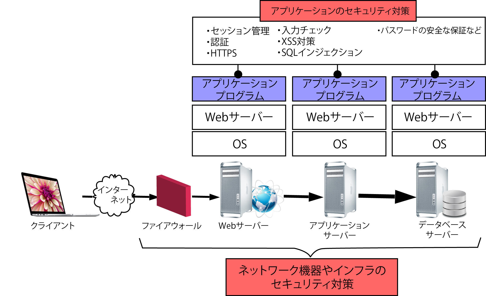
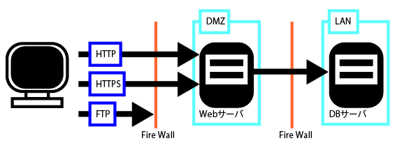
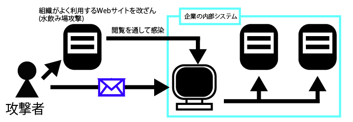

# インフラはアプリケーションより狙われやすい

* Webシステムのネットワークやサーバーなどのインフラには、以下のようなものがある



* ルーターやスイッチなどのネットワーク機器
* ファイアウォールやIDS(Intrusion Detection system、侵入検知システム)、IPS(Intrusion Prevention System、侵入防止システム)などのネットワークセキュリティ対策システム
* Webアプリケーションの動作に関連する、Webサーバー、アプリケーションサーバー、DBサーバー
* システムを管理するための端末(パソコン)

## インフラの代表的なセキュリティ対策

* ネットワークレイヤーのセキュリティ対策で利用する代表的な機器(またはソフトウェア)は、ファイアウォールやIDS、IPS
* ファイアウォールは、特定のネットワークと外部のネットワークの通信を制御するもの
* ファイアウォールで通信を制御する方法としては、送信元と宛先の「IPアドレス」と「ポート番号」で制御を掛ける「パケットフィルタリング型」が代表
* ただし、ファイアウォールは公開しているWebサーバーへの通信は許可するため、Webアプリケーションを狙った攻撃を防げない
    * そこで他のセキュリティ対策を併用する
    * 例えば、IDSやIPSは、ネットワークを流れるパケットを監視して、不正アクセスと思われる攻撃パターンを検知する
    * IDSは検知してアラート(警告)をあげるところまでですが、IPSは検知した不正な通信を止める機能を持つ
* IDSやIPSでは、攻撃を検知するために「シグネチャ」と呼ばれるパターンを利用する
* そのため、基地の攻撃には有効ですが、道の攻撃に対しては無力



### Webアプリケーションに特化したファイアウォール

* WAF
    * インフラに設置するセキュリティ機器(及びソフト)の中にも、Webアプリケーションへの攻撃を防御することに特化している
* WAFには、ハードウェア型、ソフトウェア型、SaaS形式で提供されるものがあります。
* WAFを使うことで、Webアプリケーションを回収することなく、攻撃を緩和可能

## インフラやネットワークを狙った攻撃と対策

* ソフトウェアの脆弱性をついた攻撃
* ソフトウェアの設定ミスに起因する攻撃
* DoS攻撃などの大量アクセスでWebサイトを利用不能にさせる攻撃
* 管理者のクライアントPCを狙った攻撃

### (1)ソフトウェアの脆弱性をついた攻撃

```text
これは、サーバーのOSやミドルウェア、フレームワーク、ライブラリの脆弱性をついた攻撃
```

### (2)ソフトウェアの設定ミス起因する攻撃

```text
これは、ソフトウェアの構築(インストール)や設定変更時に発生する単純なミス、または設置値の誤解に起因する
例えば、Webサーバーで後悔ディレクトリーの設定を間違うと、設定ファイルやバックアップファイル、最悪の場合は会員情報など後悔してはならないファイルが閲覧可能になる
```

* URLでディレクトリーを指定したら、ディレクトリーのファイル一覧が見えてしまう
* 管理者用画面へのアクセス制限の設定ミスで、誰でもアクセスできてしまう
* WebアプリケーションのURLを指定したが、Webアプリケーションが動作せず、スクリプトの中身(ソースコード)が表示されてしまう
* 古いバージョンや、開発やテスト中に利用していたWebアプリケーションが残っており、アクセスできてしまう
* 管理者用画面に設定されたパスワードが単純で、容易に推測できてします。

### (3)DoS攻撃などの大量アクセスでWebサイトを利用不能にさせる攻撃

* SoD(Denial of Service、サービス停止)攻撃とは、大量のトラフィックを対象のシステムに発生させることで、正規のユーザーがWebサイトを利用できない状態にする攻撃のこと
* 大量のトラフィックを発生させるために、DoS(Distributed Denial of Service、分散サービス停止)攻撃という手法がよく使われる
* DDoS攻撃では、「踏み台」と呼ばれるリモートコントロール可能な何千台、何万台という規模のコンピューターから、一斉に対象システムに対してアクセスを試みる
* こうしたリモートコントロールされるコンピュータ群は「ボットネットワーク」と呼ばれる
* 攻撃者はコンピュータをマルウェアなどに感染させて、ボットネットワークの一部に組み込む

### (4)管理者のクライアントPXを狙った攻撃

* 特定の組織や情報を狙った攻撃を「標的型攻撃」と呼ぶ
* 標的型攻撃では、攻撃者が内部にあるパソコンから情報を窃取したり、リモートコントロールできる端末を作成したりする



* 水飲み場型攻撃
    * 特定の組織の構成員がよく閲覧するWebサイトを改ざんし、閲覧したパソコンにマルウェアを感染させる

## サーバー管理の注意点

* ユーザーのうち不要なものは削除または無効化する
    * OSインストール時には、デフォルトで作成されるユーザーがある
    * アプリケーションのインストーラーが作成するユーザーもある
* デフォルトのパスワードが設定されているものは、必ず変更する
* 次に、不要なソフトウェアをインストールしない
* 不要なサービスも止める

### 信頼できるサイトからソフトウェアをダウンロード

* ソフトウェアをインストールする際は、インストール元とインストール方法を記録しておく
* 信頼できるサイトからダウンロードすること
* インフラ構成の自動管理ツールに限らず、開発支援ツールを始めて導入する際は、学習に要する費用的、時間的なコストが発生する
* そのため、PMや組織によっては導入をためらうところもある
ようです。しかし、こうしたツールの導入は、繰り返し行う作業であればあるほど、効果を発揮する

### オープンソースのソフトウェアを利用する場合の注意点

オープンソースのソフトウェアを利用する場合は以下の点に注意しましょう。

* ソフトウェアは公式サイトからダウンロードする
* プラグインやテーマを追加する場合は、なるべく公式サイトで配布されているものを使う
* 初期設定の管理者用パスワードは必ず強度の高いパスワードに変更する
* 設定ファイルや管理者用画面へのアクセス制御を実施する
* 定期的なアップデートを実行する

### 時刻同期の設定を忘れずに

* 各種サーバーのセキュリティ対策では、くれぐれも「時刻同期」を忘れないようにする
* ファイアウォールなどのセキュリティシステムや、Webサーバーをはじめとした各種サーバーには、NTP(Network Time Protocol)似寄る時刻同期を設定する
* こうすることで全てのサーバーで正確な時刻がログファイルに記録される
* セキュリティ事故対応などの現場で出くわすログファイルには、時刻同期が取れていないケースもある
    * このような場合、ログファイルから侵入経路や攻撃の手口を解析するのが一苦労
    
### 負荷分散装置の導入時はセッション維持の仕組みが必要

* Webアプリケーションで大量のアクセスを処理したり冗長性を確保したりするには、Webサーバーを複数台用意し、負荷分散装置をWebサーバーの前に設置するのが一般的
* 負荷分散装置は、Webサーバーの応答時間や接続数などをもとに接続するWebサーバーを決定し、クライアントからのリクエストを複数のWebサーバーに振り分ける
* Webアプリケーションでセッションを維持するためには、セッションISを使う
* セッションISを含むセッション情報は、通常はWebサーバー上にメモリやファイルなどの形で一時的に保存される
* このため、負荷分散装置の配下にある別のWebサーバーでは、セッションを識別不可能
    * 複数台のWebサーバーで負荷分散を行いつつ、セッションを維持する仕組みが必要になる

セッションを維持する仕組みとしては以下のような方法がある

* 負荷分散装置の「セッション維持時機能」(persistence、stickyともいう)
    * 負荷分散装置で振り分け先のWebサーバーを判断し、同一Webサーバーに送信する
    * 方式としては、アクセス元のIPアドレスで判断する方法や、負荷分散装置でCookieを発行して判断する方法がある
    * 振り分け先のWebサーバーが障害などでダウンした時には、セッションが破棄される
    * ダウンするまでにユーザーが実施した処理は無効になる
* Webアプリケーションサーバーの機能を利用する方法やセッション情報をDBに格納する方法
    * Webサーバー間でセッション情報を共有する仕組みを導入する
    * 負荷分散装置は以下のWebサーバーがダウンしても、別のWebサーバーに接続することでセッションを維持可能

## 第6章のまとめ

### インフラはアプリケーションより狙われやすい

* ネットワークやインフラを狙った攻撃は、個別アプリケーションよりも攻撃を受けやすい
* セキュリティホールによる問題(不具合)の再現性を書くを確認するために使う「実証コード(PoC)」が攻撃に悪用される場合がある
* タイショウノセイヒン(OSやミドルウェア、ネットワーク機器やパッケージ製品)を利用しているWebシステムが、無差別に被害に遇う

### インフラの代表的なセキュリティ対策

* ネットワークレイヤーのセキュリティ対策で利用する代表的な危機には、ファイアウォールの他に、IDSやIPS、WAFなどがある
* ファイアウォールは、必要な通信だけを通すなど、特定のネットワークと外部のネットワークの通信を制御する
* IDSやIPSは、ネットワークを流れるパケットを監視して、不正アクセスと思われる攻撃パターンを検知し、防御する機能を持つ
* WAFは、Webアプリケーションに特化したファイアウォール。特定の状況では被害を緩和する効果がある
* IDSやIPS、WAFには誤検知や過剰検知の可能性がある。また有効性を維持するには、迅速なシグネチャ適用など運用体制をしっかり考えておく必要がある。

### インフラやネットワークを狙った攻撃と対策

* インフラやネットワークを狙った攻撃には「フォフトウェアの脆弱性をついた攻撃」「ソフトウェアの設定ミスに起因する攻撃」「大量のアクセスでWebサイトを利用不能にさせる攻撃(DoS)」「管理者のクライアントPCを狙った攻撃」がある
* ソフトウェアの脆弱性情報を収集し、必要なものがあれば修正モジュールを迅速に適用する。また、ソフトウェアの正しい設定を理解し、毎回確実に設定する
* 特定の組織や情報を狙った「標的型攻撃」や「水飲み場型攻撃」では内部のクライアントPCが狙われる。クライアントとPCのソフトウェアや流いる対策ソフトを最新に保つほか、社内利用者のリテラシー教育が必要

### サーバー管理の注意点

* OSやアプリケーションのインストール時にデフォルトで作成されるユーザーのうち、不要なものは無効化するか削除する。デフォルトのパスワードがそのまま設定されているものは、必ず変更する
* 不要なソフトウェアをインストールしないようにする。不要なサービスは停止する
* インターネットからソフトウェアをダウンロードしてインストール場合は、信頼できるサイトからダウンロードする
* すべてのサーバーで正確な時刻をログファイルに記録する
* 各種サーバーには、NTP似寄る時刻同期を設定する

### DNSサーバーやDBの設定に注意

* DNSサーバーには度々、重大な脆弱性が見つかっている。適切なタイミングでアップデートできるようにしておく
* 情報漏洩は外部の攻撃者によるもの以外に、システム管理者や社内の正規ユーザーから発生することも多くある
* DBの「監査ログ」を取得することで「被害範囲・経路の特定」「運用ルールや規定などへの遵守状況の監査」「内部不正の抑止効果」が期待できる
