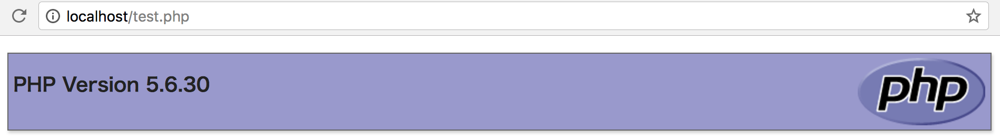
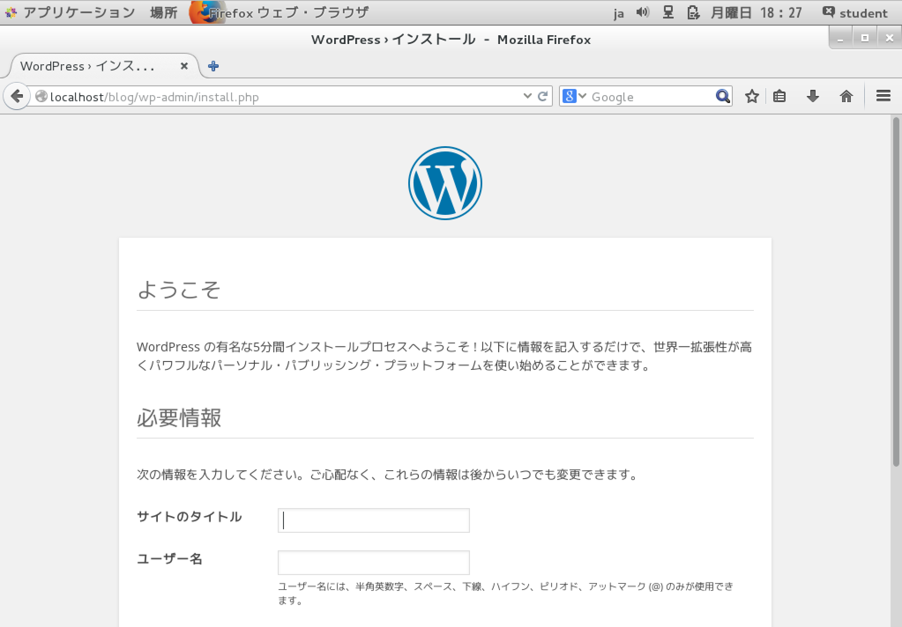
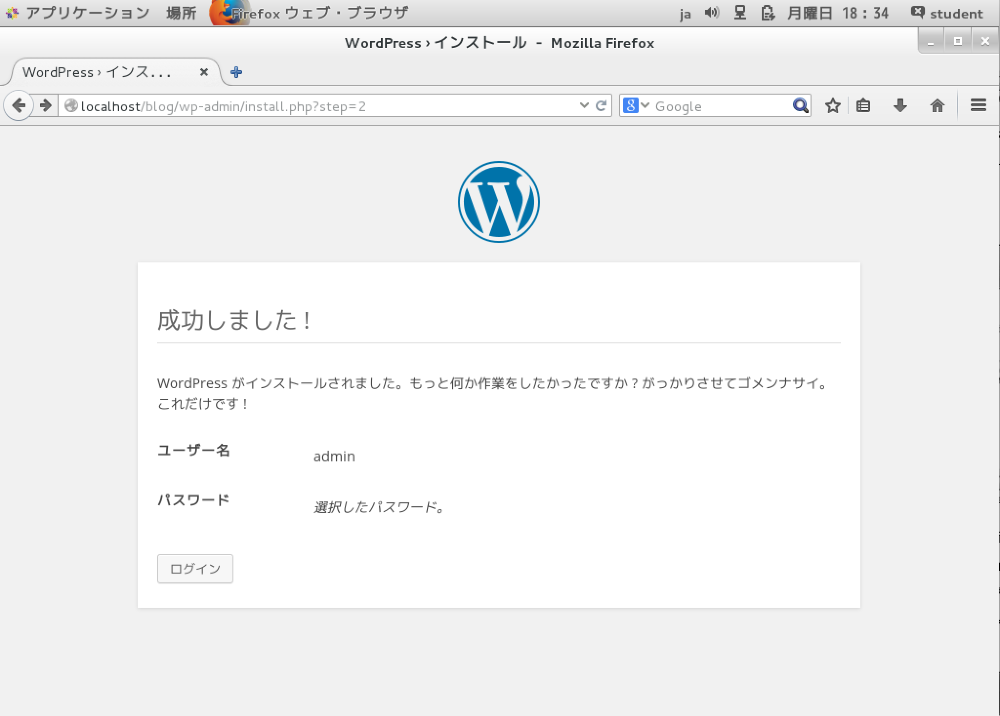
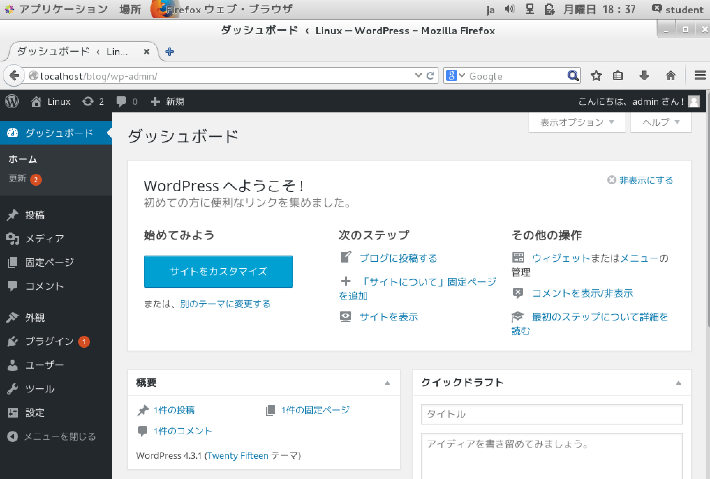

# ブログサイトを構築する

WordPreddを導入してブログサーバーを構築

## 動的なページ

* 初心者が最初に学ぶものはHTMLやCSSで記述された「静的な」Webページ
    * `静的な`: アクセスするURLが同じであれば、全く同じWebページが表示される
        * あらかじめ作成しておいたHTMLファイルが利用者のWebブラウザーに送られて表示される
    * `動的な`: アクセスするURLが同じでも、利用者や操作によってWebページの内容が変化する
        * HTMLがプログラムによって生成される
            * ログインして操作するタイプのWebサイト
            * ブログ
            * SNS
            * 掲示板
            * チャットetc
        * 動的なWebページの作成に使われるプログラミング言語として広く普及しているのがPHP
            * PHPは習得が比較的簡単
            * 大規模なWebサイトの作成にも利用可能

## PHPとDBの準備

* データベースはデータを効率的に利用可能にしたデータの集まり
* データベースはデータベース管理ソフトウェアで管理する
    * CentOSではMariaDBは採用されている

[install](install.sh)の手順でDBをインストール

http://localhost/test.phpにアクセス



## データベースを準備

* `mysql` コマンド
    * MySQLのクライアントコマンド

```bash
#rootユーザーで実行しても構わない
mysql -uroot
#以下のようにプロンプトが変わり、SQLや管理コマンドが実行できる状態になる
#MariaDB [(none)] >
```

[create_db](create_db.sql)に従いDBを作成する

## Wordpressのインストール

* 公式サイトからダウンロード
```bash
#4.0をダウンロード (その都度、最新のバージョンにする)
VER=6.0
wget https://js.wordpress.org/wordpress-${VER}-ja.tar.jg
#ダウンドードしたファイルを解凍
tar zxf wordpress-${VER}-ja.tar.jg
#展開後のディレクトリを移動して名前を変更
su
mv wordpress /var/www/html/blog
#WordPressのディレクトリにapacheユーザーがアクセス可能にする
chown -R apache:apache /var/www/html/blog #所有者とグループをapacheに変更
```

## 設定ファイルの準備

* `wp-config-sample.php`
    * 用意されている雛形
    * wordpressの設定ファイルはPHPプログラム

```bash
cd /var/www/html/blog
ls
cp wp-config-sample.php wp-config.php
```

設定ファイルを[create_db](create_db.sql)でDB情報に置き換える

```bash
FILE='wp-config.php'
OLD_DB_NAME="define('DB_NAME', 'database_name_here');"
NEW_DB_NAME="define('DB_NAME', 'wordpressdb');"

OLD_DB_USER="define('DB_USER', 'username_here');"
NEW_DB_USER="define('DB_USER', 'wpuser');"

OLD_DB_PASS="define('DB_PASSWORD', 'password_here');"
NEW_DB_PASS="define('DB_PASSWORD', 'passw0rd');"

sed -i -e "s/${OLD_DB_NAME}/${NEW_DB_NAME}/g" ${FILE}
sed -i -e "s/${OLD_DB_USER}/${NEW_DB_USER}/g" ${FILE}
sed -i -e "s/${OLD_DB_PASS}/${NEW_DB_PASS}/g" ${FILE}
```

* Webブラウザからアクセス
    * http://localhost/blog/wp-admin/install.php
* WordPressのインストール初期画面が表示される



* `localhost`の代わりにIPアドレスを指定
    * ホストパソコン側のWebブラウザーからもアクセス可能
* サイト名やユーザー名、パスワードはお好きな値を入力
* WordPressをインストール」ボタンを押すと、WordPressがインストールされる



* ログインボタンをクリックすると、ユーザー名とパスワードを入力する画面になる
    * 先ほど設定した値を入力


