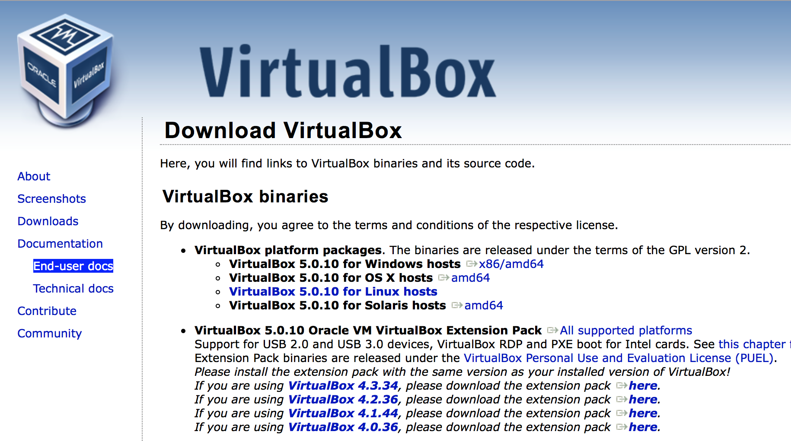
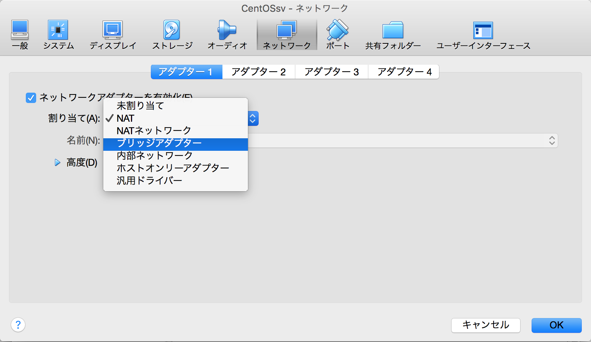
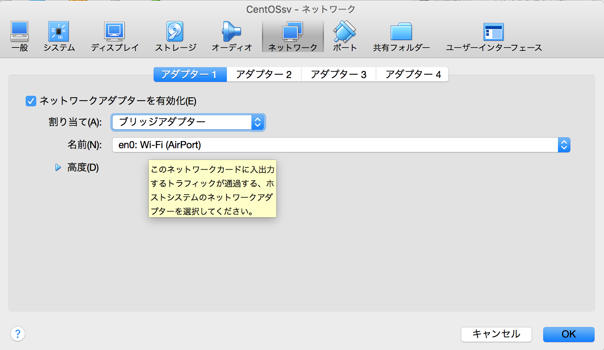

# virtualBoxをインストール

* ダウンロードページ(Downloads)から、利用しているOSに合わせてパッケージを選択
* その都度の最新版をダウンロード
    * Windows
        * VirtualBox 4.3.18 for Windows hosts x86/amd64
    * Mac
        * VirtualBox 4.3.18 for OS X hosts x86/amd64
    * [あらかじめ用意された環境](http://www.network-seminar.net/centos/)からCentOS7.zipをダウンロードでもOK

## ブリッジアダプター

* 設定画面が開く
* 右側のペインから`ネットワーク`を選択
* 割り当てを`ブリッジアダプター`に変更
* `OK`を押すと最初の画面に戻るこれで準備は全て完了

