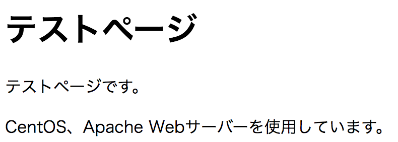

# Webページを作成

## 概要

WebページをHTMLで作成して、Webブラウザーで表示する

## TODO

* コンテンツをドキュメントルート以下に配置
    * ドキュメントルート: サイトとして公開ファイルを保存するトップディレクトリ
    * デフォルトのドキュメントルートは、`/var/www/html`
* ユーザー別にWebページを公開
* パスワード認証を設定
* アクセスの確認

## ゴール

* ブラウザでURLを入力しサーバにアクセスしindex.htmlが表示されること
    * URL: `http://サーバー名/index.html`
    * index.html: /var/www/html/index.html

## 前提条件

* Webサーバーが起動していること
* 管理者権限になれること
    * ドキュメントルートに対して権限が必要になる
        * 書き込みやコピーなどは管理者権限

## 手順

* HTMLファイルを作成して配置

### HTMLファイルを作成して配置

* test.htmlを作成する
    * 内容は[test](test.html)を参照

```bash
cd /var/www/html/
ls -l /var/www
#一般ユーザーでtest.htmlを作成する
vim test.html
```

* 仮想環境内のブラウザで`http://localhost/test.html` にアクセスするし、下図の表示になること
* ホストコンピュータのブラウザで`http://IPアドレス/test.html`にアクセスするし、下図の表示になること
* Apacheのアクセスログに反映されていること
    * Apacheのログは/var/log/httpdディレクトリ以下に保存される
        * access_logはクライアントからアクセスログ
        * error_logはエラーやApacheの起動・終了に関するログ
    


### ユーザー別にWebページを公開

* ユーザーのホームディレクトリに公開用ディレクトリを用意する
    * ユーザーの${HOME}の中に、ディレクトリを作成
        * `public_html`とする
    * ユーザーの`${HOME}/public_html`の中に、コンテンツを作成
* Apacheの設定を変更してユーザー別ページを有効にする
    * 

#### ユーザーのホームディレクトリに公開用ディレクトリを用意する

* ディレクトリの権限/所有者
    * Apache Webサーバーのプロセスはapacheユーザーの権限で公開するファイルにアクセスする
    * apacheユーザーは「その他」ユーザー扱い
        * 所有者はstudentユーザーのため
    * 親ディレクトリにアクセス権が設定されていないと、その下にあるサブディレクトリにもアクセスできない

```bash
#studentユーザでディレクトリを作成
su - student
mkdir pulic_html
#アクセス権限が775であることを確認
ls -ld public_html
#親ディレクトリ/home/${USER}のアクセス権限を確認
ls -ld /home/student
#apacheユーザに${USER}/${HOME}のアクセス権を与える
chmod o+x /home/student
```

ここまでで所望する結果は以下

```text
ls -ld public_html
drwx------ 2 student student
ls -ld /home/student
drwx-----x 15 student student
```

#### 設定ファイルでユーザー別ページを有効にする

* `/etc/httpd/conf.d/userdir.conf`を編集
    * Apacheの設定ファイル
* 管理者権限で編集

```bash
su -
FILE=/etc/httpd/conf.d/userdir.conf
#ユーザー別ページは無効を解除
sed -i -e 's/UserDir disabled/#UserDir disabled/g' ${FILE}
#ユーザー別ページは有効にする
sed -i -e 's/#UserDir public_html/UserDir public_html/g' ${$FILE}
#変更を有効にするためApacheに設定を再度読み込み
systemctl reload httpd.service
```

* studentユーザーのホームディレクトリ内にテスト用のページを作成
    * [test](test.html)を参照
    * `/home/student/public_html/index.html`
* `http://localhost/~student/`にアクセス
* 表示を確認する

### パスワード認証を設定

* 基本認証でパスワード必須のWebページにする
    * ユーザー名とパスワードを入力しないと閲覧不可
    * 基本認証(BASIC認証)を使う
* Apacheでは、任意のディレクトリにパスワード認証をかけることができる

以下が手順

* 手順
    * 基本認証を使うディレクトリを用意
    * 基本認証用のユーザーとパスワードを用意
    * 基本認証を有効にする場所を設定

#### 基本認証を使うディレクトリを用意

* `/var/www/html/secret`以下にアクセスする際にパスワードを求める
    * `/var/www/html/secret`を作成する
        * ドキュメントルート以下に作成するためrootユーザー
    * HTMLファイルを作成する
        * [test](test.html)を参照

```bash
su -
mkdir /var/www/html/secret
```

#### 基本認証用のユーザーとパスワードを用意

* `htpasswd` コマンド
    * 基本認証用のユーザーとパスワードを作成
        * ファイルにユーザー名と、暗号化されたパスワードが格納される
    * 基本認証では、システムに登録されているユーザーおよびパスワードとは別に、ユーザーとパスワードの組み合わせを管理する
    * 引数に指定するパスワードファイルの名前は任意
    * /etc/httpd/conf.dディレクトリに作成しておくとよい
        * ファイルを見失いにくくなる
        * ドキュメントルート以下に作成しない
            * 何かの拍子にユーザーとパスワードの一覧が漏洩してしまう
        * ファイル名を`.ht`で始まる名前にすると、Webブラウザーからはアクセス不可
    * ユーザー名は、システムに登録されているユーザー名と同じでも構わない
        * まったく別でも構わない
    * `-c`オプション
        * パスワードファイルを新規に作成する際に指定する
        * ユーザーを追加したり、既存ユーザーのパスワードを変更する際には不要
    
```bash
htpasswd [-c] パスワードファイル ユーザー名
```

```bash
#例: 基本認証用にstudentユーザーを登録
htpasswd -c /etc/httpd/conf.d/htpasswd student
#パスワードを入力

#パスワードファイルの中身を確認
cat /etc/httpd/conf.d/htpasswd
#student:$doe9$MSOepish$fiep29di2jdo2-fm.Hd2

#所有者と所有グループをapacheユーザー、apacheグループに変更
chown apache /etc/httpd/conf.d/htpasswd #apacheユーザーがアクセス
chgrp apache /etc/httpd/conf.d/htpasswd #apacheグループがアクセス
#apacheユーザ以外のユーザーは読み書き不可にする
chmod 600 /etc/httpd/conf.d/htpasswd
```

#### 基本認証を有効にする場所を設定

* httpd.confでは、`<Directory>`タグを使って、設定を有効にする範囲を指定する
* `/etc/httpd/conf.d`以下に基本認証用の設定ファイルを作成
    * 基本認証の設定などは、後になって追加することも多いため
    * (設定をhttpd.confに直接記述してもよい)
* /etc/httpd/conf.dディレクトリ以下の設定ファイルは自動的に設定ファイルとして扱われる
    * 拡張子は`.conf`にすること

```xml
<Directory "/var/www/html/secret">
基本認証の指定
</Drectory>
```

```bash
#設定ファイルの読み込みし、有効にする
su -
systemctl reload httpd.service
```

* Webブラウザからアクセス
    * http://localhost/secret/secret.html
* 認証ウィンドウが表示される
    * ユーザー名: student
    * パスワード: htpasswdコマンドで設定されたパスワード
* Webページが表示される

