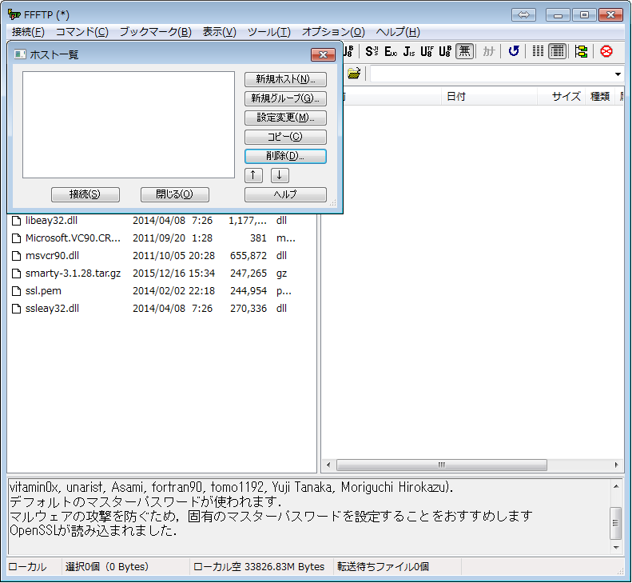
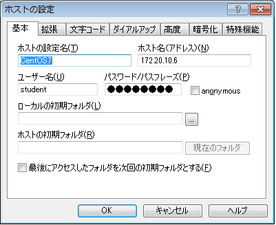
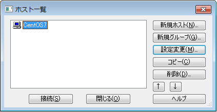
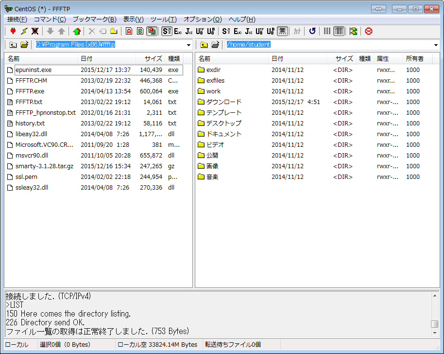

# FFFTP

## 設定

* 新規ホスト」ボタンを押下
    * ホストの設定ウィンドウが表示される
* 接続先情報を入力
    * ホストの設定名はわかりやすい名前: ここではCentOS7
    * ホスト名(アドレス): 接続先のIPアドレス(ここでは「192.168.11.5」)
    * ユーザー名: student
    * パスワード: password
* 入力後にOKボタンを押下
* ホストが追加されていることを確認
    * CentOS7をクリックし、接続ボタンを押下
* ファイルを移動する
    * ドラッグ＆ドロップ
    * 左側: Windowsのディレクトリ
    * 右側: studentユーザーのホームディレクトリ

### 起動

### 接続先情報を入力

### ホストが追加されていることを確認

### ファイルを移動する

