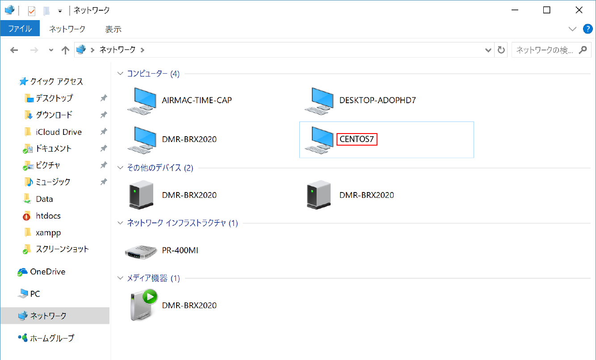
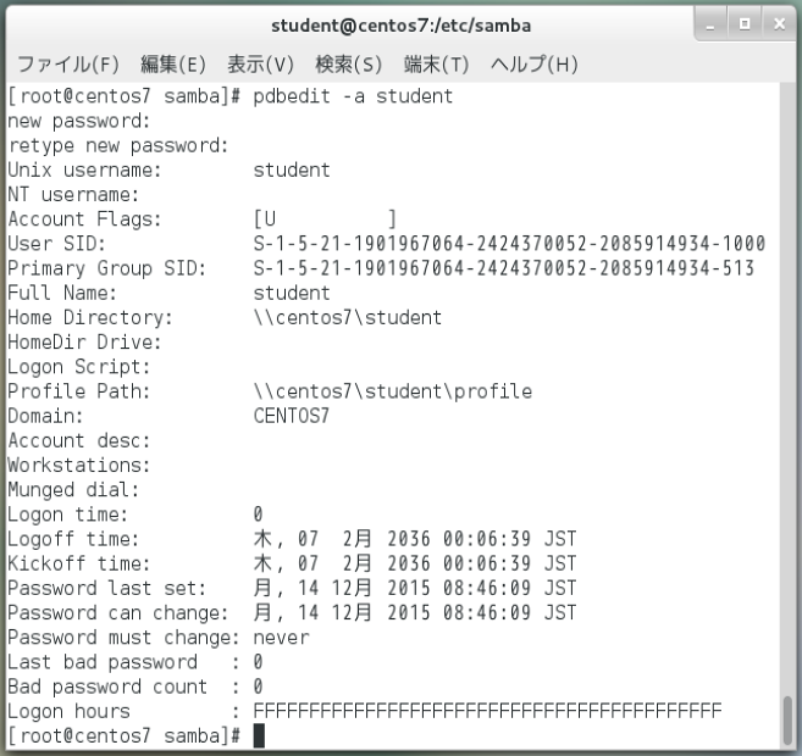
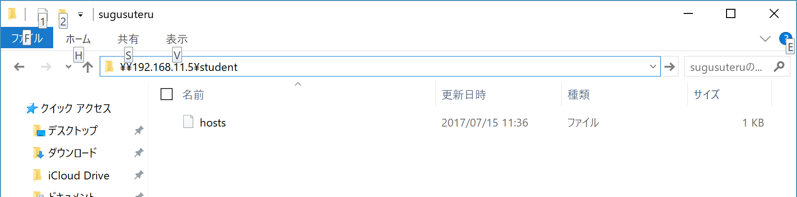

# Sambaファイルサーバーを構築

## 概要

Windowsコンピューターからも利用できる共有フォルダを作る

## 前提

以下のネットワーク環境と、共有フォルダの次の仕様は以下

* ワークグループ: WORDGROUP
* サーバー名: CENTOS7
* ネットワーク: 192.168.11.0/24
* 共有フォルダ: /home/samba
* 共有名: Public
* 読み取り: 誰でも可能
* 書き込み: 誰でも可能

## 手順

* インストール
* 共有フォルダとなるディレクトリを作成
    * 誰もがアクセスできるよう、アクセス権は777(rwxrwxrwx)とする
    * 後で確認しやすいよう、適当なファイルをコピーしておく
        * ここで`/etc/hosts`にコピー
* 設定を行う
* 起動する
* 動作確認
* 自動起動を設定する
* Windowsからアクセス
* ユーザの作成
* ユーザーのホームディレクトリを公開
* アンインストール

### インストール

```bash
yum install samba samba-client samba-common -y
```

### 共有フォルダとなるディレクトリを作成

```bash
mkdir /home/samba
chmod 777 /home/samba/
cp /etc/hosts /home/samba/
```

### 設定を行う

* Sambaの設定ファイルは`/etc/samba/smb.conf`
    * rootユーザーしか編集できない

```bash
FILE=/etc/samba/smb.conf
#書き換え箇所
OLD_WORK_GROUP='workgroup = SAMBA'
NEW_WORK_GROUP='workgroup = MYGROUP'
#追記したい内容 (空白はインデントを揃えるため)
NETBIOS_NAME='        netbios name = CENTOS7'
HOSTS_ALLOW='        hosts allow = 127. 192.168.11.'
MAP_TO_GUEST='        map to guest = Bad User'
#追記したい内容を改行区切りでまとめる
ADD_LINES="${NEW_WORK_GROUP}\n${NETBIOS_NAME}\n${HOSTS_ALLOW}\n${MAP_TO_GUEST}"
#workgroup = MYGROUPの後に、３行追加
WORK_GROUP="s/${OLD_WORK_GROUP}/${ADD_LINES}/g"
#置き換えを実施
sed -i -e "${WORK_GROUP}" ${FILE}
```

#### smb.confの末尾に共有設定を追加

```bash
#/etc/samba/smb.confに追記
FILE=/etc/samba/smb.conf

echo -e "\n[public]" >> ${FILE}
echo "        comment = Sample Share" >> ${FILE}
echo "        path = /home/samba" >> ${FILE}
echo "        public = yes" >> ${FILE}
echo "        writable = yes" >> ${FILE}
echo "        guest ok = yes" >> ${FILE}
echo "        guest only = yes" >> ${FILE}
```

```bash
#必要な設定が揃ったか確認
grep "${NEW_WORK_GROUP}" ${FILE}
grep "${NETBIOS_NAME}" ${FILE}
grep "${HOSTS_ALLOW}" ${FILE}
grep "${MAP_TO_GUEST}" ${FILE}

grep 'comment = Sample Share' ${FILE}
grep 'path = /home/samba' ${FILE}
grep 'public = yes' ${FILE}
grep 'writable = yes' ${FILE}
grep 'guest ok = yes' ${FILE}
grep 'guest only = yes' ${FILE}
```

#### 確認と切り戻し

* `testparm`
    * Sambaの構文チェック
        * 表示が出て止まる
        * Enterキーを押すと、設定の内容が表示されて終了
```bash
testparm
```

成功時は以下のように出力される

```text
Load smb config files from /etc/samba/smb.conf
Processing section "[homes]"
Processing section "[printers]"
Processing section "[print$]"
Processing section "[public]"
Loaded services file OK.
```

設定変更に失敗している場合はファイルを元に戻す

```bash
#失敗時
rm -f ${FILE}
cp ${FILE}.bk ${FILE}
cat ${FILE}
```

### 起動する

* smbサービスとnmbサービスの両方を起動

```bash
systemctl start smb.service
systemctl start nmb.service
```

### 動作確認

```bash
systemctl is-active smb.service
systemctl is-active nmb.service
```

### 自動起動を設定する

```bash
systemctl enable smb.service
systemctl enable nmb.service
```

### Windowsからアクセス

* Windowsのフォルダにある`ネットワーク`を確認
    * `CENTOS7`というアイコンが見える
        * 表示される名前は、smb.confの`netbios name`で指定した名前
    * しばらく待ってもアイコンが表示されない場合
        * フォルダのアドレス欄に`¥¥サーバーのIPアドレス¥Public`と入力
        * 共有ディレクトリを作成した時にコピーしたファイル(hosts)が見えていれば成功
* ダブルクリック
* ファイルをドラッグ&ドロップ
    * アップロード/ダウンロードのテスト
    * `¥¥IPアドレス¥共有名`でネットワーク上の共有アクセス可能
    


### ユーザの作成

#### 前提条件

Sambaユーザーを作成するには、あらかじめ同じ名前のLinuxユーザーを作成しておく必要がある

* `pdbedit` コマンド
    * Sambaユーザーを作成
    `-a` オプション
        * Sambaユーザーを追加する
* Sambaでは、ユーザーごとのホームディレクトリを共有にする機能も持つ
    * 標準で有効になっている
* Linuxのユーザーとは別にSamba用のユーザーを作成し、パスワードを設定
    * ユーザー名とパスワードを入力しなければアクセス不可にする
        * 誰でもホームディレクトリにアクセスできてしまうと困る
* `smbpasswd` コマンド
    * 後でパスワードを変更する
        
```bash
#studentという名前でSambaユーザを作成する例
pdbedit -a student
```



### ユーザーのホームディレクトリを公開

* Windowsのエクスプローラーのアドレス欄に`¥¥仮想マシンのIPアドレス¥student`と入力
    * 仮想マシンのIPアドレスが192.168.11.5であれば`¥¥192.168.11.5¥student`
* 認証ウィンドウが出てくる
    * ユーザー名「student」とパスワード(pdbeditコマンドで設定したパスワード)を入力
* 問題がなければ、ホームディレクトリ(/home/student)の内容が表示される
    * 失敗する場合は、一旦エクスプローラーのウィンドウを閉じてから、再度実行



### アンインストール

```bash
#アンインストール
yum remove samba*
```
