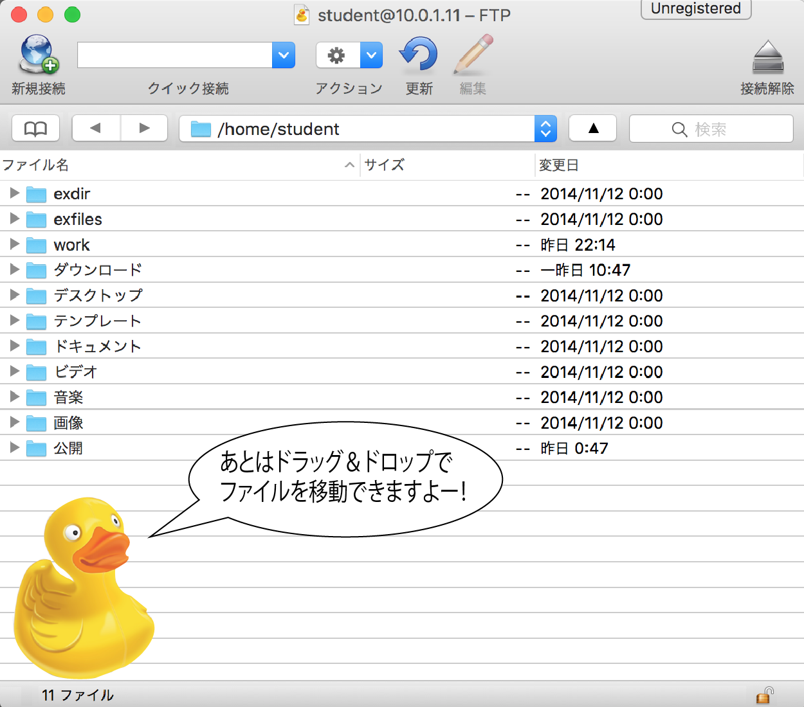
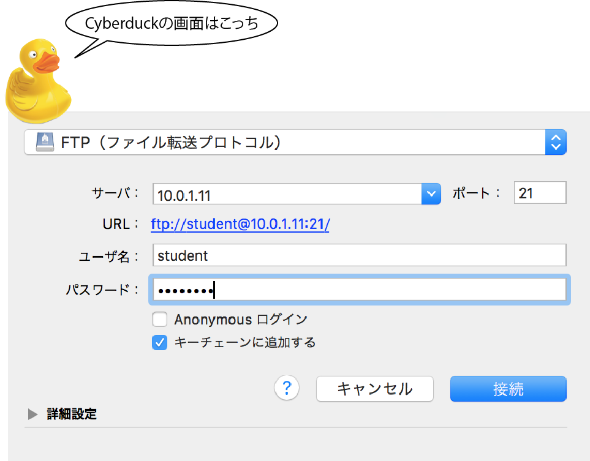

# Cyberduck

* MacのFTPクライアントの代表格

## CyberduckでFTPサーバーに接続する

* IPの確認
    * [ip addr](https://github.com/aki-creatist/linux/blob/master/04_network/PORT.md)

```bash
#Linuxで以下を実施
ip addr
```

## 起動



## 設定


