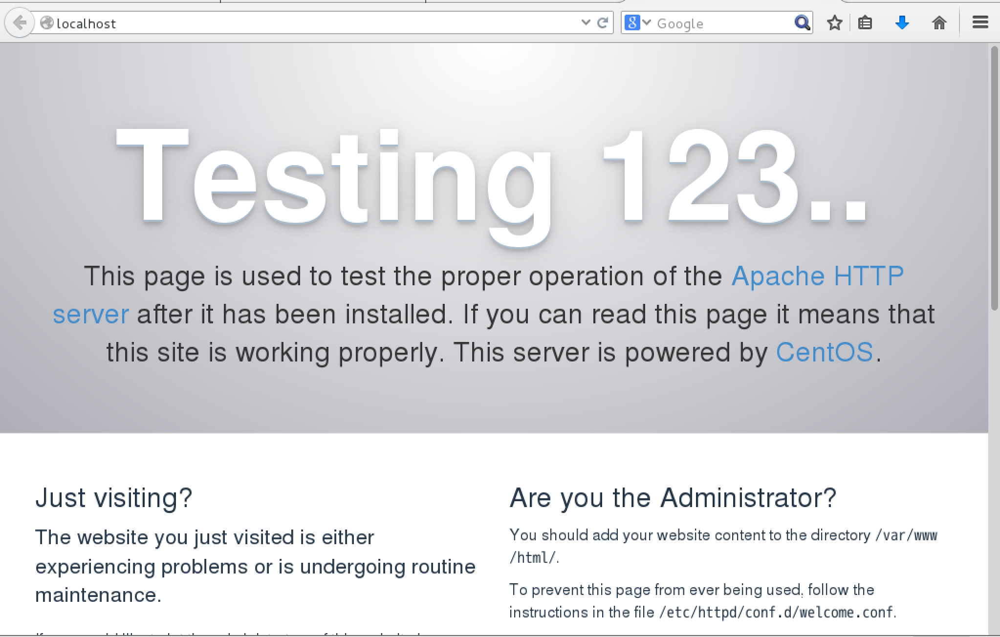
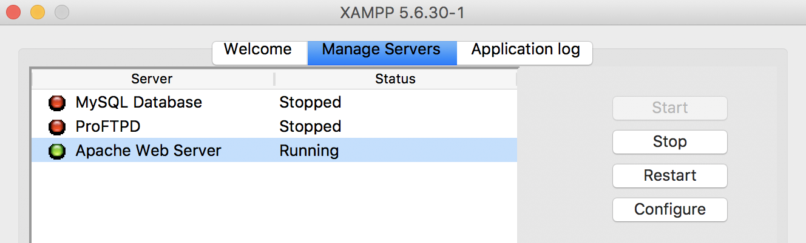
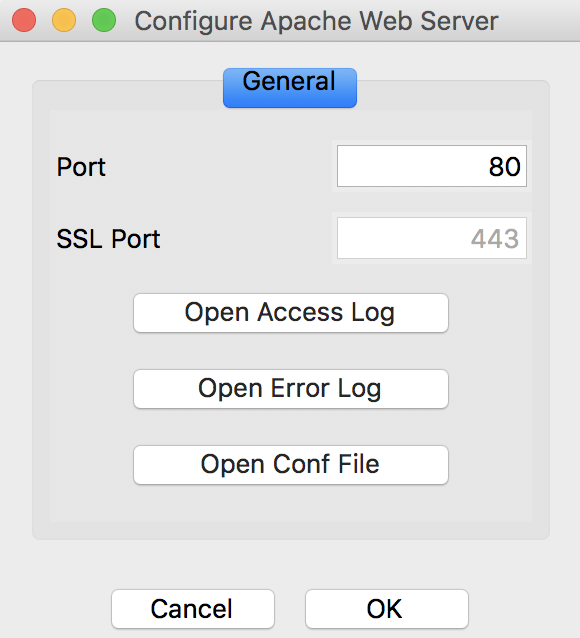
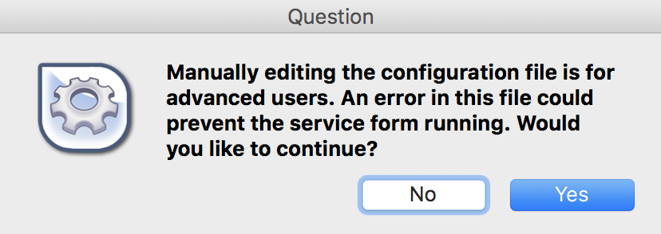

# Apacheの設定

* Apacheを設定する
    * httpd.confの設定

## 概要

* Apache
    * Webサーバと呼ばれるサーバ上で動作するプログラム
    * ブラウザからのリクエストに答えてPHPを出力したデータをブラウザに送信する
    * httpd.confでその動作を設定
        * XAMPPを利用してApache Webサーバをインストールするとほとんどの設定が完了している
    * 今回使用するバージョンは `2.4.4`

## Apacheをインストール

```bash
su
#パスワード: password
cd ~
yum -y install httpd #依存関係のあるパッケージも含め、インストールされる
```

## Apacheを設定する

```bash
FILE=/etc/httpd.conf

#書き換え箇所
OLD_SERVER_ADMIN='ServerAdmin root@localhost'
NEW_SERVER_ADMIN='ServerAdmin student@centos7.example.com'

OLD_SERVER_NAME='#ServerName www.example.com:80'
NEW_SERVER_NAME='ServerName centos7.example.com'

#置き換えのコマンドをまとめる
SERVER_ADMIN="s/${OLD_SERVER_ADMIN}/${NEW_SERVER_ADMIN}/g"
SERVER_NAME="s/${OLD_SERVER_NAME}/${NEW_SERVER_NAME}/g"

sed -i -e "${SERVER_ADMIN}" ${FILE}
sed -i -e "${SERVER_NAME}" ${FILE}

rm ${FILE}-e
```

### 設定の確認

Apaheは、次のコマンドで構文をチェックすることができる

```bash
httpd -t
#Syntax OK と表示されればOK
```

### Apacheを再起動する

* 修正したhttpd.confの設定を反映させる
    * Apacheを再起動する
        * 設定を読み込むため
    * Apacheが停止している場合は起動すると反映される
    * Apacheが起動中の場合、再起動するまで、修正した設定は反映されない
    * 設定の変更後にサーバーを再起動させるのは、Apacheに限らず一般的なこと

```bash
# root権限で実行
/opt/lampp/lampp restart #XAMPPの場合
```

* Apacheのみをstop/startする際は以下

```bash
#XAMPP
/opt/lampp/lampp stopapache
/opt/lampp/lampp startapache
```

### Apacheを起動する

```bash
#XAMPP
/opt/lampp/lampp start
#Cent OS
start httpd.service
```

### 起動の確認

```bash
systemctl is-active httpd.service
#active ← 起動中
#inactive ← 停止中
```

* netstatを利用した確認
    * Apacheが起動していれば、80番ポートが開いているはず
    * 右端にLISTENと表示されていれば、Apacheは起動している

```bash
netstat -at | grep 'http'
ss -a | grep 'http'
```


* `status` でも確認が可能

```bash
systemctl status 名前
#active ← 起動中
#inactive ← 停止中
```

### ブラウザでアクセス

* アドレス欄にURLを入力
    * URL: http://localhost/
    * テストページが表示されたら成功
* `http://自分のIPアドレス/`と指定しても可



### 自動起動設定

* `systemctl enable`
    * システム起動時にApacheも自動的に起動する

```bash
#systemctl enable サービス名
systemctl enable httpd.service
FILE_PATH_1='/usr/lib/systemd/system/httpd.service'
FILE_PATH_2='/etc/systemd/system/multi-user,target.wants/httpd.serve'
ln -s ${FILE_PATH_1} ${FILE_PATH_2}
```

### 自動起動設定を破棄

```bash
#systemctl disable サービス名
systemctl disable httpd.service #Apacheを自動起動しないようにする
systemctl disable firewalld.service #ファイヤウォールを自動起動しないようにする
```

## XAMPP

* XAMPPを使用している場合は、Control Panelを開き、以下の手順でhttpd.confを開く

## Control Panelからconfigureを押下



## Open Conf Fileを押下



## OKをクリック

