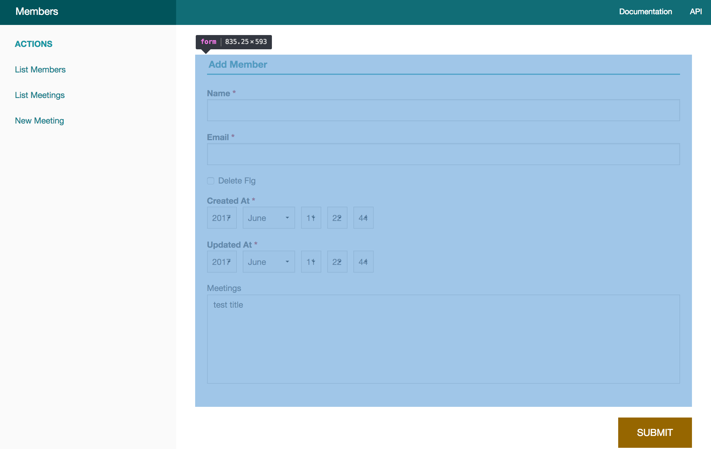
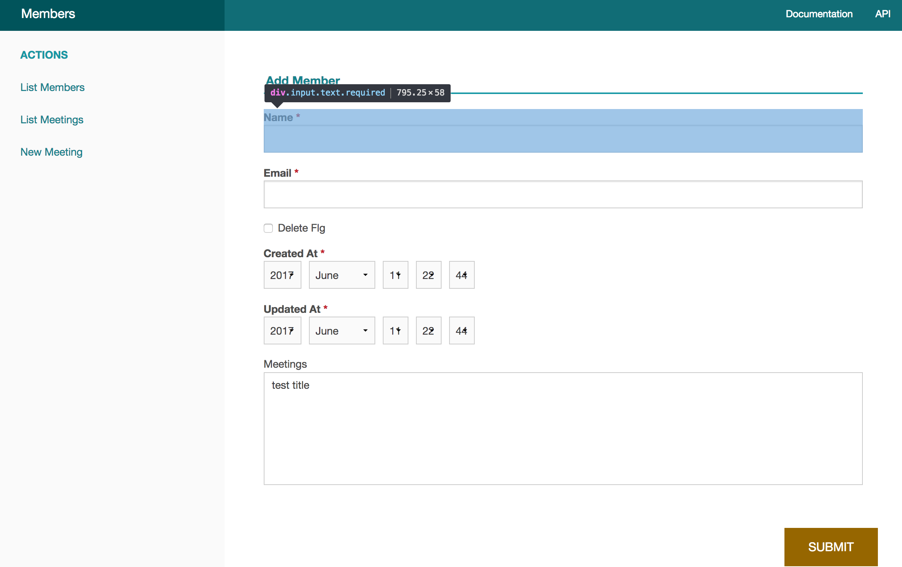
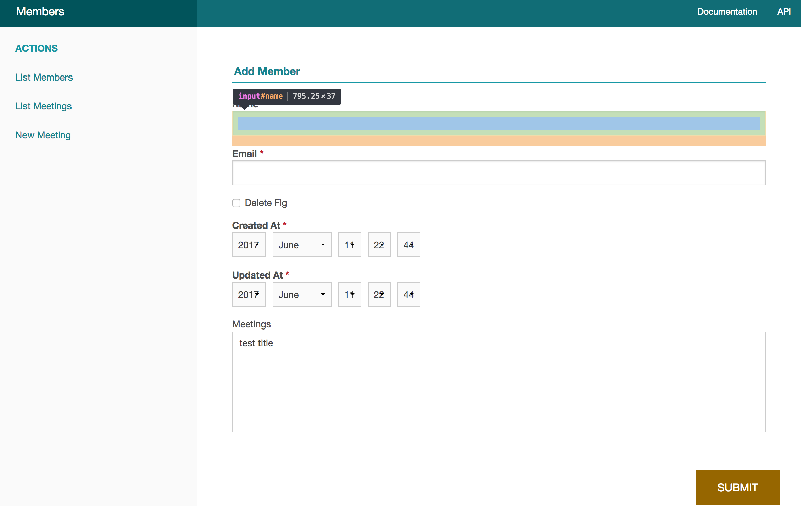
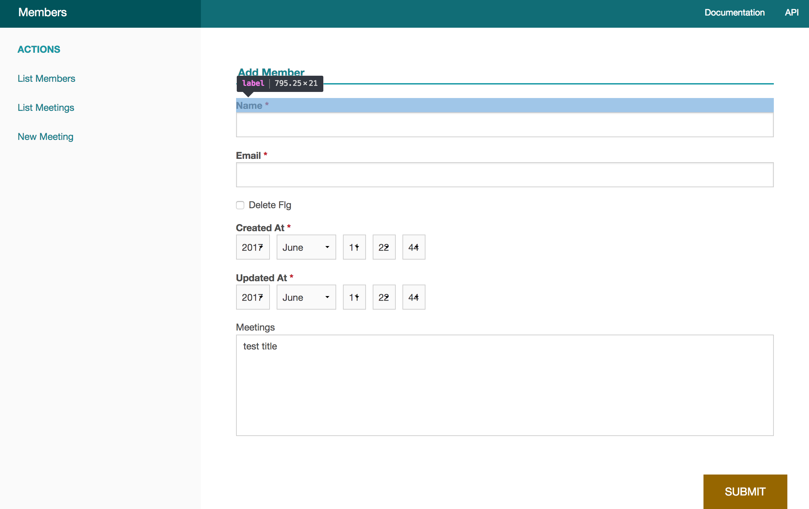
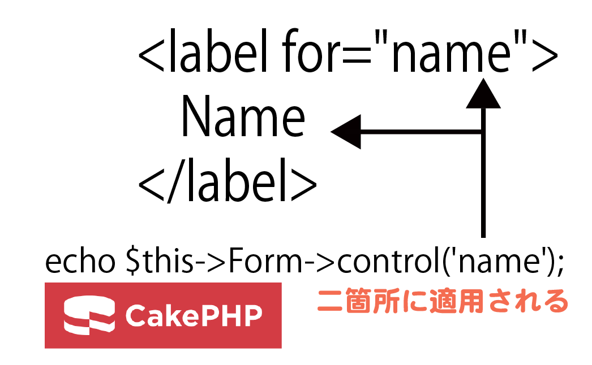
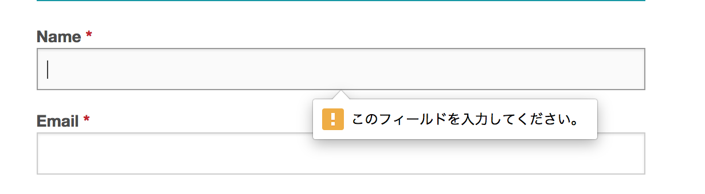
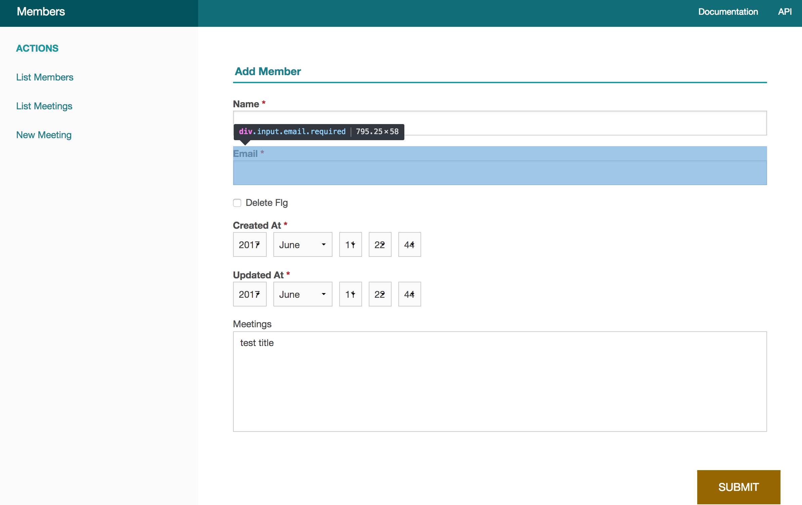
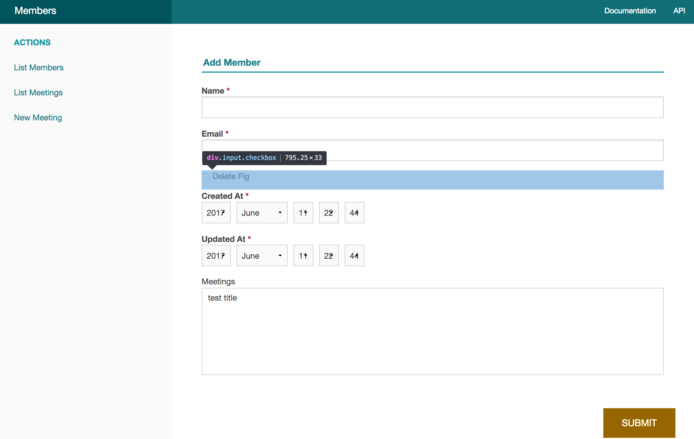

# フォーム

## 開始タグと終了タグ



HTML

```html
<form action="<?= url('members/store') ?>" method="POST">
```

CakePHP

```html
<?= $this->Form->create($member) ?>

<?= $this->Form->end() ?>
```

Laravel

```html
{!! Form::open(['url' => 'members/メソッド']) !!}

{{!! Form::close() !!}}
```

## テキストフォーム



### 名前入力欄( name )



HTML

```html
<div class="input text required">
    <label for="name">
        Name
    </label>
    <input type="text" name="name" id="name" class="form-control">
</div>
```

CakePHP

```html
echo $this->Form->control('name');
```

Laravel

```html
{{ Form::label('name', 'Name') }}
{{ Form::text('name', $value='', $attributes = [ 'required' => 'required' ]) }}
```

#### labelタグについて



* CakePHPではFormHelperを使用すると、`labelが自動生成`される
* name属性の値の先頭を大文字にしたものがlabelの値となり、属性の値はlabel for=の値となる



#### divタグについて

* CakePHPでは`control()`を使用して特定の要素を生成すると、 デフォルトでは div の囲い込みが常に生成される
* Laravelの場合には自前で`divタグを付加`する

#### div class="required"

* CakePHPではモデルのフィールドの検証ルールで『入力が必須であり、空を許可しないカラム』に挿入する
* フォームを囲い込むdivは、クラス名に required が追加される
* DB作成時にnullを許可したカラムからBakeした場合には、divタグの属性にrequiredが付加されない

```html
<!-- null=>>false ( NULL NO )のカラムから焼いた結果-->
<div class="input text">
<!-- 'null' => true ( NULL YES )のカラムから焼いた結果-->
<div class="input text">
```

* こちらもLaravelの場合には自前で`divタグに属性を付加`する
* また、CakePHPでこの設定を無効化するには下記のようにする
* 実際、Members/edit.cptでは下記のようになっている

```html
<!-- Template/members/edit.ctp-->
echo $this->Form->control('name',  ['required' => false]);
```

#### * (アスタリスク)

* ラベルに付いている`*`はbase.css( 455行目 )によって付加されている
* 上記の`div class="required"`に割り当てられている
* ブラウザからdivタグのrequired属性を消してみると`*`も消えることが確認可能

#### required="required"

* これはCakePHPではdiv class="required"の内側にある`inputタグ`の属性に自動で付加される
* こちらもLaravelの場合には第３引数に`自前で付加`する
* これは値が存在するかを判定し、必須のチェックをすることができるHTML5の属性で、submit時に必須チェックを行い、エラーメッセージを出力する



* `divタグ`の`require`属性を外す(やり方は前述)と、`inputタグ`の`class="require"`も付加されなくなる

#### id

* CakePHPもLaravelもフォームヘルパーを利用することでinputタグのidも自動的に付与される    

[コントロールの特定のタイプを生成](https://book.cakephp.org/3.0/ja/views/helpers/form.html#id10)

### email</3>



#### HTML

```html
<input type="email" name="email" required="required" maxlength="255" id="email">
```

#### CakePHP

```html
echo $this->Form->control('email');
```

#### Laravel

```html
{{ Form::label('email', 'Email') }}
{{ Form::email('email', $value='', $attributes = [ 'required' => 'required' ]) }}
```

## チェックボックス



#### HTML

```html
<div class="input checkbox">
    <input type="hidden" value="0">
    <label for="delete_flg">
        <input type="checkbox" name="delete_flg" value="1" id="delete_flg">
    </label>
</div>
```

#### CakePHP

```html
echo $this->Form->control('delete_flg');
```

#### Laravel

```html
<div class="input checkbox">
    {{ Form::hidden('delete_flg',"0") }}
    <label>
    {{ Form::checkbox('delete_flg', '1') }}
    Delete Flg
    </label>
</div>
```

### チェックボックスとhidden

* CakePHPの`checkbox()`は`hiddenタグを自動で生成`する
* Laravelでは生成されない
* CakePHPで自動で生成される`hiddenタグを削除`するには下記のようにする

```html
echo $this->Form->control('delete_flg',[ 'hiddenField' => false]);
```

## プルダウンメニュー

[pulldown01](image/pulldown01.png)

### 時間の取得

* まずは正確な時間を取得しければならない
* そのためにはタイムゾーンの設定が終わっていることを確認

#### HTML

```html
<div class="input datetime required">
    <label>
        Created At
    </label>
    <select name="created_at[year]">
        <option value="2022">2022</option>
        〜中略〜
        <option value="2017" selected="selected">2017</option>
        〜中略〜
        <option value="2012">2012</option>
    </select>

    <select name="created_at[month]">
        <option value="01">January</option>
        〜中略〜
        <option value="06" selected="selected">June</option>
        〜中略〜
        <option value="12">December</option>
    </select>
    
     <select name="created_at[day]">
        <option value="01">1</option>
        〜中略〜
        <option value="11" selected="selected">11</option>
        〜中略〜
        <option value="31">31</option>
    </select>
   
     <select name="created_at[hour]">
        <option value="00">0</option>
        〜中略〜
        <option value="22" selected="selected">22</option>
        〜中略〜
        <option value="23">23</option>
    </select>
    
      <select name="created_at[minute]">
        <option value="00">00</option>
        〜中略〜
        <option value="44" selected="selected">44</option>
        〜中略〜
        <option value="59">59</option>
    </select>
</div>
```

#### CakePHP

```html
echo $this->Form->control('created_at');
```

#### Laravel

```html
<div class="input datetime required">
    {{ Form::label('created_at', 'Created At') }}
    {{ Form::selectYear('created_at[year]', 2012, 2022, $nowArr[0]) }}
    {{ Form::selectMonth('created_at[month]', $nowArr[1]) }}
    {{ Form::selectRange('created_at[day]', 1, 31, $nowArr[2]) }}
    {{ Form::selectRange('created_at[hour]', 0, 23, $nowArr[3]) }}
    <!-- 日付が00にならず一桁なのは仕様 -->
    {{ Form::selectRange('created_at[minute]', 00, 59, $nowArr[4]) }}
</div>
```

```html
->add('name', [
        'length' => [
        'rule' => ['minLength', 3],
        'message' => 'Titles need to be at least 10 characters long',
    ]
]);
```
