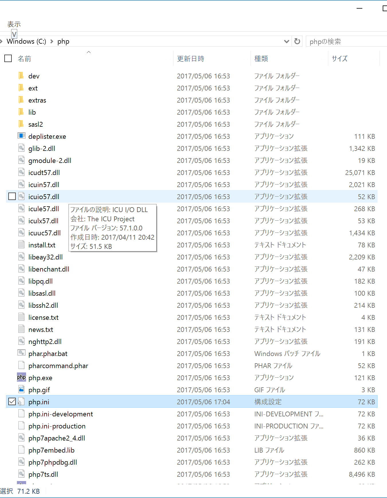
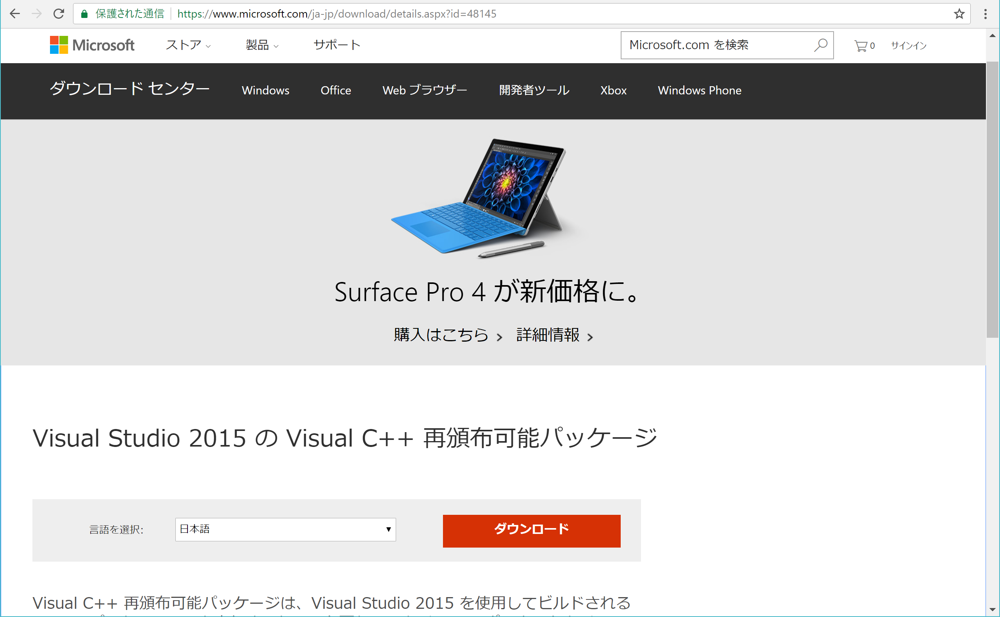
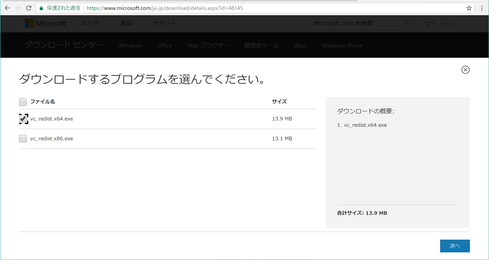
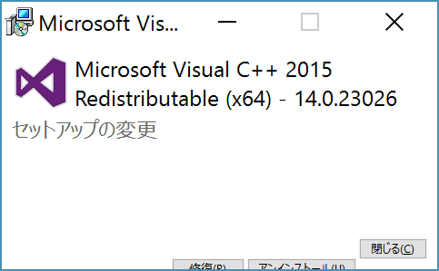
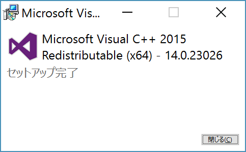

# PHP

## インストール

```bash
# 現在の環境の確認
php -v
```

## バージョンアップ - Mac

```bash
# home brewのインストール
ruby -e "$(curl -fsSL https://raw.githubusercontent.com/Homebrew/install/master/install)"
# インストールができたか確認 - Your system is ready to brew.と表示されれば完了
brew doctor
# PHP7のインストール
brew install homebrew/php/php72
# .bashrcにパスを通す
echo "export PATH="$(brew --prefix homebrew/php/php72)/bin:$PATH"" >> ~/.bashrc
# 設定を読み込む
source ~/.bashrc
# PHPがver.7になっていることを確認する
php -v
```

## バージョンアップ - win

### 1. PHP7のインストール

[PHP7ダウンロードページ](http://windows.php.net/downloads/releases/php-7.1.4-Win32-VC14-x64.zip)

### 2. Cドライブ直下に展開

Cドライブ直下にphpディレクトリを作成し、そこに展開



### 3. PATHの設定

Git Bash上で以下のコマンドを実行

```bash
#パスの設定
echo 'export PATH=/c/php:$PATH' >> ~/.bashrc
source ~/.bashrc
```

### 4. VSのダウンロード

vs2015をダウンロードして実行する

* [vs2015ダウンロードサイト](https://www.microsoft.com/ja-jp/download/details.aspx?id=48145)にアクセス
* ダウンロードを押下



次のページで、vc_redist.x64.exeの方を選択



次の画面で中央下の『修復(R)』を押下



セットアップが完了したら『閉じる(C)』を押下して終了



### 5. php.iniの作成

* Cドライブ直下のphpフォルダの中に、php.ini-developmentというファイルがある
* これをコピーしてphp.iniを作成

```bash
#php.iniの作成
cd /c/php
cp php.ini-development php.ini
```

### 6. php.iniの設定の変更

* 892行目あたりに以下の部分が見つかる
* これより下の複数行のコメントアウトを外し、有効化

```text
; Windows Extensions
; Note that ODBC support is built in, so no dll is needed for it.
; Note that many DLL files are located in the extensions/ (PHP 4) ext/ (PHP 5+)
; extension folders as well as the separate PECL DLL download (PHP 5+).
; Be sure to appropriately set the extension_dir directive.
;
extension=php_bz2.dll
extension=php_curl.dll
extension=php_fileinfo.dll
extension=php_ftp.dll
extension=php_gd2.dll
extension=php_gettext.dll
extension=php_gmp.dll
extension=php_intl.dll
extension=php_imap.dll
extension=php_interbase.dll
extension=php_ldap.dll
extension=php_mbstring.dll
extension=php_exif.dll      ; Must be after mbstring as it depends on it
extension=php_mysqli.dll
extension=php_oci8_12c.dll  ; Use with Oracle Database 12c Instant Client
extension=php_openssl.dll
extension=php_pdo_firebird.dll
extension=php_pdo_mysql.dll
extension=php_pdo_oci.dll
extension=php_pdo_odbc.dll
extension=php_pdo_pgsql.dll
extension=php_pdo_sqlite.dll
extension=php_pgsql.dll
extension=php_shmop.dll
```

* Vimで編集しているのであれば左端にカーソルを置く
* ;extension=php_shmop.dllまで下方向にCtrl+vで矩形選択の状態で選択
* xを押すと一度にコメントアウトを外すことができる

また、以下の４行はセミコロンを付け、コメントアウト状態に戻しておく

```text
;extension=php_interbase.dll

;extension=php_oci8_12c.dll

;extension=php_pdo_firebird.dll

;extension=php_pdo_oci.dll
```

最終的には以下

```text
; Windows Extensions
; Note that ODBC support is built in, so no dll is needed for it.
; Note that many DLL files are located in the extensions/ (PHP 4) ext/ (PHP 5+)
; extension folders as well as the separate PECL DLL download (PHP 5+).
; Be sure to appropriately set the extension_dir directive.
;
extension=php_bz2.dll
extension=php_curl.dll
extension=php_fileinfo.dll
extension=php_ftp.dll
extension=php_gd2.dll
extension=php_gettext.dll
extension=php_gmp.dll
extension=php_intl.dll
extension=php_imap.dll
;extension=php_interbase.dll
extension=php_ldap.dll
extension=php_mbstring.dll
extension=php_exif.dll      ; Must be after mbstring as it depends on it
extension=php_mysqli.dll
;extension=php_oci8_12c.dll  ; Use with Oracle Database 12c Instant Client
extension=php_openssl.dll
;extension=php_pdo_firebird.dll
extension=php_pdo_mysql.dll
;extension=php_pdo_oci.dll
extension=php_pdo_odbc.dll
extension=php_pdo_pgsql.dll
extension=php_pdo_sqlite.dll
extension=php_pgsql.dll
extension=php_shmop.dll
```

### 7. 再度Updateしてみる

* Git Bashでプロジェクトフォルダに移動し、再度composer updateを実行
* (コマンドプロンプトで失敗しても、Git Bashであれば成功する)    


# php.iniの設定

## 概要

* 標準のままでは日本語の設定が不足している
    * PHPの設定はphp.iniというファイルで行う
    * php.iniは、XAMPPのインストールディレクトリの中にある
    * PHPのバージョンは5.6
    * `;` (セミコロン)」が行頭にあるとその後の設定などはすべて無視される
        * コメントとして認識される
        * 文字列は二重引用符でくくることもできる

### php.iniの場所

* Windows
    * `C:¥xampp¥php¥php.ini`
* Mac
    * `/Applications/XAMPP/xamppfiles/etc/php.ini`
* Linux
    * `/opt/lampp/etc/php.ini`

```bash
# php.iniのパスまで移動

# Win
cd C:¥xampp¥php
# Mac
cd /Applications/XAMPP/xamppfiles/etc
# Linux
cd /opt/lampp/etc

# 権限(パーミッション)を変更
chmod 777 php.ini
# 権限が追加されたかどうかを確認
ls -l

# vimでphp.iniを開く
vim php.ini
```

#### default_charset

* Webサーバはレスポンスヘッダという文字列をブラウザに送信
    * ブラウザ上では文字コードがUTF-8で表示される

```bash
FILE=test.txt
# レスポンスヘッダの内容が扱う文字コードをUTF-8に設定する
OLD=';default_charset = "UTF-8"'
NEW='default_charset = "UTF-8"'
sed -ie "s/${OLD}/${NEW}/g" ${FILE}
```

#### date.timezone

* PHPで使用される日付や時刻に関係した関数すべてに使用される標準の時間帯を設定
    * XAMPPインストール直後は `Europe/Berlin` が設定されている
    * `Asia/Tokyo` と日本の時間帯を指定する

```bash
OLD='date.timezone = Europe\/Berlin'
NEW='date.timezone = Asia\/Tokyo'
sed -ie "s/${OLD}/${NEW}/g" ${FILE}
```

#### mbstringを設定する

```bash
# マルチバイト(日本語)関連の設定
OLD=';mbstring.language = Japanese'
NEW='mbstring.language = Japanese'
sed -ie "s/${OLD}/${NEW}/g" ${FILE}

# 内部文字コード
OLD=';mbstring.internal_encoding = EUC-JP'
NEW='mbstring.internal_encoding = Japanese'
sed -ie "s/${OLD}/${NEW}/g" ${FILE}

# HTTP入力文字コード
OLD=';mbstring.http_input = auto'
NEW='mbstring.http_input = UTF-8'
sed -ie "s/${OLD}/${NEW}/g" ${FILE}

# HTTP出力文字コード(変換せず出力)
OLD=';mbstring.http_output = SJIS'
NEW='mbstring.http_output = pass'
sed -ie "s/${OLD}/${NEW}/g" ${FILE}

# HTTP入力の変換機能(有効)
OLD=';mbstring.encoding_translation = Off'
NEW='mbstring.encoding_translation = On'
sed -ie "s/${OLD}/${NEW}/g" ${FILE}

# 文字コード検出順序(UTF-8)のみ
OLD=';mbstring.detect_order = auto'
NEW='mbstring.detect_order = UTF-8'
sed -ie "s/${OLD}/${NEW}/g" ${FILE}

# 無効な文字の代替出力(何も出力しない)
OLD=';mbstring.substitute_character = none;'
NEW='mbstring.substitute_character = none;'
sed -ie "s/${OLD}/${NEW}/g" ${FILE}
```


