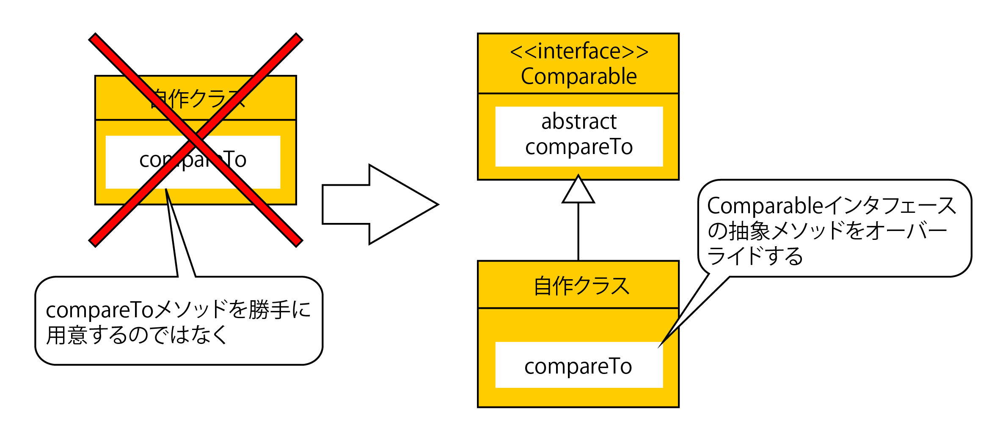

# Comparableインターフェース

* 概要
* メソッド

## 概要

* Comparable
    * オブジェクト同士が大小比較できることを保証するインタフェースで、抽象メソッドcompareToが宣言されている
* `compareTo()`
    * これを組み込むクラスはComparableインタフェースを実装してcompareToをオーバーライドする
    * こうすることで、そのクラスのオブジェクトが順序付け可能と保証されるため



* Comparableインタフェースの実装に際しては`何を比較するよう実装されたか`をジェネリクスで明示することが普通
* 例えば、Memberオブジェクト同士を比較する実装であれば、次のように宣言する

```text
…Member implements Comparable<Member>{
    …
    public int compareTo( Member m ){
        …
    }
}
```

## メソッド

* int compareTo( T obj )
    * 戻り値: 負の整数：自身 ＜ obj0：自身 ＝ obj正の整数：自身 ＞ obj
    * 例外 | ClassCastException：objの型が原因で、比較できない場合
* Comparableインタフェースを実装する具象クラスは、上記の内容で`compareTo()`を実装しなければならない
    * 比較可能なフィールドを持つクラスでは、`compareTo()`を`自身の値 - 比較相手の値`を返却するよう実装するのが普通
* `compareTo()`で等しいと判断されるオブジェクト同士は、`equals()`との`一貫性`と呼ぶ
* Javaのクラスライブラリの中には、一貫性を前提としているものもあるため、これが保証できないと正しい動作は期待できない