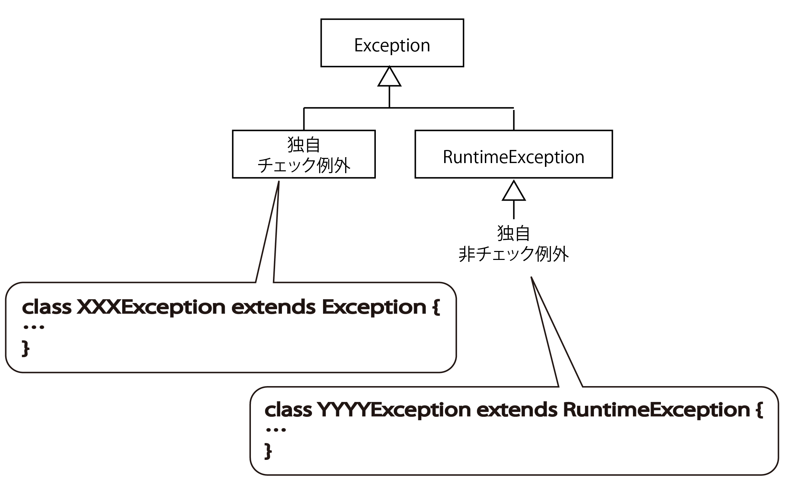

# Exceptionクラス

* 概要
* Exceptionクラスのコンストラクタ
* RuntimeExceptionクラスのコンストラクタ
* 主なメソッド

## 概要

* Exceptionクラスは例外の仕組みを備えたクラス
* 全ての例外はExceptionクラスのサブクラスとなる
* 例外クラスは、try〜catchまたはthrowsで処理しなければならない
* チェック例外と例外処理を省略できる非チェック例外に分かれる
* 非チェック例外は、RuntimeException(実行時例外)クラスを拡張する
    * Exceptionクラスを拡張したときはチェック例外となる
    * RuntimeExceptionクラスを拡張した時は非チェック例外となる

## Exceptionクラスのコンストラクタ

* Exception(): 例外を生成する
* Exception( String msg ): メッセージ付きの例外を生成する

## RuntimeExceptionクラスのコンストラクタ

* RuntimeException(): 実行時例外を生成する
* RuntimeException( String msg ): メッセージ付きの実行時例外を生成する

## 主なメソッド

* String getMessage(): メッセージを取得する
* void printStackTrace(): 例外のパックトレース(例外が送出された足跡)を表示する
* String toString(): 例外の文字列表現を返する