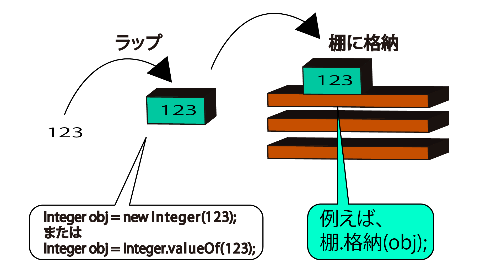

# ボクシング/アウトボクシング

* 基本型データを棚に納める際にはラッパークラスでラップする
* また、ラップしたデータを利用するためには、オブジェクトからデータを取りな出さなければならない
* しかし、その処理を実際にプログラムで見かけることはごく稀というのも、Javaにはボクシング/あんボクシングという機能が備わっているから
    * ボクシング: 基本型データを自動的にラップすること
    * アンボクシング: ラップしたデータを自動的に取り出すこと

int型の値123を例に説明するちなみにint型に対応するラッパークラスはIntergerクラス

整数値123を棚に納める本来の手順は次の通り



ところが、実際には、

```text
棚.格納(123);        // 棚に123を格納する
```

という記述で格納可能値123がボクシングされるので、ラップをまるまる省略できる

逆も同じ例えば、123をラップしたオブジェクトobjを作成した上で、

```text
5 + obj
```

とすると、123がアンボクシングされ、

```text
5 + 123
```

が実行される

* [Sampel](SampleWrapper01.txt)