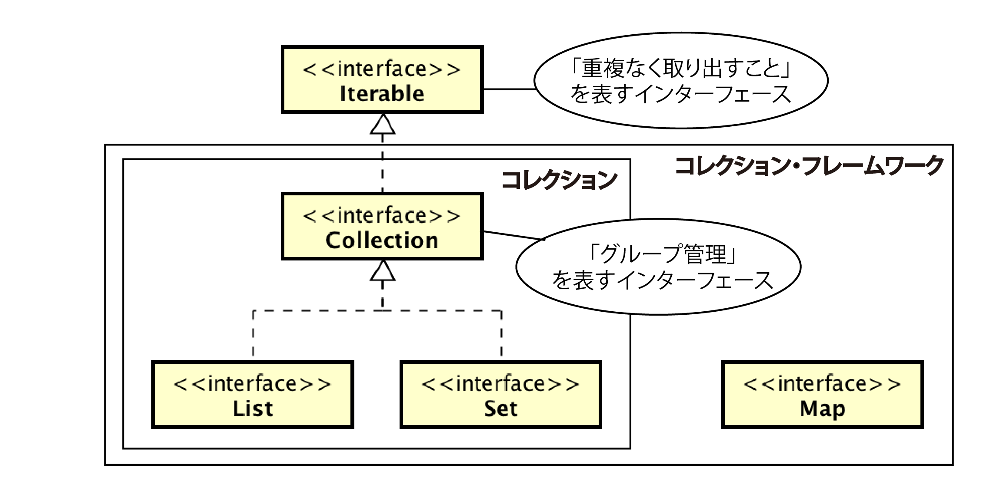

# コレクション・フレームワークの基礎知識

* コレクション・フレームワークの種類
* クラスの構造
* List、Set、Mapの関係
* 拡張for文

## 概要

* コレクションフレームワークは、複数の実態を格納する`入れ物`
* ネットショッピングにおける買い物かごをイメージする場合
    * この入れ物にはいくつかの種類があり、コレクション・フレームワークはその総称

## コレクション・フレームワークの種類

コレクション・フレームワークには、次の種類がある

* List
    * 配列によく似た性質を持つ入れ物で、要素は０から始まる番号で管理される同じ実態を複数格納することが可能
* Set
    * 数学上の集合をモデルとする入れ物で、要素は番号付けされず同じ実態は複数格納不可
* Map
    * 実態をキーと関連づけて格納する入れ物キーと実態のペアを、エントリと呼ぶ
    * 同一のキーを持つエントリを風k数登録不可
    * また、一つのキーに複数の実態を対応させることはできない

## クラスの構造

* List、Set、Mapは実はクラスではなくインターフェース
* これらを実装する具象クラスは別に用意されている

### Listがとる構造

* Listの取り扱いに必要なメソッドを宣言している
* ArrayList
    * 配列でListを実装する
* LinkedList
    * リスト構造でListを実装する

### 宣言

* 処理に必要なほとんどのメソッドは、インターフェース側に宣言されている
    * そのため、入れ物をどの具象クラスで生成しようとも、インターフェース型で宣言するのが一般的
    * 例: 商品(Item)の実態を風k数格納する入れ物(basket)は、次のように宣言する
        * Item専用のList型の入れ物を作成する
        * 実際には入れ物はArrayListで作成する

```text
List basket = new ArrayList();
```

## List、Set、Mapの関係

* List、Set、Mapは全てコレクション・フレームワーク
* しかし、`ListとSetは同じ系統`で`Mapは別系統`という違いがある
* これをクラス構造で示すと、次のようになる



* List及びSetは、Iterable、Collectionのサブインターフェース
* これは`全要素を重複なく取り出し可能なグループ`であることを表す
    * 具体的には、List及びSetには後述する拡張for文を用いることが可能

### コレクション

* ListやSetのような`Collectionインターフェースを上位に持つクラスやインターフェース`
* MapはList及びSetとは異なる系統に属する
* そもそもMapはデータをキーで管理するための入れ物
    * 全要素を重複なく取り出せることにそれほど意味はない

## 拡張for文

* 入れ物に格納した全要素を一つずつ取り出す手間に、拡張for文という文法を使うことが可能
* これは、添字のような管理番号を使わないfor文で、次の書式で記述する

```text
for(取り出した要素を格納する変数 : 入れ物の名称){
    繰り返す処理
}
```

例: 入れ物(basket)に格納された全商品(Item)は、次のように取り出せる

```text
for( Item it :basket ) {
    System.out.println(it)
}
```

* このfor文を繰り返すたびに、basketの中身を一つずつ取り出してitに格納する
* なお、拡張for文を使うためには、`Iterableが実装されていること`
* または`配列であること`が条件
* そのため、List及びSet(を実装するクラス)で使用可能だが、Mapには使用不可