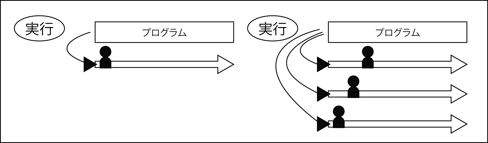
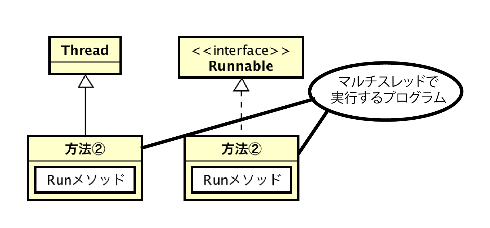

# マルチスレッドとは

* マルチスレッドプログラムの作成法

## 概要

* スレッドとは、Javaにおける`プログラムの実行者`
* Javaプログラムを実行すると、Java上にスレッドという名の実行者が生成され、これがプログラムに記述した流れ通りに命令を実行する
* これまでのプログラムは、スレッドを一つしか生成しなかったがが、複数のスレッドを生成して同時に実行するプログラムも存在する
* このような`プログラムを同時に実行する仕組み`をマルチスレッドと呼ぶ

## マルチスレッドプログラムの作成法

* マルチスレッドで実行するクラスを作成するためには、次の二つの方法がある
    * Threadクラスを拡張する
    * Runnableインターフェースを実装する
* いずれの方法でも、マルチスレッドで実装するプログラムは、runという名前のメソッド(`void run()`)に記述が必要

②の方法で作成したクラスは、自身にはスレッドを作る機能がないので、Treadクラスと連携して実行する