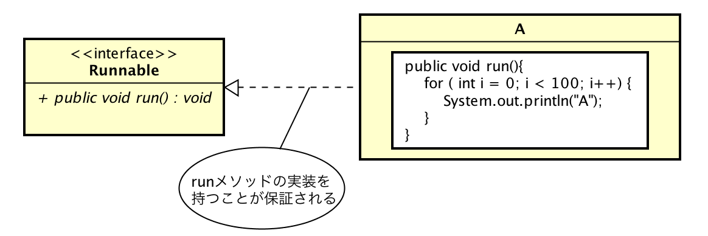

# Runnableインタフェース

* 概要
* スレッドの作成、実行

## 概要

* マルチスレッドで実行するプログラムは、`run()`に記述する
* このため、マルチスレッドで使用するクラスは、`run()`を持つことの保障が必要
* この保証を行うインターフェースが、Runnable
* Runnnableインタフェースには`Run()`が宣言されている
* これを実装するクラスは、必ず`run()`を用意が必要

## スレッドの作成、実行

* Threadクラスを拡張したクラスは、クラスから直接スレッドを生成して実行することが可能
* しかし、Runnableインタフェースを実装したクラスからは、そのような処理を行うことができない
    * スレッドの作成や、実行はThreadクラスに固有の機能であるため

Runnableインタフェースを実装したクラスからは、次の手順でスレッドの生成・実行を行わなければならない

* クラスの実体を作成する
* その実体を引数としてThreadクラスの実体を作成する
* Threadクラスの実体の`start()`を呼び出す

[SmapleThread02](SmapleThread02.txt)