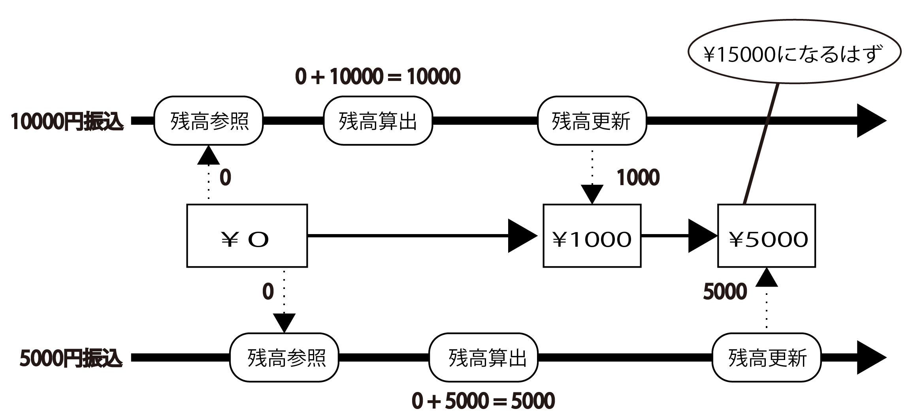

# 同期

* (1)排他制御
    * `Synchronazed()`
    * synchronizedブロック
* (2)スレッド間通信
    * 待機と再開の仕組み
    * 協調のルール
    * 主なメソッド
* (3)コレクションの同期

## 概要

* マルチスレッド環境下では、多くのスレッドが同じデータを競合したり、スレッド同士がタイミングを合わせなければならない場面が登場する
* ここでは、それらに対処するための同期制御を説明する

## (1)排他制御

* 多くのスレッドが同じデータを同時に更新時、タイミングによっては正しく更新できないことがある
* 例えば、10000円振り込むスレッドと、5000円振り込むスレッドが次のタイミングで同じ講座を更新したとき、更新結果に不整合が生じる



* このような状況を防ぐためには、`同時には一つのスレッドしかデータを更新できない`よう制御する
* この制御が排他制御で、JavaではSynchronizedキーワードを用いて実現する

## Synchronazed()

* メソッド宣言にsyncrhronizedを加えることで、排他制御されたメソッドを作成可能
* このメソッドは複数のスレッドから同時に呼び出された場合でも、１スレッドずつ順番に実行される


[SmapleThread03](SmapleThread03.txt)

## synchronizedブロック

* メソッドの一部のみ排他制御したい場合は、その部分をsynchronizedブロックで囲む

```text
synchronized( ロックする資源 ){
    資源に対する更新など、排他制御する処理
}
```

通常は、ロックする資源は地震の実体なので

```text
synchronized( this )
```

とする

排他制御にフラグを用いるような場合には、

```text
synchronized( フラグ )
```

とする

## (2)スレッド間通信

* スレッド同士を強調させるため、スレッドに待機や再開を命じることが可能
* これに必要なメソッドはObjectクラスに用意されているため、全てのオブジェクトに継承されている

## 待機と再開の仕組み

* ここでいう待機と再開は、スレッド同士が強調する仕組み
* これには、遮断機役のオブジェクトが必要入り口に遮断機が設置された駐車場をイメージ
* 遮断機が上がっていれば、スレッド(自動車)は自由に駐車場を利用可能
* ところが駐車場がいっぱいになると遮断機が降りてしまう
* スレッドは、遮断機の前に列を作って待機しなければならない
* 駐車場にスペースが空くと、それを見た係員が遮断機を上げて自動車を一台通する待機していたスレッドを再開させる
* このような仕組みを取れば、遮断機を挟んで２つのスレッドが互いに強調するtことが可能
* 例えば、スレッドAの処理結果をスレッドBが利用するような場合を考える
* スレッドAは遮断機が降りた状態で仕事を始める
* 仕事の途中えスレッドBがやってきても遮断機の前で待機するので、不完全な処理結果を参照される恐れはないスレッドAは自分の仕事を終えてから遮断機を上げ、スレッドBを再開させれば良い

## 協調のルール

* 遮断機を挟んで強調するスレッドは一組とは限らない
* 数多くのスレッドが遮断機を挟んで強調することもあり得まる
* この時、遮断機は同時に操作されないよう排他制御されなければならない
* そこで、待機や再開を含むメソッドや処理ブロックをsynchronizedで排他制御することが必要
* 待機と再開において、遮断機役のオブジェクトを`モニター`、これを占有(排他制御)するスレッドを`モニターのオーナー(所有者)`と呼ぶ
* これらの用語を用いれば協調のルールを、**待機や再開はモニターのオーナーでなければ実行できない**と言い換えることが可能
* 実際、synchronizedされていないwaitや`notify()`を呼び出すと、

```text
IllegalMonitorStateException:
```

という例外が発生する

## 主なメソッド

* final void wait() throws InterruptedException
    * これを実行したスレッドを一時停止する
    * スレッドの実行を一時停止する停止したスレッドは、モニターの待機集合に格納される
*  final void notify
    * モニターで待機中のスレッドを一つ再開する
    * モニターの待機集合に格納されたスレッドを一つ選び、再開させる
    * どのスレッドが選ばれるかは実装によって異なる
*  final void notifyAll
    * モニターで待機中のスレッドを全て再開する
    * モニターの待機集合に格納されたスレッドを全て再開させる
* [Sample](SampleThread04.txt)

## (3)コレクションの同期

* マルチスレッド環境下で実行しても問題が生じないプログラムを、スレッドセーフ(Thread-safe)なプログラムと呼ぶ
* ただし、全てのプログラムがスレッドセーフというわけではない
* コレクションも、マルチスレッド環境下でもよく使用するにもかかわらず、一部の実装を除いてスレッドセーフではない
* JavaのCollectionクラスには、コレクションをマルチスレッド環境下で安全に使用するためのメソッドが用意されている

これらのメソッドを用いることで通常のコレクションからスレッドセーフなコレクションを取得可能

* static <T> List <T> synchronizedList(List <T> list )
    * listを元にスレッドセーフなリストを返す
    * 引数: list: スレッドセーフでないリスト
    * 戻り値: スレッドセーフなリスト

このメソッドは`元のリストに連動するスレッドセーフなリスト`を返却するのであり、引数に指定したリストがスレッドセーフになるわけではない

スレッドセーフにラップされたと考える

返却値のリストに行われる処理は、スレッドセーフでもとリストに反映される

* static <T> Set <T> synchronizedSet`(Set <T> s )
    * sを元にスレッドセーフなセットを返す
    * 引数: s: スレッドセーフでないセット
    * 戻り値: スレッドセーフなセット

指定したセットsに連動するスレッドセーフなセットを返却する

返却値のセットに行われる処理は、スレッドセーフで元セットに反映される


* static <K,V> Map <K,V> synchronizedMap`(Map <K,V> s )
    * mを元にスレッドセーフなマップを返す
    * 引数: m: スレッドセーフでないマップ
    * 戻り値: スレッドセーフなマップ

指定したマップmに連動するスレッドセーフなマップを返却する返却地のマップに行われる処理は、スレッドセーフでもとマップに反映される