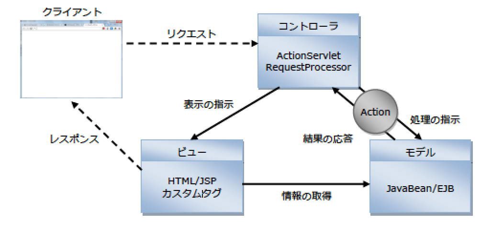

# 基本

## 目次

* 参考URL
* Strutsが提供する機能
* Strutsのメリット
* MVCモデルとStruts

## 概要

* 画面からのリクエストに応じてActionが呼び出される
    * Action: 任意の処理を行うクラス
* どのようなリクエストのURLがきた時に、どのようなActionの実装クラスが呼び出されるかをMLファイルに定義
* また、Actionが何か処理を行った場合にJSPファイルを表示する
* どのJSPファイルを表示するかを指定可能
    * これにより、処理が成功した時とエラーが発生した時などで、処理結果で表示するJSPファイルを切り替えることが可能
* XMLファイルに入力チェック仕様を記述することで、プログラミングを記述せずに入力チェック(Validation)処理が可能

## 参考URL

* [The Apache Software FoundationのStrutsページ](http://www.apache.org)

## Strutsが提供する機能

* リクエス卜値のJavaBeanプロパティへの自動設定機能
* リクエス卜値の検証（入力チェック）機能
* ファイルアップロード機能
* JSP開発を支援するカスタムタグライブラリ
* レイアウ卜機能
* ロケ一ルに合わせた国際化機能
* 仮想パスによる画面遷移管理機能

## Strutsのメリット

* モジュールによるアプリケーションの分割
    * アプリケーションが肥大してくると設計、実装、保守のすべての面において管理が難しくなる
    * Strutsではモジュールという管理単位を導入することにより、モジュール探知で設計、開発、保守を行うことが可能

## MVCモデルとStruts

* StrutsではMVCモデルを採用
* 以下のようなMVCモデルを採用している

* Strutsを用いたアプリケーションにおけるMCC
    * モデルは開発者が実装するJavaBean
    * ビューはJSPおよびStrutsのカスタムタグ、
    * コントローラはActionServletとRequestProcessor、Action

## 処理の概要

* リクエスト処理
    * ユーザからのリクエストは、まずActionServletに渡される
* リクエストを転送
    * ActionServletはリクエストのURLから呼び出すモジュールを判断し、そのモジュールのRequestProcessorへリクエストを転送
* ロジックを実行
    * RequestProcessorは、あらかじめ設定された内容に応じて実行するActionを決定
    * Actionを介してモデルであるJavaBeanのロジックを実行
* 結果（どのJSPページを表示に使用するか）を取得
    * モデルの処理が終了すると、RequestProcessorはActionを介して結果を取得。
* フォワード
    * ActionServletは取得した情報を、ビュー（JSP）にフォワードを行う
* 表示
    * 遷移先のJSPでは、sessionやrequestスコープに登録された JavaBeanからデータを取得し、表示を行う
* レスポンスとして取得
    * ユーザは最終的にJSPページによって生成された結果を、レスポンスとして取得