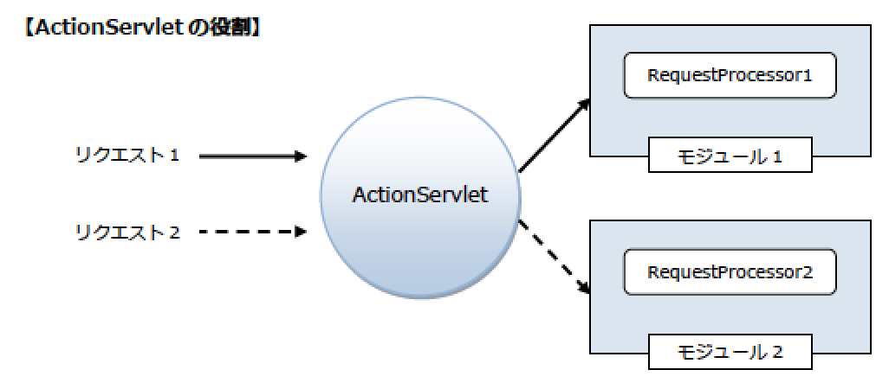

# Strutsの構成要素

* コアクラス

## Strutsの構成要素

* Strutsのコアクラスと設定ファイルについて
    * Strutsは25のパッケージ、300近くのクラスで構成

### コアクラス

* ActionServlet
    * ActionServletはStrutsフレームワーク内で唯一のサーブレット
    * クライアントからのリクエストを最初に受け取り処理する
    * ActionServletの主な役割は、受け取ったリクエストに応じたRequestProcessorを呼び出すこと
    * ActionServletはインスタンス化されるときに、`init()`内で次のような処理を行う
        * web.xmlから初期化パラメ一タを読み込む
            * このときActionServletは、struts-config.xmlの場所を取得する
        * struts-config.xmlを読み込む
            * HTTPリクエス卜のパスとActionのマッピング、メッセージリソースの読み込み、プラグインのロードなどが行われる
        * その後HTTPリクエストのURLからモジュールを判定して、適切なRequestProcessorの呼び出す
            * つまり、コントローラとして処理のほとんどはRequestProcessorが担っていることになる

* RequestProcessor
    * Strutsにおけるコントローラの中心的な役割を担う
    * モジュールに対して1つのインスタンスが作成され、各モジュールに対するリクエストをStruts設定ファイルの内容に基づいて処理する
    * RequestProcessorの主な処理内容は以下
        * リクエストされたURLに関連づけられた各種情報の取得
        * ActionFormの取得とリクエス卜パラメ一タの値の格納
        * Actionの取得と実行
        * JSPやHTMLへのフォワ一ド
    * RequestProcessorの処理のおおまかな流れは以下
        * HTTPリクエストのURLに対応したActionMapping情報を、struts-config.xmlの内容から検索する
            * ActionMappingとはHTTPリクエストパスとAction、およびそれに関連付けられるActionFormの関係を定義したもの
        * ActionFormの設定が行われる①で取得したActionMapping情報からインスタンスを生成すべきActionFormが決定される
            * インスタンスがスコープに登録された後、HTTPリクエストパラメ一夕をプロパティにセットする
        * ActionFormにセットされたリクエストパラメータの検証（入力チェック）を行う
        * Actionの`execute()`が実行され、このメソッドからビジネスロジック層へ処理が引き継がれる
        * 他のリソースへ処理が引き渡される他のサーブレット、JSP、HTMLなど、引き渡し先はさまざま
            * フォワードかリダイレクトかについては、struts-config.xmlで指定する

* Action
    * Actionはリクエストとモデルの橋渡しとしての役割を担う
    * 具体的にはモデルにアクセスし、ビューに渡すデ一夕を準備するというのが主要な役割
* ActionForm
    * モデルとビューの間に位置し、フォームから送られた値をActionへ転送する役割を担う
        * ユ一ザーが入力した値の入力チェックも行う

* Struts設定ファイル
    * Strutsの各種情報を定義するファイルで、struts-config.xmlというXMLファイル
    * 基本的にモジュール1つに対して、1つのStruts設定ファイルを作成する
    * リクエストされるURLと、Actionや ActionFormとの関連をファイルに設定するまた画面遷移もこのファイルで管理する