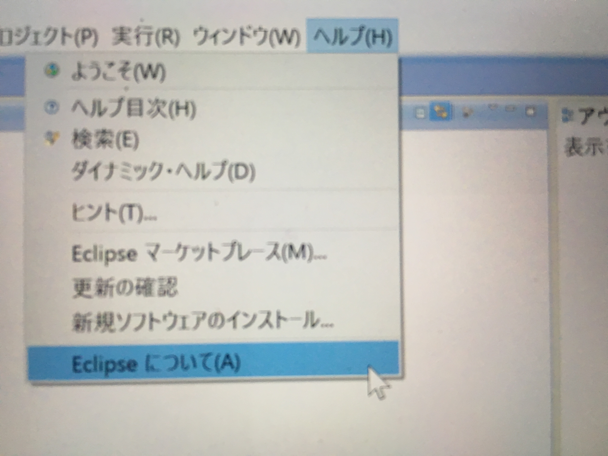
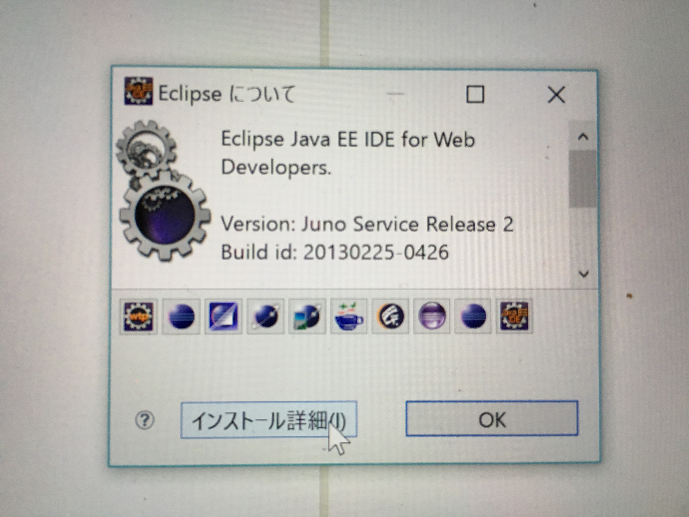

# Struts開発環境

* Amateras StrutsIDEプラグイン
    * GEFプラグインのインストール方法
    * eclipse起動
    * StrutsIDEとEclipseHTMLEditerのインストール

Strutsを動作させるために必要な環境を構築する方法

* OS: Windows7
* JDK: JDK1.6
* サーブレットコンテナ: Tomcat6.0
* フレームワーク: Struts1.3.1

必要なソフトは以下

* `Pleiades All in One Eclipse3.7 Full All in One Edition`
    * オープンソースで提供されているIDE（統合開発環境）
    * プラグイン（拡張ライブラリ）を導入することで、様々な機能を追加可能
* `Amateras StrutsIDE プラグイン`
    * Strutsプロジェクトの作成機能をEclipseに追加するためのプラグイン
    * Strutsのプロジェクトに必要となるJarファイルを自動的に設定してくれる

### Amateras StrutsIDEプラグイン

Strutsプラグインの動作にはGEFプラグインとEclipseHTMLEditerプラグインが必要となる

* GEFプラグインのインストール
* StrutsIDEとEclipseHTMLEditerのインストール

#### GEFプラグインのインストール方法

#### eclipse起動

メニューからヘルプ-新規ソフトウェアのインストールを選択する

作業対象にhttp://download.eclipse.org/tools/gef/updates/releasesを入力し、追加をクリック

* 指示に従ってインストール
* 手順に沿ってインストールが完了したことを以下の手順で確認

#### StrutsIDEとEclipseHTMLEditerのインストール

* StrutsIDEとEclipseHTMLEditer をAmaterasのWeb ページからダウンロード
* 以下のサイトにアクセスし、ダウンロードタブを開く
* ダウンロードしたファイルを、Eclipseをインストールしたフォルダ内にあるpluginsに移動し、Eclipseを再起動

※バージョンは、両方共に2.0.7のものをダウンロード

以上でStruts開発環境の構築は完了