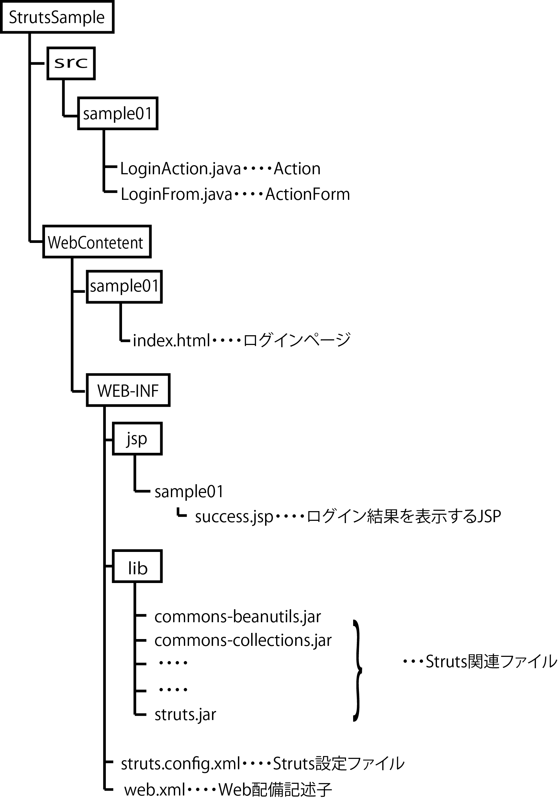

# Strutsを動かす

* [プロジェクトの作成](01)
* 2.設定ファイルの編集
    * 1web.xmlの編集
    * 2.struts-config.xmlの作成
    * 3.ActionクラスとActionFormクラスの作成
    * 4.HTML、JSPの作成
    * 5.サンプルを実行する

## サンプルプログラムの仕様
    * ログインフォームにIDとパスワードを入力し、ログインボタンを押すことで画面遷移
    * 次の画面では、入力したIDとパスワードが表示される

アプリケーション作成の流れ

* プロジェクト作成
* 設定ファイル(web.xml、struts-config.xml)作成
* Action、Actionform作成
* JSP、HTML作成
* ビルドとデプロイ
* Tomcat起動

作成するファイルの一覧

| ファイル名 | 解説 | ロケーション |
|:----|:----|:----|
| web.xml | アプリケーションの設定ファイル | /WEB-INF/ |
| struts-config.xml | Struts設定ファイル | /WEB-INF/ |
| LoginAction.java | 入力されたIDやパスワードを処理するAction | /src/sample01/ |
| Loginform.java | リクエストパラメータで送られてきたIDやパスワードを受け取るActionForm | /src/sample01/ |
| success.jsp | ログイン結果を示すJSP | /WEB-INF/jsp/sample01/ |
| imdex.html | IDやパスワードの入力フォーム | /sample01/ |

Eclipse上から見たディレクトリ構成

